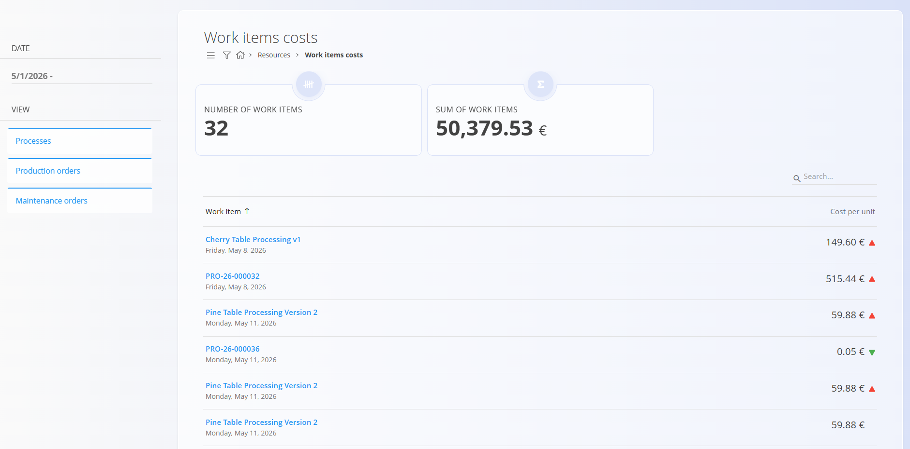

<!-- app_route: /work-items-costs -->
<!-- app_label: Work items costs -->
<!-- canonical_source_url: https://tom-pit.github.io/Connected.Docs/en/Domains/Resources/Views/WorkItemsCosts/ -->
<!-- canonical_source_title: Work items costs -->

# Work items costs

The **Work items costs** view provides insight into the **actual cost of producing a single work item**, based on recorded materials, effort, and expenses. It is primarily used to analyze processes, [production](../../Production/Documents/ProductionOrders.md), and [maintenance orders](../../Maintenance/Documents/MaintenanceOrders.md) and understand cost distribution and performance.

To access **Work items costs**, go to **Resources / Work items costs** in the [navigation](../../../Common/UI/Navigation.md).

> [!NOTE]
> When the **Processes** view is selected, the screen displays estimated [process version costs](../../Production/Analytics/VersionCostView.md) rather than actual work item costs.

## Work items costs list

The list shows all work items within the selected date range.

Each row represents a **single work item**, typically linked to a production or maintenance order, and displays:

- Work item reference
- Creation date
- Calculated cost per unit
- Visual indicators showing cost changes compared to previous periods

Filters allow narrowing results by:

- Date range
- Work item type (production or maintenance orders)

Clicking on a work item opens its detailed cost breakdown.

## Work item cost details

Selecting a work item opens a detailed view with a full cost analysis.

### Cost overview

At the top of the screen, key indicators provide a quick summary:

- **Cost per unit**
- **Cost trend** compared to previous values
- **Cost distribution** between materials and effort
- **Performance indicators**, such as best and worst contributors

Any linked documents (e.g., production or maintenance orders) are also shown for reference.

### Materials

This section lists all materials used to manufacture the item, including:

- Material name and type
- Quantity used
- Total cost
- Percentage of total cost

Expanding a material row shows additional details when available.

### Effort

The effort section shows time spent by users on the work item, including:

- User
- Recorded duration
- Calculated effort cost
- Percentage of total cost

Effort costs are calculated using resource cost definitions.

### Expenses

Any additional [expenses](../../Supply/Management/Expenses.md) linked to the work item are listed here. If no expenses are recorded, the section is displayed as empty.

## Usage notes

- Work item costs are **read-only** and fully calculated by the system.
- Accuracy depends on properly configured:
  - Resource costs
  - Material prices
  - Effort tracking
- This view is typically used by production managers and analysts.

## Menu

The menu provides additional actions available on this page.

Available actions:

- **Export to PDF**
- **Recalculate** – recalculates the costs of the selected work item or process version using the latest materials, resources, and expenses.

For details about menu actions, see [**Menu actions**](../../../Common/Concepts/MenuActions.md).
