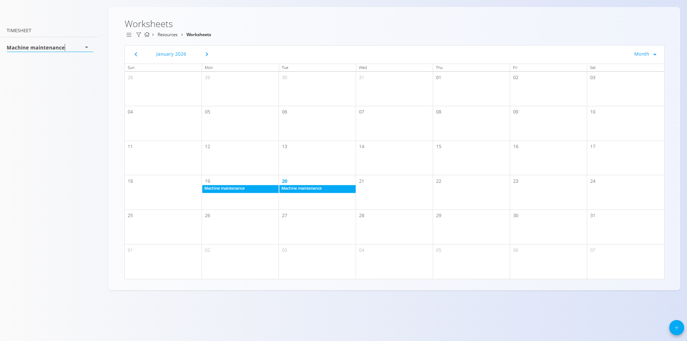
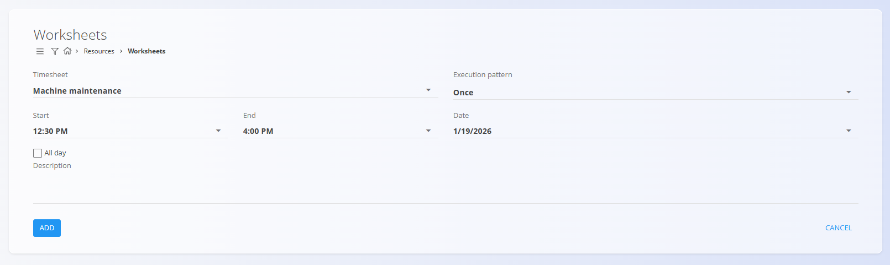
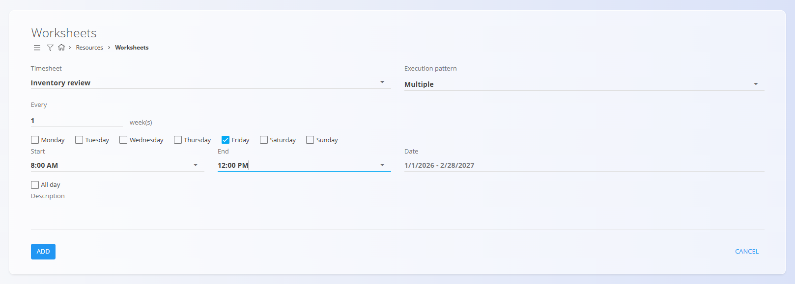

<!-- app_route: /management/resources/worksheets -->
<!-- app_label: Worksheets -->
<!-- canonical_source_url: https://tom-pit.github.io/Connected.Docs/en/Domains/Resources/Views/Worksheets/ -->
<!-- canonical_source_title: Worksheets -->

# Worksheets

Worksheets provide a calendar-based view for planning work based on **Timesheets**.  
They represent *planned work* and allow users to schedule activities over time.

To access **Worksheets**, go to **Resources / Worksheets** in the [navigation](../../../Common/UI/Navigation.md).

## Schema

### Worksheet fields

| Field | Description |
|------|-------------|
| **[Timesheet](../Management/Timesheets.md)** | Defines the type of work being planned. |
| **Execution pattern** | Determines whether the worksheet is executed **Once** or **Multiple** times. |
| **Start** | Start time of the planned work. |
| **End** | End time of the planned work. |
| **All day** | Marks the worksheet as covering the entire day. |
| **Date** | Date of execution. When **Multiple** is selected, this defines the date range in which the worksheet repeats. |
| **Description** | Optional additional information about the planned work. |

## Worksheets calendar

The calendar displays all worksheets for the selected **Timesheet**. Worksheets can be displayed in **day**, **week**, or **month** view.

On the left side, a filter allows selecting which **Timesheet** is shown in the calendar.  
Only worksheets belonging to the selected timesheet are displayed.

## Actions

### Create a new worksheet

To create a new worksheet, click the **+** action button in the bottom-right corner.

Depending on the selected **execution pattern**, different options are available.

#### Once

Use **Once** to schedule a single occurrence.

#### Multiple

Use **Multiple** to schedule a recurring worksheet over a date range.

After saving, the worksheet appears in the calendar on the corresponding date(s).

### Edit a worksheet

Worksheets can be edited directly from the calendar view.

To edit a worksheet, **double-click on the event in the calendar**. The edit dialog opens, allowing you to update its fields such as time, execution pattern, or description.

### Delete a worksheet

Worksheets can be deleted from the **edit dialog**.

To delete a worksheet:
1. Double-click the worksheet event in the calendar to open the edit screen.
2. Click **Delete**.
3. Confirm the deletion.

If the worksheet uses a **Multiple** execution pattern, an additional confirmation is shown:
- **“Do you wish to remove all future entries as well?”**

After this step, a final confirmation dialog is displayed:
- **“Are you sure you want to delete worksheet detail?”**

Once confirmed, the worksheet is permanently removed.

