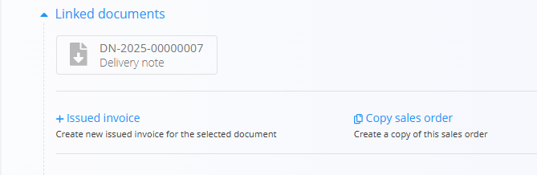

<!-- app_route: /sales/documents/issued-invoices -->
<!-- app_label: Issued invoices -->
<!-- app_navigation_hint: Open Issued invoices, then click the action button to create a new draft invoice. -->
<!-- canonical_source_url: https://github.com/Tom-PIT/Connected.Docs/blob/main/en/Domains/Sales/Documents/IssuedInvoicesCreate.md -->
<!-- canonical_source_title: How to create an issued invoice -->

# How to create an issued invoice

New [issued invoices](IssuedInvoices.md) can be created:

- manually from the **Issued invoices** screen  using the [action button](../../../Common/UI/ActionButton.md)
- from related sales documents using **Linked documents → + Issued invoice**

Supported source documents include:

- committed [sales orders](SalesOrders.md)
- [delivery notes](DeliveryNotes.md)

When created from another document, the system automatically pre-fills most invoice data, including the customer, delivery information, and detail lines.

## Step 1 — Create the document

Create a new draft invoice using one of the following methods:

- Click the [action button](../../../Common/UI/ActionButton.md) on the **Issued invoices** screen
- Use **Linked documents → + Issued invoice** from a related sales document (e.g., [sales order](SalesOrders.md), [delivery note](DeliveryNotes.md))

A new draft issued invoice is created. If created directly from another document it will have most of its fields already pre-filled.

## Step 2 — Fill in header information

Fill in the key header fields in the top section of the invoice form. When creating from a related document, most of these fields are pre-filled based on the source document:

   - [**Customer**](../../../Common/Management/BusinessDirectory.md)  
   - **Issue date**  
   - **Delivery date**  
   - **Due date** (mandatory)  
   - **Reference type / Reference number**  
   - [**Organization bank account**](../Management/OrganizationBankAccounts.md)  
   - [**Payment method**](../Management/PaymentMethods.md)

   

## Step 3 — Add details

Add items in the **Details** section. Details define the ordered items and their quantities, prices, taxes, and discounts. Each detail line corresponds to a specific product, service, or asset.

 To add a new item: 
 
 1. Type or scan a **serial number**, **EAN**, or **asset name** in the **Details** bar. The system displays all matching items. 
 2. Select the desired item from the list.
 3. Adjust **quantity**, **price**, **discount**, or **tax information**, then click **Save**.

    

4. Continue adding as many detail lines as needed. After saving, the detail appears in the list:

   

For information about working with document details, see [**Document details**](../../../Common/Concepts/DocumentDetails.md).

### Ledger details

The **Ledger** section defines how the document is posted to the general ledger. It determines which accounts are used for revenue, expense, and tax postings when the document is saved and posted.

When the document is posted:

- The **net amount** is posted to the selected revenue or expense account.
- The **tax amount** is posted to the selected tax account.
- The system creates corresponding journal entries in the ledger.

The available accounts are defined in the **[Chart of accounts](../../Accounting/Management/Ledger/ChartOfAccounts.md)**.

## Step 4 — Configure additional sections

### Alternative currency

The Alternative currency section allows prices in the document to be expressed in a currency different from the system’s default currency. This is typically used for international sales. Rates are taken from the [Exchange rates](../Management/ExchangeRates.md) code list.

When an alternative currency is selected, document prices are automatically recalculated using the specified exchange rate.

### Delivery

Review or adjust delivery information in the **Delivery** section.

The Delivery section defines where the goods will be shipped. It is filled automatically from the customer or vendor data but can be adjusted for each document.  

These values affect the printed document and follow-up logistics documents, but do not modify the master data.

### Transport and Intrastat sections

When **Intrastat** is set to **Obliged** in **System / Configuration / Intrastat**, additional sections become available in the document.

- **Transport** - Used to capture logistics-related information about how the goods were delivered.
- **Intrastat** - Used to collect data required for Intrastat reporting. These fields are only shown when Intrastat reporting is enabled for the system.

> [!NOTE]  
Several Intrastat-related values are taken from **material code lists** (Intrastat configuration), such as country and transaction nature. These fields are not freely configurable per document and depend on predefined master data.

#### Intrastat details

When Intrastat reporting is enabled and the transaction involves a customer from another EU country, an additional **Intrastat** section becomes available in the detail edit form. This section collects statistical information required for Intrastat reporting.

These fields are mandatory for cross-border EU transactions when the organization is Intrastat-obliged.

### Attachments

Use the **Attachments** section to upload and manage files related to the document, such as photos, PDFs, certificates, or supporting records.

For detailed instructions, see [**Attachments**](../../../Common/Concepts/Attachments.md).

### Top content and Bottom content

Pre-filled content sections allow you to add predefined text blocks to the top or bottom of the invoice. This is useful for including standard terms and conditions, payment instructions, or any other relevant information that should appear on the printed document. 

The content is selected from [**Predefined texts**](../../../Common/Management/PredefinedTexts.md).

### Payment methods

Payment method assignments appear at the bottom of the document. 

Click **Add payment method** to assign a [payment method](../Management/PaymentMethods.md) to the order. This field is informational and does not trigger any financial transactions by itself. It is used for internal tracking of how the customer intends to pay for the order.

## Step 5 - Publish the issued invoice

When the invoice is ready, click **Publish** at the top of the page. Publishing moves the document from **Draft** to **Committed**, finalizes totals, and enables accounting export and further processing.

> [!NOTE]  
> Once published, an issued invoice cannot be edited or deleted. If a correction is needed, use **[Reverse document](../../Logistics/Documents/Reversals.md)** action in the menu.

