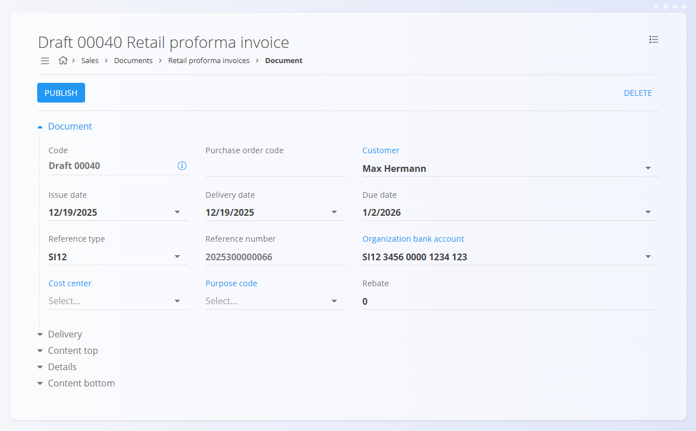

<!-- app_route: /sales/documents/retail-prepayments -->
<!-- app_label: Retail proforma invoices -->
<!-- canonical_source_url: https://github.com/Tom-PIT/Connected.Docs/blob/main/en/Domains/Sales/Documents/RetailProformaInvoices.md -->
<!-- canonical_source_title: Retail proforma invoices -->

# Retail proforma invoices

A **Retail proforma invoice** is a sales document used in retail scenarios to record a sale in an invoice-like format while allowing flexible payment handling.  
It is typically used when a customer purchases goods in person and payment may be recorded immediately or later.

Retail proforma invoices support the same payment lifecycle as retail issued invoices and can be printed or sent to the customer at any stage.

To access this page, go to **Sales / Documents / Retail proforma invoices**.

## How retail proforma invoices fit into the sales workflow

Retail proforma invoices are used for over-the-counter or direct retail sales:

1. A customer visits the shop and selects one or more items.  
2. A **Retail proforma invoice** is created manually using the [action button](../../../Common/UI/ActionButton.md).  
3. The document is published and moves to the **Unpaid invoices** state.  
4. Payments are recorded using the **Payment** button:
   - Partial payments move the document to **Partially paid invoices**.
   - Full payment moves the document to **Fully paid invoices**.
5. The proforma invoice can be printed or sent to the customer.
6. Stock is adjusted separately using an [**Issue**](../../Logistics/Documents/Issues.md) document (or a [**Delivery note**](DeliveryNotes.md) followed by an Issue).

Retail proforma invoices **do not affect inventory**.

## Stock handling

Retail proforma invoices **do not decrease stock**, regardless of payment status.

To adjust inventory:
- Create an [issue](../../Logistics/Documents/Issues.md) document, or  
- Create a [delivery note](DeliveryNotes.md) followed by an [issue](../../Logistics/Documents/Issues.md).

## Schema

  
<strong>Document</strong>

| Field | Description |
|-------|-------------|
| [**Code**](../../../Common/UI/DocumentCodes.md) | System-generated identifier of the document. |
| **Purchase order code** | Optional reference provided by the customer. |
| **Customer** | Mandatory. Selected from the [**Business directory**](../../../Common/Management/BusinessDirectory.md). Only entities classified as **Customer** and **Person** are available. |
| **Issue date** | Date when the document is created. |
| **Delivery date** | Delivery or pickup date. |
| **Due date** | Payment deadline (mandatory). |
| **Reference type** | Type of payment reference (mandatory). |
| **Reference number** | Reference number used on payment documents. |
| **[Organization bank account](../Management/OrganizationBankAccounts.md)** | Account where payments are received (mandatory). |
| **[Cost center](../../../Common/Management/CostCenters.md)** | Optional cost allocation. |
| **Purpose code** | Optional purpose classification. |
| **Rebate** | Overall rebate applied to the document. |
| **Content top** | Introductory text from [**Predefined texts**](../../../Common/Management/PredefinedTexts.md). |
| **Content bottom** | Closing or legal text from [**Predefined texts**](../../../Common/Management/PredefinedTexts.md). |

  
<strong>Transport, Alternative currency, and Delivery</strong>

| Field | Description |
|--------|-------------|
| **[Delivery term](../../../Common/Management/DeliveryTerms.md)** | Delivery conditions  as agreed upon with the customer. |
| **[Mode of transport](../../../Common/Management/ModeOfTransport.md)** | Transport method  as agreed upon with the customer. |
| [**Alternative currency**](../../../Common/Management/Currencies.md) | Alternative currency to the default one used in the document |
| [**Exchange rates**](../Management/ExchangeRates.md) | Exchange rate of the alternative currency with respect to the default currency	|
| **Delivery** | Delivery company and address information. |

  
<strong>Details</strong>

| Field | Description |
|--------|-------------|
| **Asset** | Product, service, or asset selected for this line. |
| **Detail name** | Display name of the selected item (can be edited if allowed). |
| **[Tax rate](../../../Common/Management/TaxRates.md)** | Tax rate applied to the line (defined in tax configuration). |
| **Net price (per unit)** | Price per unit excluding tax. |
| **Tax price (per unit)** | Price per unit including tax (calculated automatically based on tax rate). |
| **Quantity** | Quantity of the selected asset. |
| **Discount (%)** | Percentage discount applied to the net price. |
| **Total amount excluding tax** | Calculated net total (Net price × Quantity − Discount). |
| **Total amount with tax** | Total amount including tax. |
| **Tax calculation type** | Defines how tax is calculated when special VAT rules apply: • **Trilateral supplies** – For triangular EU transactions where VAT is accounted for by the final buyer (reverse charge). • **Tax is accounted** – Applies reverse charge VAT; the customer accounts for the tax instead of the seller. • **Export services** – Used for services provided to customers outside the EU (typically VAT exempt). • **Transport services** – Special VAT treatment for goods transport services. • **Passenger transport** – VAT rules specific to passenger transport activities. • **Travel agencies** – Applies the VAT margin scheme for travel agency services. • **According to customs procedures 42 and 63** – Used for imports where VAT is deferred to the destination EU country. • **Sale of recalled goods from the EU** – Special VAT handling for returned or recalled goods within the EU. |
| **Description** | Optional additional information for the line. |
| **Use alternative currency** | Option to express the line amount in a selected alternative currency. When selected, the amount is recalculated based on the exchange rate defined in the document. |

  
<strong>Ledger and Interstat details</strong>

| Field | Description |
|--------|-------------|
| **Ledger - Account revenue / expense** | General [ledger account](../../Accounting/Management/Ledger/ChartOfAccounts.md) used to post the line amount (e.g., sales revenue or purchase expense). |
| **Ledger - Account tax** | General [ledger account](../../Accounting/Management/Ledger/ChartOfAccounts.md) used to post the tax amount associated with the document line. |
| **[Intrastat – Tariff](../../Accounting/Management/Intrastat/Tariffs.md)** | Commodity code used for Intrastat reporting. |
| **Intrastat – Country of origin** | Country where the goods originate. |
| **Intrastat – Net weight (kg)** | Net weight used for statistical reporting. |
| **Intrastat – Statistical value** | Declared statistical value of goods for Intrastat reporting. |

## Management

Retail proforma invoices support the following states:

- **Draft**
- **Unpaid invoices**
- **Partially paid invoices**
- **Fully paid invoices**

Once published, the **Payment** button becomes available and payments can be recorded.

### List view

The list view can be filtered by:

- **Document dates**
- **View**
  - Drafts
  - Unpaid invoices
  - Partially paid invoices
  - Fully paid invoices
- **Customer**

Each row displays:
- Customer
- Document code
- Document date
- Paid amount
- Total amount

## Actions

### Create a new retail proforma invoice

Retail proforma invoices can only be created manually.

1. Click the [action button](../../../Common/UI/ActionButton.md) to create a new draft retail proforma invoice.

   

2. Select a **Customer**. Only records classified as both **Customer** and **Person** in the [**Business directory**](../../../Common/Management/BusinessDirectory.md) are available.

   

3. Fill in mandatory header fields: **Due date**, **Reference type**, **Reference number**, and **[Organization bank account](../Management/OrganizationBankAccounts.md)**.

4. Add items in the **Details** section by typing or scanning a serial number, EAN, or asset name.

   

   For information about working with document details, see [**Document details**](../../../Common/Concepts/DocumentDetails.md).

5. Save the details.

6. Select a **Payment method** at the bottom of the document.
   
   

7. When ready, click **Publish** to confirm the document.  
   The document moves from **Draft** to **Unpaid invoices**.

#### Transport and Intrastat sections

When **Intrastat** is set to **Obliged** in **System / Configuration / Intrastat**, additional sections become available in the receive document form.

- **Transport** - Used to capture logistics-related information about how the goods were delivered.
- **Intrastat** - Used to collect data required for Intrastat reporting. These fields are only shown when Intrastat reporting is enabled for the system.

> [!NOTE]  
Several Intrastat-related values are taken from **material code lists** (Intrastat configuration), such as country and transaction nature. These fields are not freely configurable per document and depend on predefined master data.

#### Delivery section

The Delivery section defines where the goods will be shipped. It is filled automatically from the customer or vendor data but can be adjusted for each document.  

These values affect the printed document and follow-up logistics documents, but do not modify the master data.

#### Details

Details define the ordered items and their quantities, prices, taxes, and discounts. Each detail line corresponds to a specific product, service, or asset.

For information about working with document details, see [**Document details**](../../../Common/Concepts/DocumentDetails.md).

##### Ledger details

The **Ledger** section defines how the document is posted to the general ledger. It determines which accounts are used for revenue, expense, and tax postings when the document is saved and posted.

When the document is posted:

- The **net amount** is posted to the selected revenue or expense account.
- The **tax amount** is posted to the selected tax account.
- The system creates corresponding journal entries in the ledger.

The available accounts are defined in the **[Chart of accounts](../../Accounting/Management/Ledger/ChartOfAccounts.md)**.

##### Intrastat details

When Intrastat reporting is enabled and the transaction involves a customer from another EU country, an additional **Intrastat** section becomes available in the detail edit form. This section collects statistical information required for Intrastat reporting.

These fields are mandatory for cross-border EU transactions when the organization is Intrastat-obliged.

### Record payments

Payments are recorded using the **Payment** button at the top of the document.

In the payment dialog you can see:

- **Total cost** – Invoice gross amount and due date.  
- **Payment** – Amount being paid now and date of payment.  
- **Remaining amount** – Outstanding balance after the payment.

You can register multiple payments over time. The system automatically updates the invoice status:

- **Unpaid** – No payments recorded.  
- **Partially paid** – Some payments recorded, but an outstanding amount remains.  
- **Fully paid** – Remaining amount is zero.

> [!NOTE]  
> When an invoice is fully covered by recorded payments, it appears in the **Fully paid invoices** view. Partially paid documents appear under **Partially paid invoices**, and unpaid ones under **Unpaid invoices**.

### Edit a retail proforma invoice

A retail proforma invoice can be edited while it is in **Draft** state.

Editable sections include:
- Document header
- Detail lines
- Delivery information
- Content texts

Once published, edits are no longer allowed unless the document is returned to draft (if permitted).

### Delete a retail proforma invoice

Draft documents can be deleted in the edit view, **only if they contain no details**.

If the draft still includes items in the **Details** section:

1. Open the document menu (top right corner).
2. Select **Delete all details** to remove all lines at once.
3. Once the document contains no details, click **Delete** to remove the draft.

If you need to remove only a specific material instead of clearing the entire document:

1. Click the material serial number to open the **Edit detail** screen.
2. Click **Delete** inside the Edit detail window.

> [!NOTE]
> Committed invoices **cannot** be deleted, but they can be [reversed](../../Logistics/Documents/Reversals.md) or **returned to draft**.

## Menu

The menu provides additional actions available on this page.

Available actions:

- **Print**
- **Export to PDF**
- **Send as email** 
- **[Reverse document](../../Logistics/Documents/Reversals.md)**
- **Return to draft**

For details about menu actions, see [**Menu actions**](../../../Common/Concepts/MenuActions.md).

> [!NOTE]
> A reversal negates the financial effect of a committed prepayment. See **[Reversals](../../Logistics/Documents/Reversals.md)** for more details.

