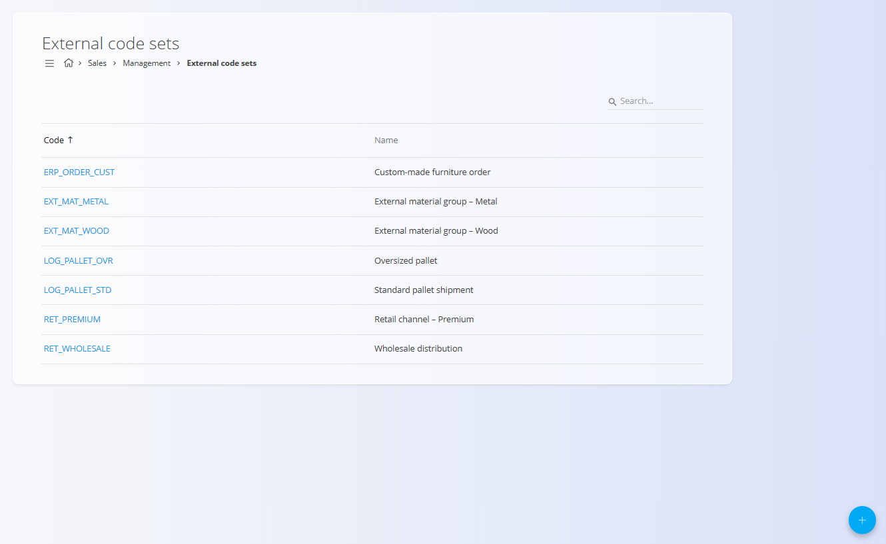

<!-- app_route: /management/common-types/external-code-sets -->
<!-- app_label: External code sets -->
<!-- canonical_source_url: https://github.com/Tom-PIT/Connected.Docs/blob/main/en/Domains/Sales/Management/ExternalCodeSets.md -->
<!-- canonical_source_title: External code sets -->

# External code sets

The **External code sets** screen defines configurable codes used to map internal data to **external systems, partners, or classifications**.  These codes are typically used when integrating with third-party ERP systems, logistics providers, customers, or industry-specific classifications.

To access this screen, go to **Sales / Management / External code sets** in the [navigation](../../../Common/UI/Navigation.md).

> [!NOTE]
External code sets do not enforce a specific meaning by themselves. Their interpretation depends on how they are referenced in other documents or integrations.

## Schema

| Field | Description |
|------|------------|
| Code | Unique identifier of the external code set. Used for references and integrations. |
| Name | Human-readable description explaining the purpose of the code set. |

## Management

### List view

The list view displays all defined external code sets.

Each row shows:
- **Code**
- **Name**

The list supports searching by code or name.

## Actions

### Create external code set

To create a new external code set:
1. Click the **Add** action button.
2. Enter a **Code** and **Name**.
3. Click **Add** to save the entry.

## Editing

To edit an existing external code set, click its **Code** in the list to open it in edit mode. Update the **Code** or **Name** as needed.

Click **Save** to apply the changes or **Cancel** to discard them.

### Delete external code sets

Click¸the name of the external code set you want to delete, then click **Delete** on the edit screen to remove it. After confirmation, the record is permanently deleted.

> [!NOTE]
> An external code set can be deleted only if it is not referenced by mappings, documents, or integrations.
