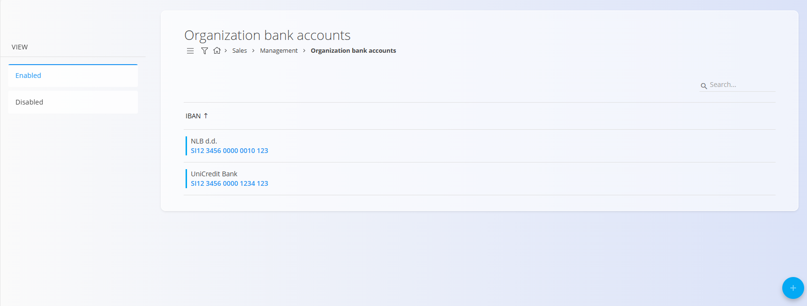
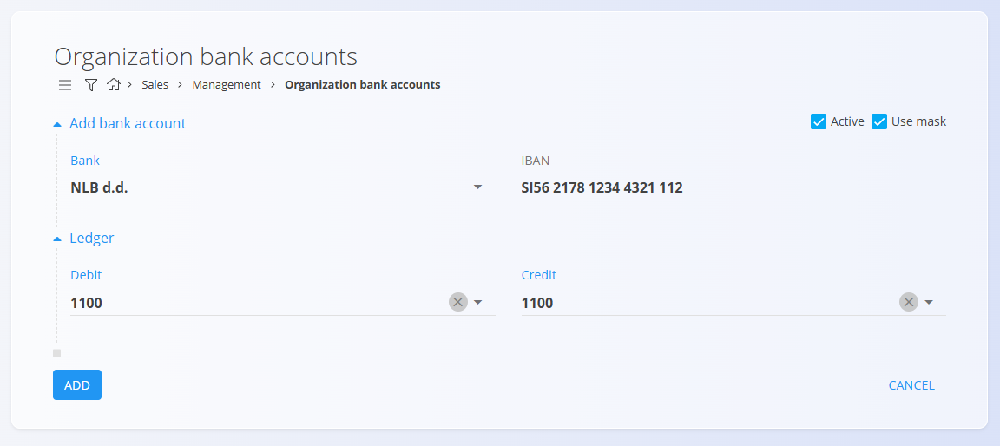

<!-- app_route: /management/common-types/organization-bank-accounts -->
<!-- app_label: Organization bank accounts -->
<!-- canonical_source_url: https://tom-pit.github.io/Connected.Docs/en/Domains/Sales/Management/OrganizationBankAccounts/ -->
<!-- canonical_source_title: Organization bank accounts -->

# Organization bank accounts

The **Organization bank accounts** code list stores the IBAN accounts used by your company for issuing invoices, receiving payments, and other financial processes. This screen allows you to view, add, enable, or disable the IBAN accounts used by your organization.
 Each entry defines a bank, its IBAN number, and whether it is active or formatted using the IBAN mask.

To access Organization bank accounts, go to **Sales / Management / Organization bank accounts** in the [navigation](../../../Common/UI/Navigation.md).

> [!NOTE]  
> **Prerequisites**  
> Before managing bank records, ensure that the [Banks](../../../Common/Management/Banks.md) code list is properly configured.

## Schema

| Field | Description |
|-------|-------------|
| [**Bank**](../../../Common/Management/Banks.md) | Bank to which the account belongs (mandatory). |
| **IBAN** | International Bank Account Number (mandatory). |
| **Active** | Indicates whether the account can be used in documents (selected by default). |
| **Use mask** | Determines whether the IBAN is displayed and entered using an input mask for improved readability. |
| **Ledger – Debit/Credit** | General ledger account selected from the [**Chart of accounts**](../../Accounting/Management/Ledger/ChartOfAccounts.md) that is debited/credited when a tax amount is posted using this tax rate. |

## Management

### Bank accounts list

The screen shows the list of bank accounts. Use the left panel to filter bank accounts:
- **Enabled**
- **Disabled**

Click on an IBAN number to edit an specific bank account.

## Actions

### Add new organization bank account

Click the [Action Button](../../../Common/UI/ActionButton.md) to add a new bank account.

Enter the required information:
- **Bank**
- **IBAN**
- **Active** (optional)
- **Use mask** (optional)
- **Ledger** section

#### Ledger

The Ledger section defines which general ledger account represents the organization’s bank account in accounting transactions.

The selected ledger account is used when posting payments, receipts, bank statements, and reconciliations. All financial movements related to this bank account are recorded against the selected account.

> [!NOTE]
> Correct ledger configuration is required for accurate cash management, reconciliation, and regulatory compliance.

### Edit an organization bank account

Click the IBAN number of the account you want to edit. You can update any fields as needed.

### Delete an organization bank account
  
Click the IBAN number of the account you want to delete, then click **Delete** on the edit screen.

If confirmed, the record is permanently removed; otherwise, the system keeps it unchanged.

> [!NOTE]
>A bank account can be deleted only if it is not referenced by other system entities.  

