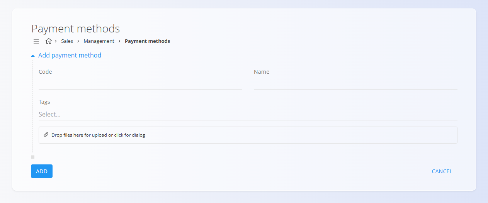

<!-- app_route: /management/common-types/payment-methods -->
<!-- app_label: Payment methods -->
<!-- canonical_source_url: https://tom-pit.github.io/Connected.Docs/en/Domains/Sales/Management/PaymentMethods/ -->
<!-- canonical_source_title: Payment methods -->

# Payment methods

The **Payment methods** code list defines the ways customers can pay for goods or services—such as credit cards, online payment services, or other supported methods. Each method includes a **code**, a **name**, optional **tags**, and an uploaded **icon** representing the payment provider. These records are used throughout the system wherever a payment option must be selected.

To access this page, go to **Sales / Management / Payment methods** in the [navigation](../../../Common/UI/Navigation.md).

## Schema

| Field | Description |
|-------|-------------|
| **Code** | Short identifier for the payment method (mandatory). |
| **Name** | Full display name of the payment method (mandatory). |
| **Tags** | Optional categorization labels (e.g., *credit card*, *online payment*). |
| **Image / Icon** | Optional logo uploaded to visually represent the method. |

## Management

### List view

The list view displays all existing payment methods, including their **code**, **name**, and any associated **tags** or **icons**.  

You can use the **Search** bar to quickly filter payment methods by their code or name.

## Actions

### Create new payment method

Click the action button to open the creation form. You can enter basic information and upload a logo or icon representing the payment provider.

### Edit a payment method

Click any payment method in the list to open its edit screen.  

From there you can modify the code, name, tags, or replace the uploaded image.

### Delete a payment method

Click any payment method in the list to open its edit screen and click **Delete**.

If confirmed, the record is permanently removed; otherwise, the system keeps it unchanged.

> [!NOTE]  
> A payment method can be deleted only if it is not used in dependent documents or settings.

