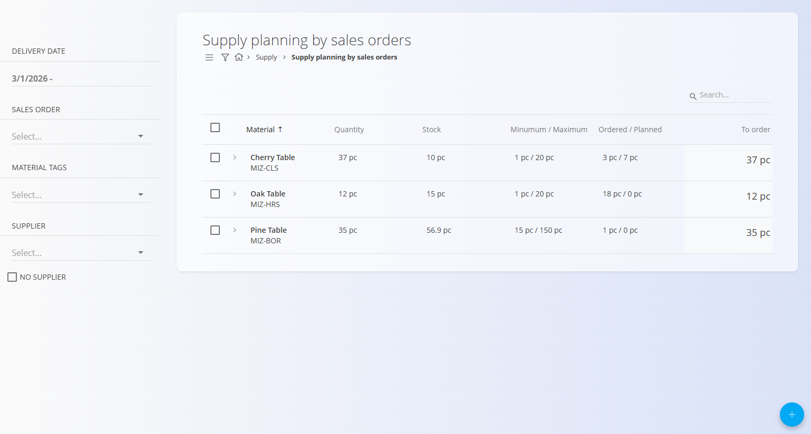
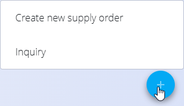

<!-- app_route: /supply/documents/supply-planning-by-sales -->
<!-- app_label: Supply stock boundaries planning by sales -->
<!-- canonical_source_url: https://tom-pit.github.io/Connected.Docs/en/Domains/Supply/Documents/SupplyStockBoundariesPlanningBySales / -->
<!-- canonical_source_title: Supply stock boundaries planning by sales -->

# Supply stock boundaries planning by sales

The **Supply stock boundaries planning by sales** view supports purchase planning based on **sales-driven demand**. It uses the same planning logic and workflow as [**Supply stock boundaries planning**](SupplyStockBoundariesPlanning.md), but adds **sold quantity analysis** to help prioritize replenishment based on recent sales activity (regardless of status).

This view is **actionable** and allows you to create [**Supply orders**](SupplyOrders.md) and [**Inquiries**](Inquiries.md) directly, while relying on sales data to provide additional context for planning decisions.

To access this view, go to **Supply / Supply stock boundaries planning by sales** in the [navigation](../../../Common/UI/Navigation.md).

## List view

The main list displays materials that require replenishment, enriched with sales-related information.

Typical columns include:

* **Material**
* **Sold quantity** – Quantity sold within the selected date range
* **Available stock**
* **Minimum quantity / Maximum quantity**
* **Ordered / Planned** – Quantities already covered by existing supply documents
* **Order quantity** – Suggested quantity to order

## Filters

The left sidebar allows you to refine the planning view using:

* **Delivery date**
* **Sales order**
* **Material tags**
* **Supplier**  

Only materials matching both the filters and planning conditions are displayed.

## Create supply orders or inquiries according to sales demand

Creating documents from this view works **exactly the same way** as in **Supply stock boundaries planning**.

1. Select one or more materials using the checkbox and optionally type the **Order quantity** directly on the list.

    

2. Click the action button and choose:

   * **Create new [supply order](SupplyOrders.md)**, or
   * **[Inquiry](Inquiries.md)**

   

3. Choose the **vendor** and **supply date** in the dialog.

    

4. Click **Create** to continue.

You will be redirected to a new **Supply order** or **Inquiry** with materials, quantities, and vendor information pre-filled.

For detailed action behavior, deletion rules, and document handling, refer to:

* **Supply stock boundaries planning**
