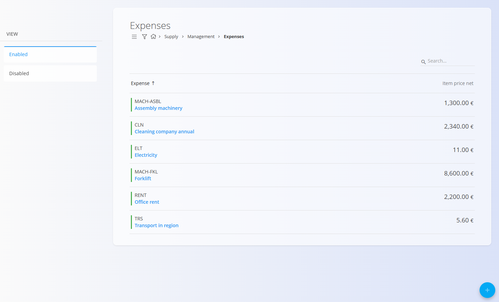
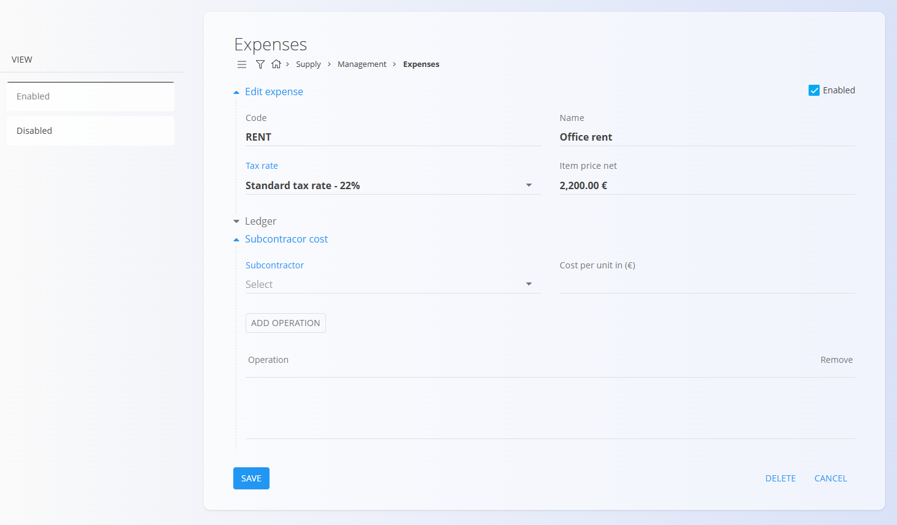

<!-- app_route: /management/common-types/expenses -->
<!-- app_label: Expenses -->
<!-- canonical_source_url: https://github.com/Tom-PIT/Connected.Docs/blob/main/en/Domains/Supply/Management/Expenses.md -->
<!-- canonical_source_title: Expenses -->

# Expenses

The **Expenses** code list contains all costs that your organization wants to register as predefined expenses. These can include recurring services, equipment-related costs, subcontractor fees, or any operational or financial cost that needs to be referenced in supply or production processes.

This list helps maintain consistency by storing all expenses in one place, making them available for use across documents and operational workflows.

To access this code list, go to **Supply / Management / Expenses** in the [navigation](../../../Common/UI/Navigation.md).

## Schema

  
<strong>General</strong>

| Field | Description |
|-------|-------------|
| **Code** | Unique identifier of the expense. |
| **Name** | Descriptive name of the expense. |
| **[Tax rate](../../../Common/Management/TaxRates.md)** | Tax rate applied to the expense. |
| **Item price net** | Default net price of the expense item. |
| **Enabled** | Indicates whether the expense is available for use in documents. |
| **Subcontractor** | Business partner providing the subcontracted service, selected from the [**Business directory**](../../../Common/Management/BusinessDirectory.md). |
| **Cost per unit (€)** | Cost of this subcontracted operation per unit. |
| **Operations** | List of operations associated with this subcontractor cost. |

  
<strong>Operation</strong>

| Field | Description |
|-------|-------------|
| [**Processes**](../../Production/Management/Processes.md) | Process in which the operation is used. |
| **Version** | Version of the selected process. |
| **Operation** | Specific operation belonging to the selected process and version. |

  
<strong>Ledger</strong>

| Field | Description |
|-------|-------------|
| [**Account**](../../Accounting/Management/Ledger/ChartOfAccounts.md) | Ledger account used for postings generated from this expense. |
| **Tax entry type** | Tax handling classification for the expense (e.g., Stock, Standard expense, Real estate). |
| **Asset type** | Nature of the purchase used for reporting (e.g., Goods, Services). |
| **Deduct tax** | Indicates whether input tax is deductible for this expense. |
| **Self taxing** | Indicates whether reverse charge/self-taxing applies. |
| **Ignore for financial stock** | The expense is recorded but not included in the financial value of stock when processing invoices. |

## Management

### List of expenses

The list displays all defined expenses along with their default net item price.

Each record includes a status indicator to the left of its name:  
- **Blue** indicates the expense is **enabled**  
- **Gray** indicates the expense is **disabled**

### Filters

The left sidebar contains two filters:

- **Enabled**  
- **Disabled**

These filters control whether the list shows active or inactive expense entries.

## Actions

### Create a new expense

Click the [action button](../../../Common/UI/ActionButton.md) to create a new expense. The input form includes sections:

- **Add new expense**
- **Ledger**
- **Subcontractor cost**

Enter the required information and the cost of the expense in **Item price net** field, if known. Click **Save** to create the expense. The new record will then appear in the list.

> [!NOTE]
> The cost of the expense will be automatically filled in a supply order if the expense is added as a line item and the **Item price net** is known.

#### Subcontractor cost

This optional section allows adding subcontractor-related costs.  
You can specify:

- **Subcontractor** 
- **Cost per unit (€)**  
- **Operations**  

Click **Add operation** to open the operation selection dialog.

After entering the information, click **Add** to save the record or **Cancel** to return to the list.

#### Ledger

In this section we assign the expense to the appropriate ledger account. See [**Chart of Accounts**](../../Accounting/Management/Ledger/ChartOfAccounts.md).

The options available in this section determine how the expense is handled in financial postings and reporting. They include:
- **Deduct tax**
- **Self taxing**
- **Ignore for financial stock**

These can later be reset on the received invoice if needed.

### Edit an expense

To edit an expense, click the entry in the list and the system opens the edit mode.

All fields—including subcontractor cost and operations—can be modified. You can enable or disable an expense using the **Enabled** checkbox.

When you are done editing, click **Save**. If you do not want to save the changes, click **Cancel**.

## Delete an expense

click the entry in the list and the system opens the edit mode and click **Delete** to remove the expense permanently after confirmation.

> [!NOTE]  
> - Deletion is allowed only if the expense is not referenced in dependent records.
> - Disabled expenses remain in the system but cannot be selected in new documents.

