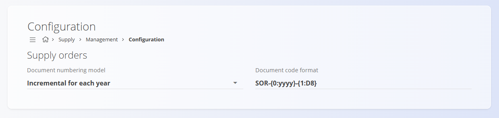

<!-- app_route: /management/supply/configuration -->
<!-- app_label: Supply configuration -->
<!-- canonical_source_url: https://github.com/Tom-PIT/Connected.Docs/blob/main/en/Domains/Supply/Management/SupplyConfiguration.md -->
<!-- canonical_source_title: Supply configuration -->

# Supply configuration

Configure **Supply** settings affecting document numbering. Any changes are saved automatically.

To access this page, go to **Supply / Management / Configuration** in the [navigation](../../../Common/UI/Navigation.md).

## Document numbering settings

Choose the numbering model and format for [**Supply orders**](../Documents/SupplyOrders.md).

| Field | Description |
|-------|-------------|
| **Document numbering model** | • **Incremental for each year:** sequence resets annually.   • **Incremental:** a global sequence that never resets. |
| **Document code format** | Pattern defining structure (e.g., PREFIX‑YEAR-NUMBER). |
