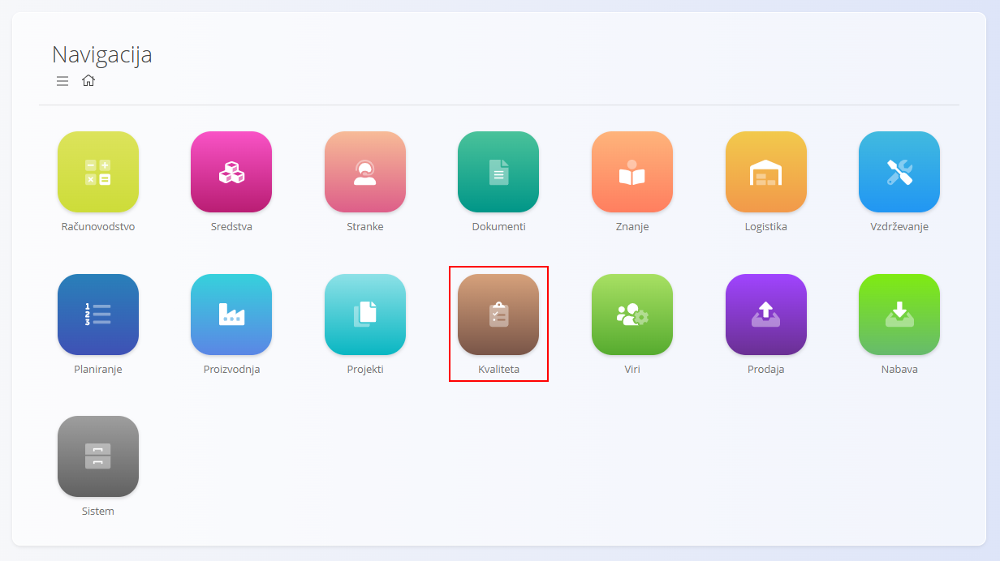
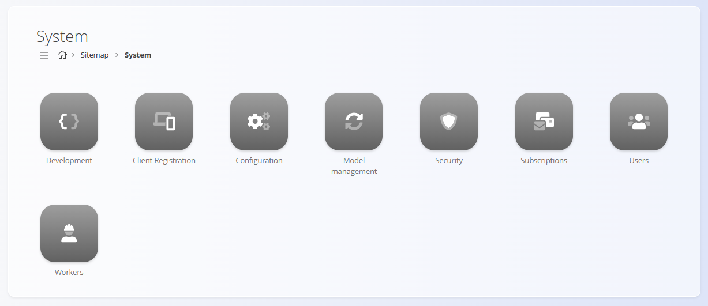

<!-- app_route: /sitemap/system -->
<!-- app_label: System domain -->
<!-- canonical_source_url: https://tom-pit.github.io/Connected.Docs/en/Domains/System/ -->
<!-- canonical_source_title: System domain -->

# System

The **System** domain contains administrative tools used to configure, secure, and maintain the platform.

Unlike operational domains such as **Sales**, **Supply**, or **Production**, the System domain is primarily intended for administrators and advanced users responsible for system setup, user management, integrations, and global configuration.

To access this domain, navigate to **System** from the sitemap.

> [!NOTE]
> Available options depend on the enabled modules, installed extensions, and user permissions.

## What is included in the System domain?

The System domain is organized into several administrative areas:

* **[Configuration](#configuration)** – global system and organizational settings
* **[Users](#users)** – user accounts and access management
* **[Security](#security)** – authentication and access control
* **[Subscriptions](#subscriptions)** – licensing and subscription management
* **[Client registration](#client-registration)** – registration and identification settings
* **[Development](#development)** – technical and developer-focused tools
* **[Workers](#workers)** – background processing and system services

## Configuration

The **Configuration** area contains settings that affect the behavior of the entire platform.

Examples include:

* Organizational information
* Default country and currency
* Warehouse settings
* Fiscalization settings
* Connectivity and integration settings
* Localization options

Available configuration entries may vary depending on installed modules and country-specific requirements.

See:

* [**Configuration**](Settings/Configuration.md)
* [**Warehouse configuration**](Settings/WarehouseConfiguration.md)
* [**Sales Retail SI Settings**](Settings/SalesRetailsSISettings.md)

## Users

The [**Users**](Management/Users.md) section manages access to the platform.

Administrators can:

* Create user accounts
* Assign roles and permissions
* Manage user status
* Configure localization settings

## Security

The **Security** section contains authentication and authorization settings used to protect access to the platform and its data.

Available options depend on the deployment model and enabled security features.

## Subscriptions

The **Subscriptions** section contains licensing and subscription-related information used to manage access to platform features and services.

## Client registration

Client registration contains settings and information related to system registration and identification.

Available options may vary depending on deployment and licensing requirements.

## Development

The **Development** section contains technical tools intended for developers, consultants, and advanced administrators.

These tools are typically used during implementation, customization, troubleshooting, and integration activities.

## Workers

The **Workers** section provides information about background services and automated processes executed by the platform.

Depending on configuration, these services may be responsible for:

* Scheduled tasks
* Notifications
* Synchronization jobs
* Integration processing
* Other automated operations

## System and Other Domains

The System domain supports all other domains throughout the platform.

| Area            | Interaction                                                          |
| --------------- | -------------------------------------------------------------------- |
| [**Sales** ](../Sales/README.md)      | Supplies fiscalization, organization, and user settings.             |
| [**Supply** ](../Supply/README.md)     | Provides warehouse and integration settings.                         |
| [**Production**](../Production/README.md)  | Supplies user, localization, and system-wide configuration.          |
| [**Maintenance**](../Maintenance/README.md) | Provides access control and shared configuration.                    |
| [**Resources**](../Resources/README.md)   | Uses users, roles, and localization settings.                        |

The System domain acts as the administrative foundation of the platform and supports the operation of all business processes.
