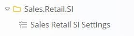
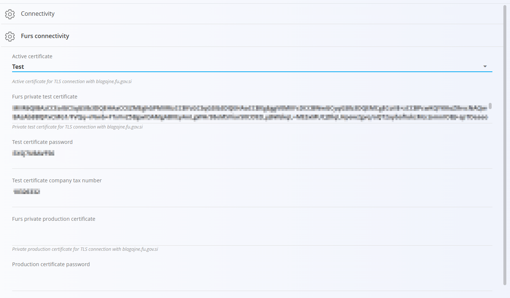

<!-- app_route: /management/configuration -->
<!-- app_label: Configuration -->
<!-- app_navigation_hint: Open **Configuration** in the main navigation, then open **Sales Retail SI Settings**. -->
<!-- canonical_source_url: https://tom-pit.github.io/Connected.Docs/en/Domains/System/Settings/SalesRetailsSISettings/ -->
<!-- canonical_source_title: Sales Retail SI Settings -->

# Sales Retail SI Settings

The **Sales Retail SI Settings** are used to configure the connection with the **FURS (Financial Administration of the Republic of Slovenia)** for fiscalization of retail invoices.

These settings enable the system to send tax-relevant data for [retail issued invoices](../../Sales/Documents/RetailIssuedInvoices.md) to FURS.

To access these settings, navigate to **System / Configuration/ Sales.Retail.SI / Sales Retail SI Settings**.

> [!NOTE]
> The **SI** suffix indicates that these settings apply to **Slovenia**.  
> If another country is selected (e.g. Croatia), the available settings may differ according to local fiscalization requirements.

## Overview

Fiscalization requires a secure connection to FURS using **digital certificates**. These certificates are issued by FURS and are required to authenticate the company when submitting invoice data.

More information about certificates and technical specifications is available on the official [FURS portal](https://edavki.durs.si/EdavkiPortal/OpenPortal/CommonPages/Opdynp/PageD.aspx?category=dpr_teh_spec). 

## Certificates

The configuration includes two types of certificates:

- **Test** – sends data to the FURS test system  
- **Production** – sends data to the live FURS system  

Switching this option changes where fiscal data is submitted.

## Schema

| Field | Description |
|------|-------------|
| **Active certificate** | Defines which environment is used for connection to FURS:  • **Test** – sends data to the test system  • **Production** – sends data to the live system |
| **FURS private test certificate** | Digital certificate used for connection to the FURS test environment |
| **Test certificate password** | Password for accessing the test certificate |
| **Test certificate company tax number** | Company tax number used in the test environment |
| **FURS private production certificate** | Digital certificate used for connection to the FURS production environment |
| **Production certificate password** | Password for accessing the production certificate |
| **Automatic FURS confirmation** | If enabled, invoices are automatically sent to FURS when issued |

