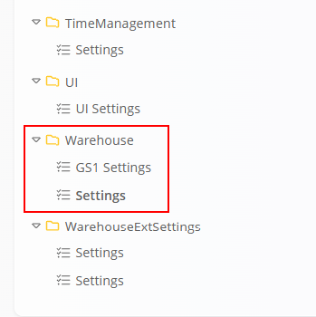
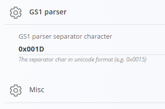
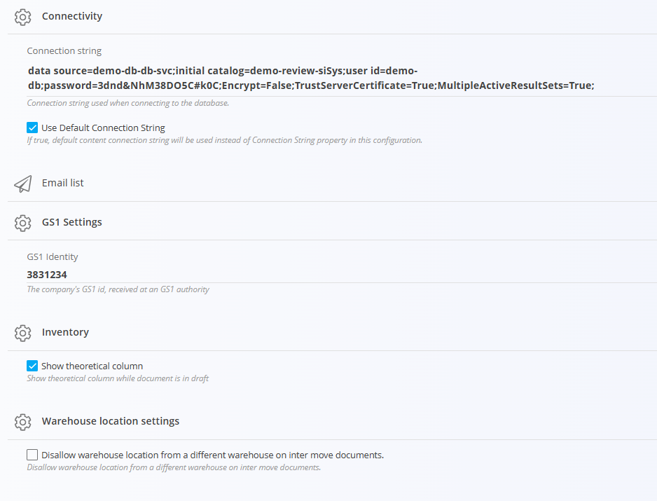

<!-- app_route: /management/configuration -->
<!-- app_label: Configuration -->
<!-- canonical_source_url: https://tom-pit.github.io/Connected.Docs/en/Domains/System/Settings/WarehouseConfiguration/ -->
<!-- canonical_source_title: Warehouse configuration -->

# Warehouse configuration

Warehouse configuration settings allow you to customize how the system handles various warehouse operations, such as inventory management and GS1 settings. These settings can be accessed and modified by navigating to **Warehouse** in the sidebar menu.

## GS1 settings

The GS1 parser configuration defines how the system interprets GS1 barcodes when scanning items during processes such as receiving or production.

### GS1 parser separator character

Specifies the separator character used to split GS1 data elements (Application Identifiers) within a scanned barcode. This character is used to detect the end of variable-length fields (such as batch/lot number).

> [!IMPORTANT]
> The value must be entered in Unicode (hexadecimal) format (e.g. **0x001D**).

To enter GS1 identification details go to **Warehouse / Settings / GS1 settings** in the sidebar menu (see below).

## Settings

Warehouse settings allow you to configure key application parameters, including database connectivity, GS1 identification, inventory behavior, and warehouse rules.

### Email list

Use this section to define email-related configurations (e.g. recipients for notifications or system messages).

### GS1 Settings

Configures GS1 identification used for barcode generation and parsing.

- **GS1 Identity** – The company’s GS1 prefix assigned by a GS1 authority.
This value is used when generating GS1-compliant codes such as:
	- GTIN (product codes)
	- SSCC (logistics units)

### Inventory

- **Show theoretical column** – When enabled, displays the theoretical quantity column while the document is in draft status.

### Warehouse location settings

- **Disallow warehouse location from a different warehouse on inter move documents** – Prevents selecting locations that belong to a different warehouse when creating [inter-warehouse](../../Logistics/Documents/InterWarehouse.md) movement documents.

