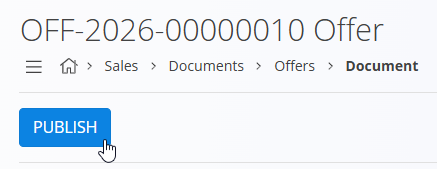
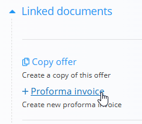
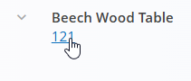
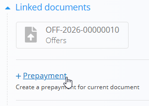
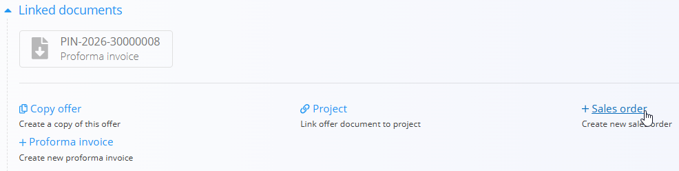
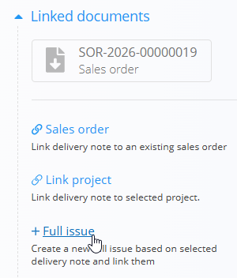
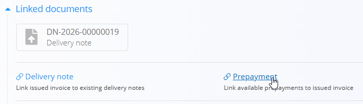
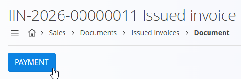

<!-- canonical_source_url: https://github.com/Tom-PIT/Connected.Docs/blob/main/en/GettingStarted/02.SalesProcessWithPrepayment.md -->
<!-- canonical_source_title: Sales process (with prepayment) -->

# Sales process (with prepayment)

This guide walks through a typical sales process including a prepayment step. Use links for details; do not duplicate configuration here.

> [!TIP]
> Follow this guide step‑by‑step to configure the platform. Use the links to open each code list or setting if you need further details, then return to this page to continue with the next step.

> [!NOTE]
> Inventory movement occurs at **Issue**. **Prepayment** and **Issued invoice** record financial transactions.

## Steps

<!-- app_route: /sales/documents/offers -->
<!-- app_label: Sales offers -->

### 1. Create and publish a sales offer

Create a commercial offer to confirm prices, quantities, and validity with the customer.

1. Go to **Sales / Documents / Offers**.
2. Use the [action button](../Common/UI/ActionButton.md) to create a draft [offer](../Domains/Sales/Documents/Offers.md).
3. Fill **Customer**, **Expiration date**, and add items in the **Details** section.
4. Fill any optional fields as needed.
5. Click **Publish** to confirm the document.

   

<!-- app_route: /sales/documents/proforma-invoices -->
<!-- app_label: Proforma invoices -->

### 2. Create a proforma invoice

Turn the agreed offer into a proforma to request an advance and share payment details.

1. From the committed offer, use **Linked documents → [**+ Proforma invoice**](../Domains/Sales/Documents/ProformaInvoices.md)**.

   

2. Adjust **Reference type**, **Organization bank account**, **Validity date**, and any other optional fields as needed.
3. Adjust product quantities according to how much the customer has agreed to pay in advance. Click a product line to open its edit section and set the quantity that will be prepaid; totals update accordingly.

   

4. Click **Publish**.

<!-- app_route: /sales/documents/prepayments -->
<!-- app_label: Prepayments -->

### 3. Record a prepayment (partial or full)

Record the customer’s advance so the order is financially covered before delivery.

1. From the committed proforma invoice, use **Linked documents → [+ Prepayment](../Domains/Sales/Documents/Prepayments.md)**.

   

2. Fill: 
    1. **Due date**
    2. **Reference type/number**
    3. **Organization bank account**
    4. **Payment method**
3. Review that prepayment lines and amounts match the proforma quantities set in [Step 2 - Create a proforma invoice](#2-create-a-proforma-invoice).
4. Click **Publish** to commit the prepayment.

<!-- app_route: /sales/documents/sales-orders -->
<!-- app_label: Sales orders -->

### 4. Create a sales order

Create a sales order to reserve stock and plan fulfillment.

1. Go back to the previously committed offer, and use **Linked documents → [+ Sales order](../Domains/Sales/Documents/SalesOrdersCreate.md)**.

   

2. Confirm quantities and delivery details and click **Publish**.

<!-- app_route: /production-orders -->
<!-- app_label: Production orders -->

### 4a. Restock or produce (if needed)

If items are unavailable, see **[Restock or produce](05.RestockOrProduce.md)** for options to procure or manufacture before delivery.

For production companies, a quick way to create a production order is from the published sales order: 
- **Linked documents → [**+ Production order**](../Domains/Production/Documents/ProductionOrderCreate.md)**

This creates a Production order draft that can be committed later in the **[Production domain](../Domains/Production/ProductionDomain.md)**.

<!-- app_route: /sales/documents/delivery-notes -->
<!-- app_label: Delivery notes -->

### 5. Deliver goods

The sales order is ready; prepare the shipment and move stock out of the warehouse.

Follow these operational steps to move stock out of the warehouse:

1. From the sales order, open **Linked documents → [+ Delivery note](../Domains/Sales/Documents/DeliveryNotes.md)**.  
   Verify customer, delivery address, and add the items to be shipped. You can adjust quantities if only part of the order is being delivered.
2. In the delivery note, open **Linked documents → [+ Full issue](../Domains/Logistics/Documents/Issues.md)**.

   

   Select the warehouse and location(s), confirm quantities to pick.
3. Click **Publish** to commit the issue.  
   This moves stock out of our warehouse and updates inventory balances.
4. (Optional) Verify the change in **[Stock view by location](../Domains/Logistics/Views/StockViewByLocation.md)**.

<!-- app_route: /sales/documents/issued-invoices -->
<!-- app_label: Issued invoices -->

### 6. Issue the final invoice and apply prepayment

Issue the final invoice for delivered goods, apply the prepayment, and collect any balance.

1. From the delivery note or the sales order, open **Linked documents → [+ Issued invoice](../Domains/Sales/Documents/IssuedInvoicesCreate.md)**.
2. Link the previously recorded prepayment via **Linked documents → [Prepayment](../Domains/Sales/Documents/Prepayments.md)** to reduce the due amount.

   

3. Review the final totals and add **Payment methods** if needed.
4. Click **Publish** and record remaining payments via the **Payment** button to complete the transaction.

   

> [!TIP]
> - Use **Linked documents** to step through each stage and confirm auto-filled data (customer, items).
> - Open **[Company cards](../Domains/Sales/Views/CompanyCards.md)** to review customer history, orders, and balances.