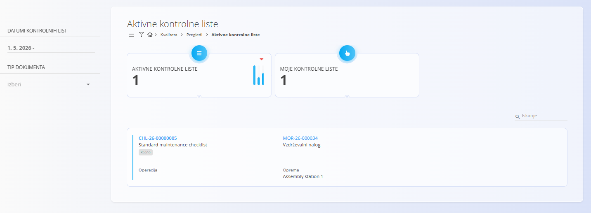
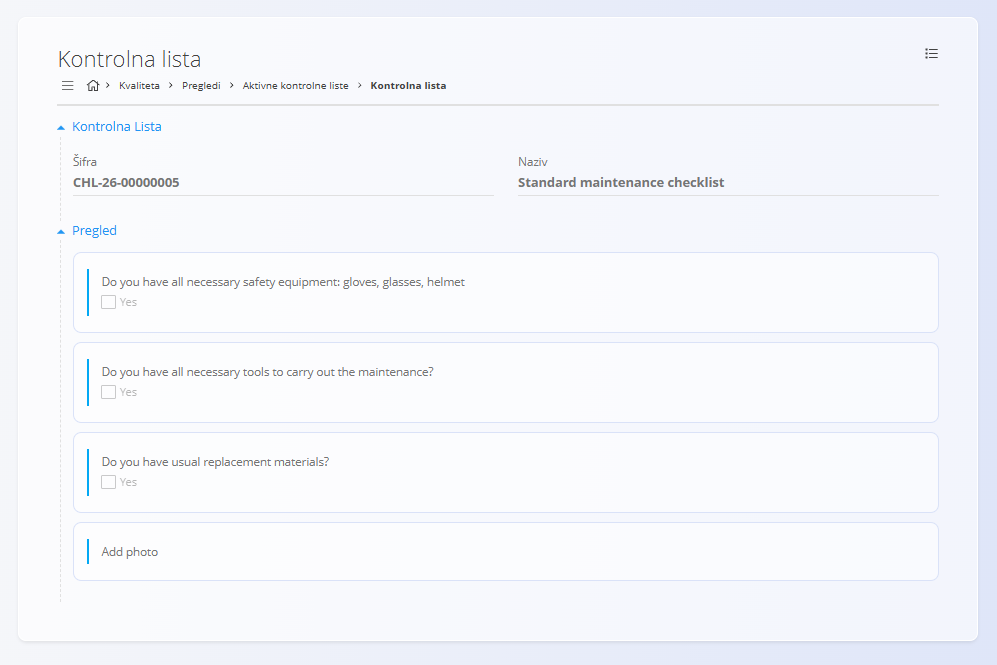

<!-- app_route: /quality/views/active-checklists -->
<!-- app_label: Aktivne kontrolne liste -->
<!-- canonical_source_url: https://tom-pit.github.io/Connected.Docs/sl/Domene/Kvaliteta/Pregledi/AktivneKontrolneListe/ -->
<!-- canonical_source_title: Aktivne kontrolne liste -->

# Aktivne kontrolne liste

Pogled **Aktivne kontrolne liste** prikazuje vsa izvajanja kontrolnih list, ki so trenutno v teku. Operaterji ga uporabljajo za spremljanje in dokončanje tekočih nalog kakovosti ali vzdrževanja. Ko je kontrolna lista zaključena, se v tem pogledu ne prikazuje več in se premakne v pogled Zaključene kontrolne liste.

Za dostop do tega pogleda se pomaknite na **Kvaliteta / Pogledi / Aktivne kontrolne liste** v [navigaciji](../../../Skupno/UI/Navigacija.md).

### Pregled

Ta pogled ponuja seznam vseh trenutno aktivnih (nedokončanih) kontrolnih list v realnem času. Namenjen je osebju v proizvodnji, vzdrževalnemu osebju in nadzornikom za hiter pregled, katere kontrolne liste zahtevajo pozornost.

## Shema

| Polje | Opis |
|------|------|
| **Kontrolna lista** | Šifra in ime kontrolne liste, ki se izvaja; prikazuje trenutno fazo prek statusne oznake (npr. Na začetku). |
| **Dokument** | Vrsta in koda izvornega dokumenta: [Proizvodni nalog](../../Proizvodnja/Dokumenti/ProizvodniNalogi.md) ali [Vzdrževalni nalog](../../Vzdrzevanje/Dokumenti/VzdrzevalniNalogi.md). |
| **Operacija** | Šifra in ime operacije, povezane z izvajanjem kontrolne liste. |
| **Izdelek** | Ime in koda izdelka, povezana z operacijo (v proizvodnih kontekstih). |
| [**Organizacijska enota**](../../Proizvodnja/Upravljanje/OrganizacijskeEnote.md) | Enota, odgovorna za izvajanje (npr. Montaža, Elektro vzdrževanje). |
| **Oprema** | Prikazano za kontrolne liste, povezane z vzdrževanjem; oprema, ki se vzdržuje ali preverja. |

## Seznam aktivnih kontrolnih list

Na vrhu strani dva kazalnika povzemata trenutno stanje:
- **Aktivne kontrolne liste** — skupno število aktivnih izvajanj kontrolnih list.
- **Moje kontrolne liste** — število aktivnih izvajanj kontrolnih list, dodeljenih trenutno prijavljenemu uporabniku.

## Filtri

Uporabite filtre za zoženje seznama:
- **Datumi kontrolnih list** — filtriranje po datumu začetka, roku ali časovnem obdobju aktivnosti.
- **Tip dokumenta** — omejitev rezultatov na določen izvorni dokument:
  - [Vzdrževalni nalog](../../Vzdrzevanje/Dokumenti/VzdrzevalniNalogi.md)
  - [Proizvodni nalog](../../Proizvodnja/Dokumenti/ProizvodniNalogi.md)

## Interakcije vrstic

- Kliknite **šifro kontrolne liste**, da odprete izvajanje kontrolne liste na strani [Pregled kontrolne liste](#podrobnosti-kontrolne-liste).
- Kliknite **šifro dokumenta**, da odprete povezani dokument:
  - [Proizvodni nalog](../../Proizvodnja/Dokumenti/ProizvodniNalogi.md), kadar je vrsta dokumenta Proizvodni nalog
  - [Vzdrževalni nalog](../../Vzdrzevanje/Dokumenti/VzdrzevalniNalogi.md), kadar je vrsta dokumenta Vzdrževalni nalog
- Kliknite **šifro operacije**, da odprete stran [Izvedba](../../Proizvodnja/Dokumenti/Izvedba.md), osredotočeno na trenutno izvajanje.

## Podrobnosti kontrolne liste

Stran za pregled kontrolne liste prikazuje trenutno **šifro** in **ime** kontrolne liste, nato pa pregled kontrolnih točk.

Tipična postavitev vključuje seznam kontrolnih točk z zahtevanimi vnosi (potrditve, meritve, tolerance).

## Meni

Meni omogoča dodatna dejanja, ki so na voljo na tej strani.

Na voljo sta naslednji dejanji:

- **Tiskanje**
- **Izvoz PDF in CSV**

Za podrobnosti o dejanjih menija glejte [**Dejanja menija**](../../../Skupno/Koncepti/MeniDejanja.md).

