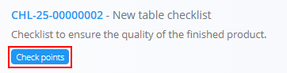
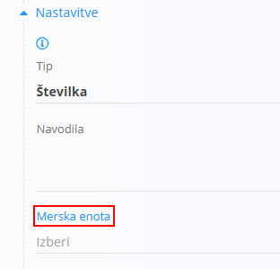

<!-- app_route: /management/check-lists -->
<!-- app_label: Kontrolne liste -->
<!-- canonical_source_url: https://github.com/Tom-PIT/Connected.Docs/blob/main/sl/Domene/Proizvodnja/Upravljanje/KontrolneTocke.md -->
<!-- canonical_source_title: Kontrolne točke -->

# Kontrolne točke

Kontrolne točke pripadajo posamezni **[Kontrolni listi](KontrolneListe.md)** in določajo posamezne korake, kontrole ali preverjanja, ki jih morajo izvajalci opraviti med proizvodnjo ali preverjanjem kakovosti. Zagotavljajo dosledno izvajanje procesa ter omogočajo strukturirano zbiranje podatkov za sledenje, revizije in poročanje.

Za dostop do kontrolnih točk pojdite na **Kakovost / Upravljanje / Kontrolne liste** v [navigaciji](../../../Skupno/UI/Navigacija.md) in pri želenem kontrolnem seznamu kliknite **Kontrolne točke**.

> [!TIP]
> Za celovit prikaz si oglejte video vodič **[Kontrolne točke kakovosti](https://www.youtube.com/watch?v=EB7WktBCFC4)**.

## Shema

| Polje | Opis |
|------|------|
| [**Šifra**](../../../Skupno/UI/SifreDokumentov.md) | Sistemsko generiran enolični identifikator kontrolne točke. |
| **Naziv** | Naziv kontrolne točke (obvezno). |
| **Opis** | Dodatne podrobnosti ali kontekst kontrolne točke. |
| **Vrstni red** | Številka, ki določa zaporedje kontrolne točke znotraj kontrolnega seznama. |
| **Kategorija** | Neobvezna razvrstitev za združevanje ali filtriranje kontrolnih točk. |
| **Neobvezno** | Določa, ali je kontrolno točko dovoljeno preskočiti med izvajanjem. |
| **Tip** | Določa vrsto vnosa izvajalca: • **Besedilo** – prosti besedilni vnos • **[Označi](#tip-označi)** – potrditveno polje (da / ne) • **Priponka** – zahteva nalaganje datoteke (slika, PDF …) • **[Seznam](#tip-seznam)** – izbor ene ali več vrednosti s seznama • **[Številka](#tip-številka)** – številčni vnos |
| **Navodila** | Dodatna navodila, prikazana izvajalcu med izvajanjem kontrole. |

## Seznam kontrolnih točk

Seznam prikazuje vse kontrolne točke, povezane z izbranim kontrolnim seznamom, razvrščene po **Vrstnem redu**.

Za iskanje uporabite iskalno polje, ki omogoča filtriranje po nazivu ali šifri.

## Dodati novo kontrolno točko

1. Kliknite **[akcijski gumb](../../../Skupno/UI/AkcijskiGumb.md)** v spodnjem desnem kotu.  
2. Izpolnite polja, opisana v shemi:  
   - **Naziv** (obvezno)  
   - **Opis** (neobvezno)  
   - **Vrstni red** – določa zaporedje v kontrolnem seznamu  
   - **Kategorija** – po potrebi  
   - **Neobvezno** – označite, če kontrolna točka ni obvezna  
   - **Tip** – izberite vrsto vnosa  
   - **Navodila** – navodila za izvajanje kontrole  

   

3. Kliknite **Dodaj**, da shranite kontrolno točko.

> [!NOTE]
> Nekaj posebnosti se lahko pojavijo glede na izbran **Tip**. Glejte [Posebnosti glede na tip](#posebnosti-glede-na-tip)

## Urediti kontrolne točke

1. Izberite kontrolno točko s seznama.  
2. Spremenite poljubno polje, vključno s **Tipom**, **Kategorijo** ali **Navodili**.  
3. Kliknite **Shrani**.

## Izbrisati kontrolne točke

Kontrolne točke je mogoče brisati, razen če je to omejeno z nastavitvami delovnega toka. Za odstranitev odprite kontrolno točko in kliknite **Izbriši**.

## Posebnosti glede na tip

Določena polja se prikažejo ali postanejo obvezna glede na izbran **Tip**.

### Tip: Označi

Pri izbiri tipa **Označi** se prikaže dodatno polje:

| Atribut | Tip | Opis |
|----------|------|------|
| **Potrditveno besedilo** | Text | Besedilo, prikazano ob potrditvenem polju. |

### Tip: Seznam

Pri izbiri tipa **Seznam** se prikažejo dodatne nastavitve:

| Atribut | Tip | Opis |
|----------|------|------|
| **Število veljavnih vrednosti** | Dropdown | Določa ali je možna izbira **Ena** ali **Več** vrednosti. |

Uporabnik lahko dodaja vrednosti seznama:

- Klik na **Dodaj novo vrednost** odpre vnos:
  - **Besedilo**
  - **Veljavno** (checkbox)

- Klik na **Dodaj** shrani vrednost v seznam

Dodane vrednosti so prikazane v tabeli:
- **Besedilo**
- **Veljavno**

### Tip: Številka

Pri izbiri tipa **Številka** se prikažejo dodatna polja:

| Atribut | Tip | Opis |
|----------|------|------|
| **Merska enota** | Dropdown | Izbira merske enote. |
| **Najmanjša vrednost** | Number | Najnižja dovoljena vrednost. |
| **Privzeta vrednost** | Number | Privzeta vrednost za kontrolno točko. |
| **Največja vrednost** | Number | Najvišja dovoljena vrednost. |

> [!NOTE]
> Na voljo je povezava do zaslona za upravljanje [**Merske enote**](../../../Skupno/Upravljanje/MerskeEnote.md), kjer lahko dodajate ali urejate merske enote.
>
> 