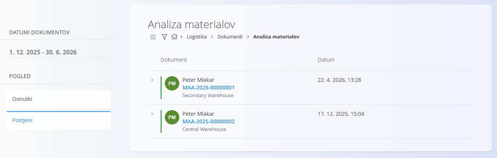
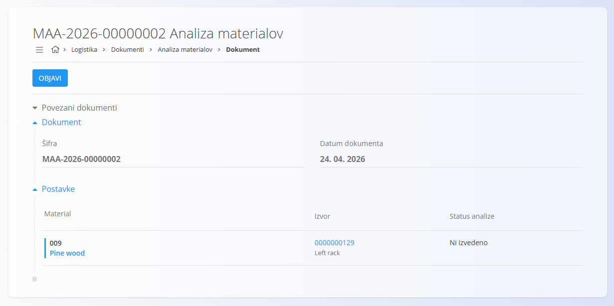
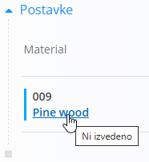
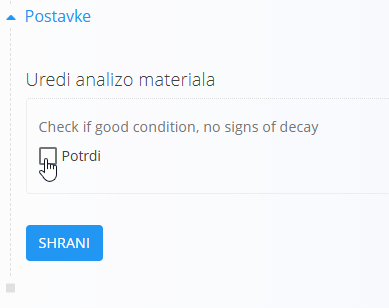
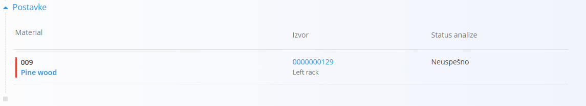
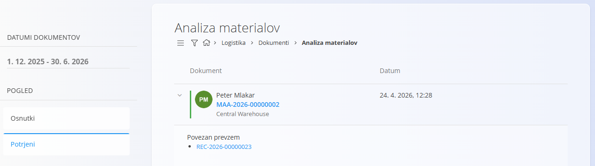

<!-- app_route: /warehouse/documents/material-analysis --> 
<!-- app_label: Analiza materialov --> 
<!-- canonical_source_url: https://tom-pit.github.io/Connected.Docs/sl/Domene/Logistika/Dokumenti/AnalizaMaterialov/ --> 
<!-- canonical_source_title: Analiza materialov -->

# Analiza materialov

Dokumenti **Analiza materialov** prikazujejo materiale, ki so bili prevzeti in za katere je potrebno izvesti analizo ali testiranje na podlagi pravil, nastavljenih v **[Upravljanje analize materialov](../Upravljanje/AnalizaMaterialov.md)**. Ta zaslon uporabite za pregled zahtevanih preverjanj, označevanje uspešnosti analiz ter objavo rezultatov.

> [!NOTE]
> Dokumenti analize materialov se ustvarijo samodejno ob prevzemu materialov, za katere je v **Upravljanje analize materialov** nastavljena zahteva za analizo.

> [!TIP]
> Za celovit prikaz si oglejte video vodič **[Analiza materialov](https://www.youtube.com/watch?v=aJhceUVcusw)**.

Za dostop do **Analize materialov** pojdite na **Logistika / Dokumenti / Analiza materialov** v [navigaciji](../../../Skupno/UI/Navigacija.md).

## Shema

| Polje | Opis |
|-------|------|
| [**Šifra**](../../../Skupno/UI/SifreDokumentov.md) | Sistemsko generiran enolični identifikator dokumenta analize materialov. |
| **Datum dokumenta** | Datum, ko je bil dokument analize ustvarjen. |
| [**Material**](../../Sredstva/Materiali/README.md) | Material v analizi (kot je določen s prevzemom in konfiguracijo analize). |
| **Izvor** | Serijska številka prevzetega materiala. |
| **Status analize** | Stanje analize: **Ni nastavljeno**, **Uspešno**, ali **Neuspešno**. |

## Seznam analiz materialov

Seznam prikazuje vse dokumente **Analize materialov**, ustvarjene ob prevzemu materialov, za katere je zahtevana analiza. Uporabite iskalnik ali filtre za iskanje po stanju.

## Pregled analize materialov

1. Kliknite dokument v pogledu **Osnutki**, da ga odprete.
   
   

2. Kliknite polje **Material**, da izberete material za testiranje (če je navedenih več materialov).
   
   

3. Kliknite gumb **Preveri**, da označite uspešno opravljen test za izbrani material, nato kliknite **Shrani**.  
   Stanje **Status** se spremeni v **Uspešno**, material pa je v seznamu označen z zeleno barvo.
   
   

   - Če test **ni uspešen**, pustite preverjanje neoznačeno in kliknite **Shrani**. Stanje se spremeni v **Neuspešno**, material pa je v seznamu označen z rdečo barvo. Če je dokument objavljen, bo na seznamu potrjenih prikazan kot neuspešen.

     

4. Ko so vsa zahtevana preverjanja zaključena, kliknite **Objavi**, da dokončate dokument analize materialov. Dokument se premakne v pogled **Potrjeni**.

    

## Izbrisati analize materialov

Dokumentov analize materialov **ni mogoče izbrisati**.
