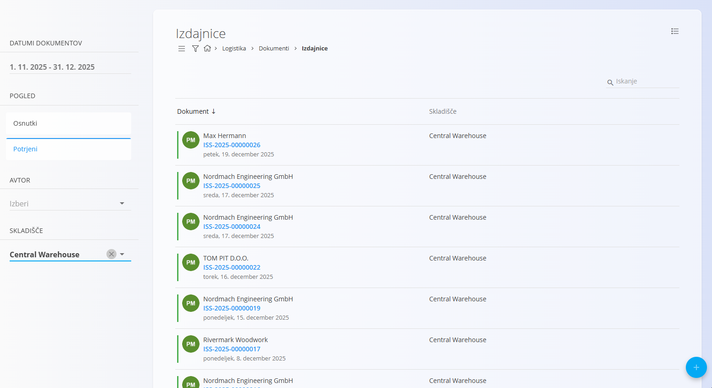
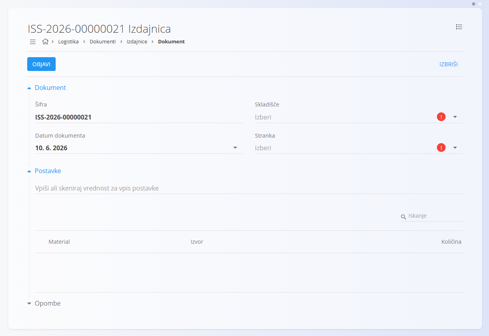
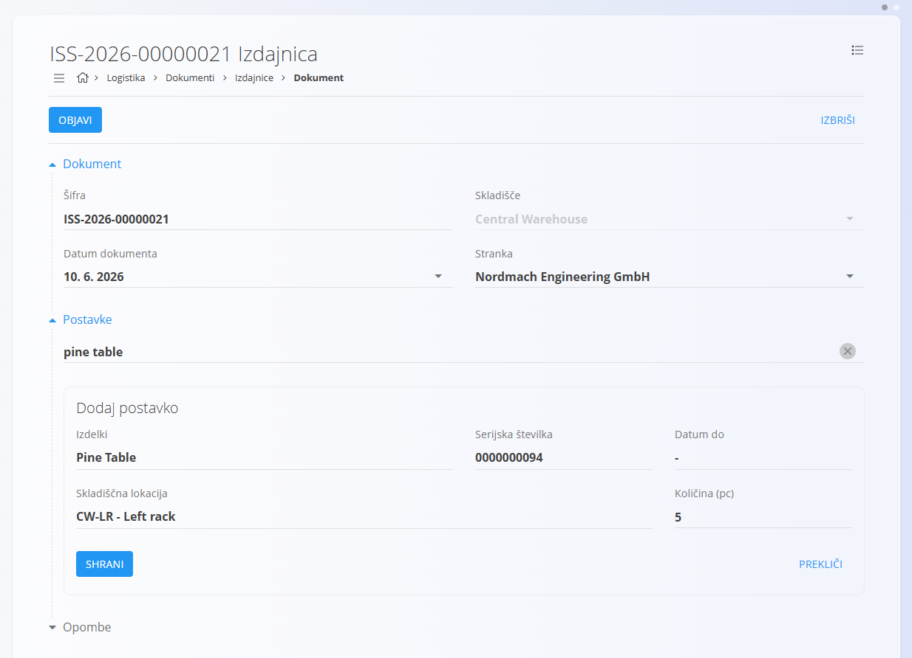
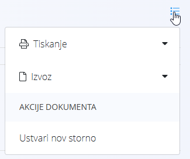
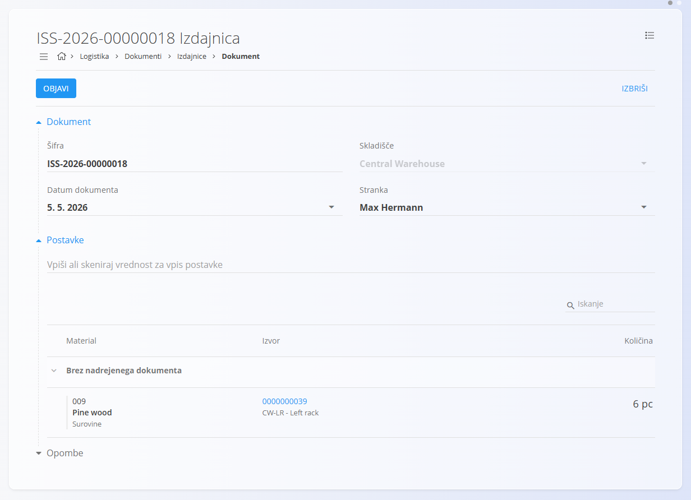

<!-- app_route: /warehouse/documents/issues --> 
<!-- app_label: Izdajnice --> 
<!-- canonical_source_url: https://github.com/Tom-PIT/Connected.Docs/blob/main/sl/Domene/Logistika/Dokumenti/Izdajnice.md --> 
<!-- canonical_source_title: Izdajnice -->

# Izdajnice

Dokument **Izdajnica** se uporablja za evidentiranje blaga, ki zapušča skladišče, na primer ob dobavi kupcu. Ko končni izdelki, materiali ali pakirani artikli zapustijo skladišče v okviru prodajne ali interne izdaje, izdajnica zajame vse relevantne podatke. Primeri vključujejo:
- izdajo **pohištva kupcu**
- **dobavo rezervnih delov**
- **izdajo pakiranega blaga** v okviru prodajnega naročila

Med postopkom izdaje poiščete ali skenirate postavke, ki jih želite izdati, potrdite pravilne serijske številke ali serije ter vnesete količine. To zagotavlja natančno posodobitev zaloge in popolno sledljivost vsake izdaje.

> [!TIP]
> Za celovit prikaz si oglejte video vodič **[Izdajnice](https://www.youtube.com/watch?v=SrVyblBiLmQ)**.

Za dostop do **Izdajnic** pojdite na **Logistika / Dokumenti / Izdajnice** v [navigaciji](../../../Skupno/UI/Navigacija.md).

## Shema

<strong>Dokument</strong>

| Polje | Opis |
|------|------|
| [**Šifra**](../../../Skupno/UI/SifreDokumentov.md) | Sistemsko generiran enolični identifikator izdajnice. |
| **Datum dokumenta** | Datum ustvarjanja izdajnice. |
| [**Skladišče**](../Upravljanje/Skladisca.md) | Skladišče, iz katerega se blago izdaja (obvezno). |
| **Stranka** | Kupec, ki prejme blago, izbran iz [Poslovnega imenika](../../../Skupno/Upravljanje/PoslovniImenik.md) (obvezno). |
| **Postavke** | Dodatne postavke, povezane z dokumentom. |

<strong>Razdelek postavk</strong>

| Polje | Opis |
|------|------|
| [**Material**](../../Sredstva/Materiali.md) | Izdani material ([izdelek](../../Sredstva/Materiali/Izdelki.md), [polizdelek](../../Sredstva/Materiali/Polizdelki.md), [surovina](../../Sredstva/Materiali/Surovine.md) ali [repro material](../../Sredstva/Materiali/ReproMateriali.md)). |
| **Serijska številka** | Izbrana serijska številka izdanega materiala. |
| **Datum do** | Datum poteka (če ima material določen rok uporabe). |
| [**Skladiščna lokacija**](../Upravljanje/Lokacije.md) | Trenutna skladiščna lokacija izbrane postavke. |
| **Količina (kos)** | Količina, ki se izdaja. |

## Seznam izdajnic

Stran **Izdajnice** prikazuje vse izdajnike dokumente. Dokument lahko poiščete z iskalnikom ali uporabite filtre v levem stranskem meniju:

- **Datumi dokumentov**
- **Pogled:**  
  - *Osnutki* — dokumenti, ki še niso objavljeni  
  - *Potrjeni* — dokončni in zaklenjeni dokumenti
- **Avtor**
- **Skladišče**

Barvni indikator ob dokumentu prikazuje njegovo stanje:

- **Zelena** — objavljeno  
- **Siva** — osnutek

S klikom na dokument odprete njegov podroben pregled.

## Dejanja

### Ustvariti izdajnice

1. Kliknite [akcijski gumb](../../../Skupno/UI/AkcijskiGumb.md) za ustvarjanje osnutka dokumenta, nato izberite **Skladišče** in **Kupca**.

   

2. V razdelek postavk vnesite ali skenirajte **serijsko številko**, **EAN šifro** ali **ime materiala**.  
   - Sistem prikaže **vse ujemajoče materiale in serijske številke**.
3. Iz seznama rezultatov izberite ustrezno postavko.
4. Sistem samodejno izpolni vse znane podatke (material, serijska številka, lokacija, rok uporabe).  

   

5. Vnesite **količino**, ki jo želite izdati — to je edino polje, ki ga lahko ročno urejate.  

   Za informacije o delu s postavkami dokumenta glejte [**Postavke dokumenta**](../../../Skupno/Koncepti/PostavkeDokumenta.md).

6. Kliknite **Shrani**, da dodate postavko v dokument. Po potrebi dodajte nove postavke (ponovite korak 2).
7. Kliknite **Objavi**, da dokument dokončno potrdite.

Novo ustvarjena izdajna se prikaže v pogledu **Osnutki**. Po objavi se premakne med **Objavljene** dokumente.

#### Priponke

Razdelek **Priponke** uporabite za nalaganje in upravljanje datotek, povezanih z dokumentom, kot so fotografije, PDF datoteke, certifikati ali podporni dokumenti.

Za podrobna navodila glejte [**Priponke**](../../../Skupno/Koncepti/Priponke.md).

#### Postavke

Vsak dokument vsebuje razdelek **Postavke**, kamor lahko vnesete dodatne komentarje ali informacije, povezane s transakcijo. Postavke se shranijo skupaj z dokumentom in so vidne tako v osnutku kot v objavljeni različici.

## Meni

V izdajnem dokumentu **meni (ikona hamburger)** v zgornjem desnem kotu ponuja različne možnosti, odvisno od stanja dokumenta.

### Osnutek izdajnice

- Tiskanje  
- Izvoz (PDF)  

### Objavljena izdajnice

- Tiskanje  
- Izvoz (PDF)  
- [**Ustvari storno**](Storno.md)

### Urediti izdajnice

Ko kliknete šifro dokumenta v seznamu izdajnih dokumentov:

- vidite razdelek **Dokument** (glava dokumenta)  
- vidite vse **Postavke** izdanega blaga  
- osnutke lahko urejate  
- dokumente lahko tiskate ali izvozite  
- objavljeni dokumenti so samo za branje (razen ustvarjanja storna)

## Izbrisati izdajnice

Osnutke je mogoče izbrisati le, če **ne vsebujejo nobenih postavk**.

Če osnutek še vsebuje postavke:

1. Kliknite serijsko številko materiala, da odprete zaslon **Uredi postavko**.  
2. Kliknite **Izbriši** v oknu urejanja.  
3. Postopek ponovite za vse preostale postavke.

Ko dokument ne vsebuje več nobene postavke, lahko kliknete **Izbriši**, da odstranite osnutek.

> [!NOTE]
> Objavljenih dokumentov **ni mogoče izbrisati** — mogoče jih je samo **stornirati**.

## Meni

Meni omogoča dodatna dejanja, ki so na voljo na tej strani.

Na voljo so naslednja dejanja:

- **Tiskanje**
- **Izvoz v PDF**
- **Izbriši postavke** (samo za osnutke)
- **Ustvari storno** (samo za objavljene dokumente)

Za podrobnosti o dejanjih menija glejte [**Dejanja menija**](../../../Skupno/Koncepti/MeniDejanja.md).
