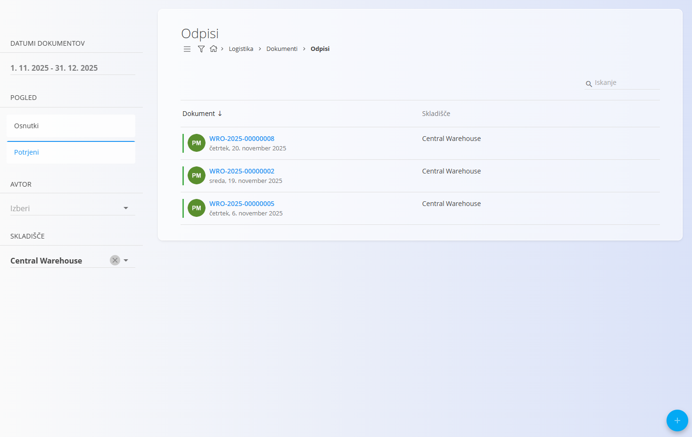
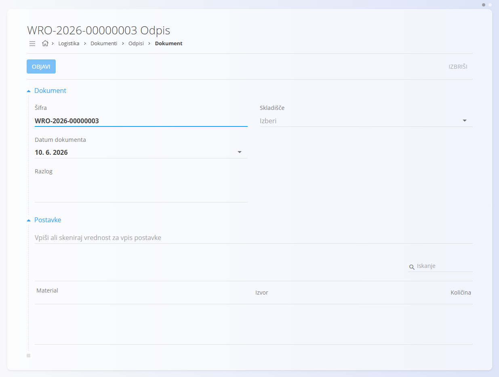
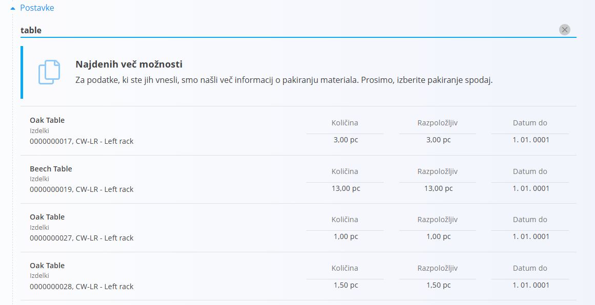
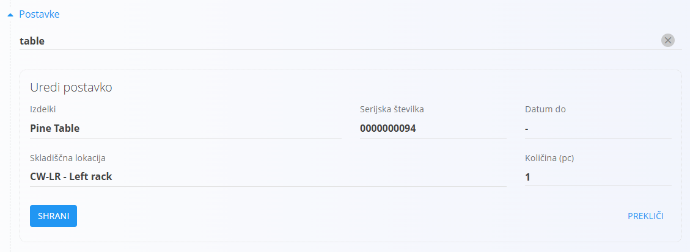

<!-- app_route: /warehouse/documents/writeoffs --> 
<!-- app_label: Odpisi --> 
<!-- canonical_source_url: https://github.com/Tom-PIT/Connected.Docs/blob/main/sl/Domene/Logistika/Dokumenti/Odpisi.md --> 
<!-- canonical_source_title: Odpisi -->

# Odpisi

Dokument **Odpis** se uporablja za evidentiranje materialov, ki jih je potrebno odstraniti iz zaloge, ker so **poškodovani**, **izgubljeni**, **pretečeni** ali kako drugače neuporabni. Tipični primeri vključujejo **zlomljene izdelke**, **pokvarjeno blago** ali **materiale, poškodovane med manipulacijo**. Odpis omogoča določitev razloga, izbiro prizadetih materialov in vnos količine, ki se odstrani iz zaloge.

Odpisi neposredno prilagodijo stanje zaloge. Če je bila odpisana napačna količina, jo je mogoče kasneje popraviti z **delnim ali celotnim stornom** prek menija povezanega dokumenta. Pred odpisom lahko uporabite tudi **[Pogled zaloge po materialu](../Pregledi/Zaloga.md#pogled-zaloge-po-materialu)** ali **[Pogled zaloge po serijski številki](../Pregledi/Zaloga.md#pogled-zaloge-po-serijski-stevilki)**, da razumete, kako je material dosegel trenutno stanje.

> [!TIP]
> Za celovit prikaz si oglejte video vodič **[Odpisi](https://www.youtube.com/watch?v=_0jEGSTorsY)**.

Za dostop do **Odpisov** pojdite na **Logistika / Dokumenti / Odpisi** v [navigaciji](../../../Skupno/UI/Navigacija.md).

## Shema

  
<strong>Dokument</strong>

| Polje | Opis |
|------|------|
| [**Šifra**](../../../Skupno/UI/SifreDokumentov.md) | Sistemsko generiran enolični identifikator dokumenta odpisa. |
| **Datum dokumenta** | Datum, ko je odpis zabeležen. |
| [**Skladišče**](../Upravljanje/Skladisca.md) | Skladišče, iz katerega se materiali odpisujejo (obvezno). |
| **Razlog** | Opis razloga za odstranitev materiala (poškodba, izguba, pretečen rok itd.). |

  
<strong>Postavke</strong>

| Polje | Opis |
|------|------|
| [**Material**](../../Sredstva/Materiali.md) | Material, ki se odpisuje ([izdelek](../../Sredstva/Materiali/Izdelki.md), [polizdelek](../../Sredstva/Materiali/Polizdelki.md), [surovina](../../Sredstva/Materiali/Surovine.md) ali [repro material](../../Sredstva/Materiali/ReproMateriali.md)). |
| **Serijska številka** | Serijska številka prizadete enote. |
| **Datum do** | Datum roka uporabe (če je relevanten). |
| [**Skladiščna lokacija**](../Upravljanje/Lokacije.md) | Lokacija, kjer je material shranjen. |
| **Količina** | Število kosov za odpis. Privzeta vrednost je celotna razpoložljiva količina na lokaciji, vendar jo je potrebno prilagoditi dejanskemu stanju. |

## Seznam dokumentov odpisa

Stran **Odpisi** prikazuje vse dokumente odpisa. 

Posamezen dokument lahko poiščete z iskalnikom ali uporabite filtre v levem stranskem meniju:

- **Datumi dokumentov**
- **Pogled**
  - *Osnutki* — ustvarjeni, a še ne objavljeni dokumenti  
  - *Potrjeni* — zaključeni odpisi
- **Avtor**
- **Skladišče**

Barvni indikator prikazuje stanje dokumenta:
- **Zelena** — objavljeno  
- **Siva** — osnutek

S klikom na dokument odprete njegov podroben pregled.

## Dejanja

### Ustvariti dokument odpisa

1. Kliknite [akcijski gumb](../../../Skupno/UI/AkcijskiGumb.md) za ustvarjanje novega dokumenta odpisa.

   

2. Izberite **Skladišče** in po potrebi vnesite **Razlog**.

3. V razdelku **Postavke** skenirajte ali vnesite **serijsko številko**, **EAN** ali **ime materiala**.
   - Če obstaja samo eno ujemanje → sistem samodejno izpolni podatke.
   - Če obstaja več ujemanj → prikaže se izbirni seznam:

     

4. Izberite pravilno postavko, da odprete okno **Uredi postavko**.

5. Prilagodite **Količino** glede na dejansko število poškodovanih ali manjkajočih kosov.

   

6. Kliknite **Shrani**, da shranite postavko. Po potrebi dodajte dodatne postavke.

7. Ko so vse postavke dodane in preverjene, kliknite **Objavi**, da zaključite odpis.

Objavljeni odpisi takoj posodobijo stanje zaloge.

### Izbrisati dokument odpisa

Osnutke dokumentov odpisa je mogoče izbrisati na zaslonu za urejanje, vendar samo, če **ne vsebujejo nobenih postavk**.

Če osnutek še vsebuje postavke:

1. Kliknite serijsko številko materiala, da odprete **Uredi postavko**.  
2. Kliknite **Izbriši** v oknu urejanja postavke.  
3. Postopek ponovite za vse preostale postavke.

Ko dokument ne vsebuje več nobenih postavk, ga lahko izbrišete.

> [!NOTE]
> Objavljenih dokumentov **ni mogoče izbrisati** — mogoče jih je samo **stornirati**.

## Meni

Meni omogoča dodatna dejanja, ki so na voljo na tej strani.

Na voljo je naslednje dejanje:

- **Ustvari storno** (samo za objavljene dokumente)

Za podrobnosti o dejanjih menija glejte [**Dejanja menija**](../../../Skupno/Koncepti/MeniDejanja.md).

