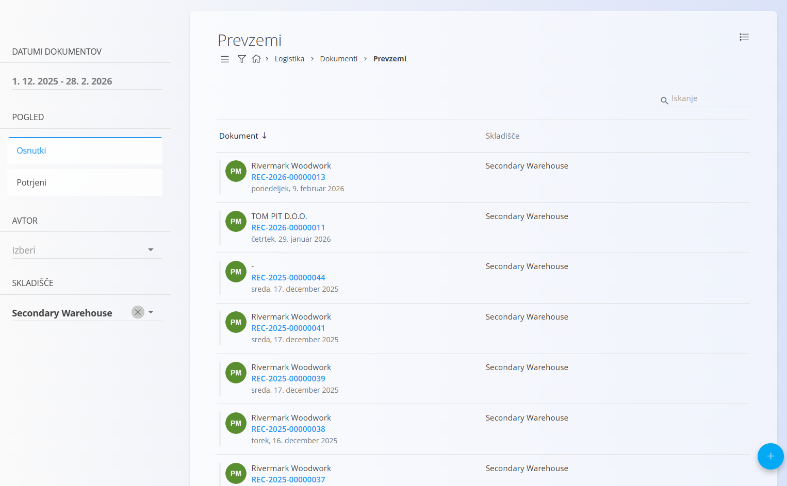
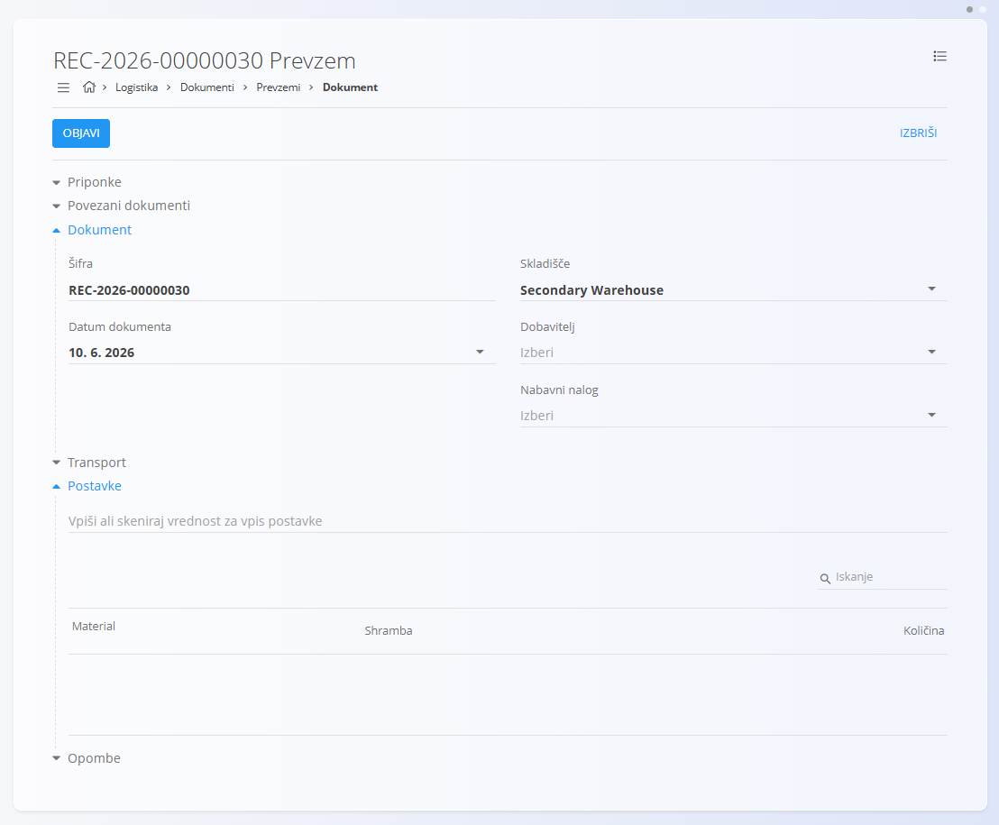
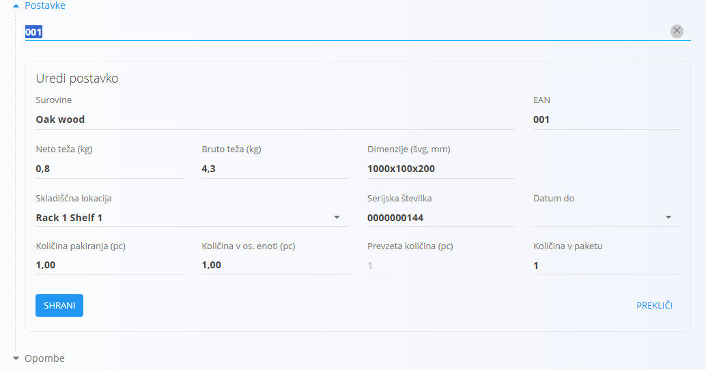
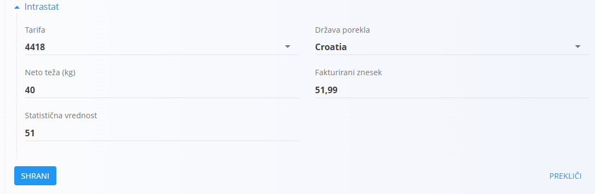
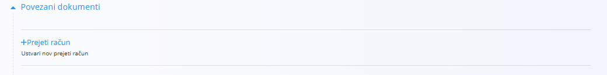
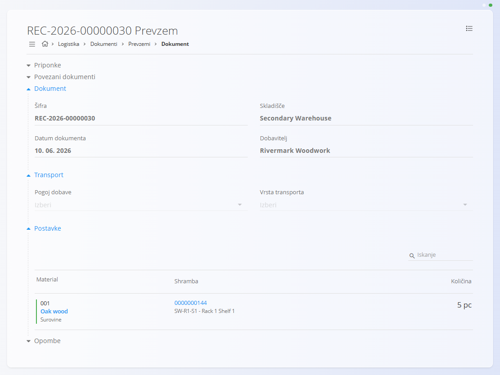

<!-- app_route: /warehouse/documents/receives --> 
<!-- app_label: Prevzemi --> 
<!-- canonical_source_url: https://github.com/Tom-PIT/Connected.Docs/blob/main/sl/Domene/Logistika/Dokumenti/Prevzemi.md --> 
<!-- canonical_source_title: Prevzemi -->

# Prevzemi

Dokument **Prevzem** se uporablja za evidentiranje prihoda materialov v skladišče. Ko blago fizično prispe od dobavitelja ali iz druge lokacije, ustvarite prevzemni dokument, s katerim ga zabeležite v sistemu. Primeri prevzemov vključujejo:
- [**Izdelke**](../../Sredstva/Materiali/Izdelki.md)  
- [**Polizdelke**](../../Sredstva/Materiali/Polizdelki.md)  
- [**Repro materiale**](../../Sredstva/Materiali/ReproMateriali.md)  
- [**Surovine**](../../Sredstva/Materiali/Surovine.md)

Postopek prevzema zajema ključne informacije, kot so material, [pakiranje](../../Sredstva/Materiali/Pakiranje.md), količina, serijske številke, rok uporabe in [skladiščna lokacija](../Upravljanje/Lokacije.md). To zagotavlja natančno stanje zaloge in popolno sledljivost materialov od trenutka vstopa v skladišče.

> [!TIP]
> Za celovit prikaz si oglejte video vodič **[Prevzemi](https://www.youtube.com/watch?v=oTOYD-nlCqE)**.

Za dostop do **Prevzemov** pojdite na **Logistika / Dokumenti / Prevzemi** v [navigaciji](../../../Skupno/UI/Navigacija.md).

## Shema

<strong>Dokument</strong>

| Polje | Opis |
|------|------|
| [**Šifra**](../../../Skupno/UI/SifreDokumentov.md) | Sistemsko generiran enolični identifikator prevzemnega dokumenta. |
| **Datum dokumenta** | Datum, ko je bilo blago fizično prevzeto. |
| [**Skladišče**](../Upravljanje/Skladisca.md) | Skladišče, v katerega se materiali prevzemajo (obvezno). |
| **Dobavitelj** | Dobavitelj blaga, izbran iz [Poslovnega imenika](../../../Skupno/Upravljanje/PoslovniImenik.md) (obvezno). |
| **Nabavni nalog** | (Neobvezno) Povezan dobavni nalog. |
| **Postavke** | Dodatne opombe, povezane z dokumentom. |

<strong>Transport in Intrastat</strong>

| Polje | Opis |
|------|------|
| [**Pogoj dobave**](../../../Skupno/Upravljanje/PogojiDobave.md) | Dogovorjeni pogoji dobave z dobaviteljem (npr. stroški in prevoz). |
| [**Vrsta transporta**](../../../Skupno/Upravljanje/VrstaTransporta.md) | Način prevoza, uporabljen za dostavo blaga (npr. cestni transport). |
| [**Država odpošiljanja**](../../../Skupno/Upravljanje/Drzave.md) | Država, iz katere je bilo blago odposlano. Ta vrednost je običajno določena na podlagi Intrastat konfiguracije materiala. |
| [**Vrsta posla**](../../Racunovodstvo/Upravljanje/Intrastat/VrstaPosla.md) | Klasifikacija vrste transakcije za Intrastat poročanje (npr. neposredna prodaja ali nakup). |
| [**Lega kraja**](../../Racunovodstvo/Upravljanje/Intrastat/LegaKraja.md) | Označuje kraj dostave blaga v skladu z Intrastat definicijami. |

<strong>Postavke</strong>

| Polje | Opis |
|------|------|
| [**Material**](../../Sredstva/Materiali.md) | Prevzeti material (izdelek, polizdelek, surovina ali repro material). |
| **EAN** | Črtna koda pakiranja ali enote. |
| **Neto teža / Bruto teža (kg)** | Podatek o teži, shranjen v sistemu ali pridobljen s skeniranjem. |
| **Dimenzije (švd, mm)** | Širina, višina in globina pakiranja. |
| [**Skladiščna lokacija**](../Upravljanje/Lokacije.md) | Lokacija, kamor bo enota shranjena. |
| **Serijska številka** | Skenirana ali generirana serijska številka. |
| **Datum do** | Datum poteka (za materiale z rokom uporabe). |
| **Količina pakiranja (kos)** | Količina, ki jo predstavlja ena pakirna enota. |
| **Količina v osnovni enoti (kos)** | Količina, izražena v osnovni merski enoti materiala. |
| **Prevzeta količina (kos)** | Dejanska prevzeta količina. |
| **Količina v paketu** | Število prevzetih paketov. |

<strong>Postavke – Intrastat</strong>

Ta razdelek je na voljo, ko je omogočeno poročanje **Intrastat** in je dobavitelj iz druge države članice EU.

| Polje | Opis |
|-------|------|
| [**Tarifa**](../../Racunovodstvo/Upravljanje/Intrastat/Tarife.md) | Intrastat tarifna oznaka materiala. |
| **Država porekla** | Država, v kateri je bilo blago proizvedeno. |
| **Neto teža (kg)** | Neto teža, uporabljena za poročanje Intrastat. |
| **Fakturirani znesek** | Vrednost blaga, prijavljena za statistične namene. |
| **Statistična vrednost** | Dodatni statistični znesek, zahtevan po nacionalnih predpisih. |

## Seznam prevzemnih dokumentov

Stran **Prevzemi** prikazuje vse prevzemne dokumente. Dokument lahko poiščete z iskalnikom ali uporabite filtre v levem stranskem meniju:

- **Datumi dokumentov**
- **Pogled:**  
  - *Osnutki* — dokumenti, ki še niso objavljeni  
  - *Potrjeni* — dokončni in zaklenjeni dokumenti
- **Avtor**
- **Skladišče**

Barvni indikator ob dokumentu prikazuje njegovo stanje:

- **Zelena** — objavljeno  
- **Siva** — osnutek

S klikom na dokument odprete njegov podroben pregled.

## Dejanja

### Ustvariti prevzemnega dokumenta

Postopek ustvarjanja novega prevzema:

1. Kliknite [akcijski gumb](../../../Skupno/UI/AkcijskiGumb.md) in izberite **Dobavitelja**.

   

2. Skenirajte ali ročno vnesite **EAN šifro pakiranja**.
   - Sistem prikaže **vse ujemajoče materiale in serijske številke**.
3. Sistem samodejno pridobi podatke o pakiranju in izpolni ustrezna polja v razdelku **Postavke**.

   

   Za informacije o delu s postavkami dokumenta glejte [**Postavke dokumenta**](../../../Skupno/Koncepti/PostavkeDokumenta.md).

4. Po potrebi prilagodite količine, skladiščne lokacije ali druge vrednosti.
5. Kliknite **Shrani**, da shranite postavko. Po potrebi dodajte nove postavke (ponovite od koraka 2).
6. Kliknite **Objavi**, da dokument dokončno potrdite.

Novo ustvarjen prevzem se prikaže med **Osnutki**. Po objavi se premakne med **Objavljene** dokumente.

#### Razdelka Transport in Intrastat

Ko je **Intrastat** nastavljen na **Obvezno** v **Sistem / Konfiguracija / Intrastat**, se v obrazcu dokumenta prejem prikažeta dodatna razdelka.

- **Transport** – Uporablja se za zajem logističnih informacij o načinu dostave blaga.
- **Intrastat** – Uporablja se za zbiranje podatkov, potrebnih za Intrastat poročanje. Ta polja so prikazana samo, kadar je Intrastat poročanje omogočeno v sistemu.

> [!NOTE]  
> Več vrednosti, povezanih z Intrastat, je prevzetih iz **šifrantov materialov** (Intrastat konfiguracija), kot sta država in vrsta posla. Ta polja niso prosto nastavljiva na ravni dokumenta in so odvisna od predhodno definiranih matičnih podatkov.

#### Intrastat polja v postavkah

Ko je **Intrastat** omogočen in je izbrani **Dobavitelj** iz druge države članice EU, se v vsaki **postavki** prikažejo dodatna polja.

Ta polja se uporabljajo za statistično poročanje Intrastat in so obvezna pri čezmejnih transakcijah znotraj EU.

#### Priponke

Razdelek **Priponke** uporabite za nalaganje in upravljanje datotek, povezanih z dokumentom, kot so fotografije, PDF datoteke, certifikati ali podporni dokumenti.

Za podrobna navodila glejte [**Priponke**](../../../Skupno/Koncepti/Priponke.md).

#### Povezavi dokumenti

Objavljeni prevzemni dokumenti vsebujejo dodatni razdelek **Povezavi dokumenti**, ki prikazuje dokumente, ki jih je mogoče ustvariti na podlagi prevzetih materialov.

Za podrobnosti o povezavah med dokumenti, sledljivosti in ustvarjanju povezanih dokumentov glejte [**Povezani dokumenti**](../../../Skupno/Koncepti/PovezaniDokumenti.md).

Pri prevzemih se lahko pojavi možnost **Razstavljanje**, ki omogoča ustvarjanje novega dokumenta razstavljanja na podlagi prevzetih postavk.

Za več podrobnosti glejte dokumentacijo [**Demontaže**](Demontaze.md).

#### Opombe

Vsak dokument vsebuje razdelek **Opombe**, kamor lahko vnesete dodatne komentarje ali informacije. Opombe se shranijo skupaj z dokumentom in so vidne tako v osnutku kot v objavljeni različici.

### Urediti dokument prevzema

Kliknite kodo dokumenta na seznamu, da odprete zaslon za urejanje. Lahko:

- Pregledate njegov razdelek **Dokument** (podatki v glavi)
- Pregledate vse **Postavke**, ki predstavljajo prejete elemente
- Uredite osnutke dokumentov
- Natisnete ali izvozite dokument

> [!NOTE]
> Objavljeni dokumenti so samo za branje (razen ustvarjanja storna)

### Izbrisati prevzemne dokumente

Osnutke je mogoče izbrisati le, če **ne vsebujejo nobenih postavk**.  
Če osnutek še vsebuje postavke, uporabite možnost **Izbriši vse postavke** v **Meniju**.

Za posamično brisanje postavk:

1. Kliknite serijsko številko materiala, da odprete zaslon **Uredi postavko**.  
2. Kliknite **Izbriši** v oknu urejanja.  
3. Postopek ponovite za vse preostale postavke.

Ko dokument ne vsebuje več nobene postavke, lahko kliknete **Izbriši**, da odstranite osnutek.

> [!NOTE]
> Objavljenih dokumentov **ni mogoče izbrisati** — mogoče jih je samo **stornirati**.

## Meni

Meni omogoča dodatna dejanja, ki so na voljo na tej strani.

Na voljo so naslednja dejanja:

- **Tiskanje**
- **Izvoz v PDF**
- **Izbriši postavke** (samo za osnutke)
- **Ustvari storno** (samo za objavljene dokumente)

Za podrobnosti o dejanjih menija glejte [**Dejanja menija**](../../../Skupno/Koncepti/MeniDejanja.md).
