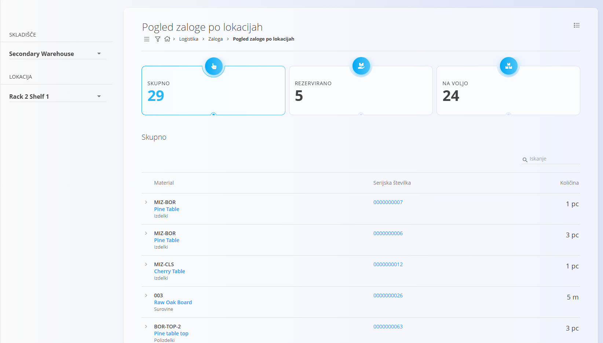
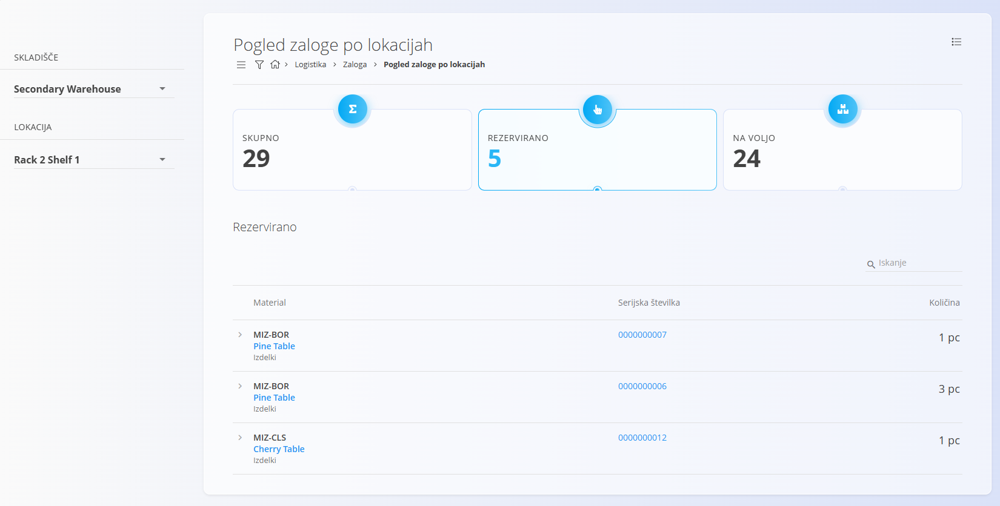
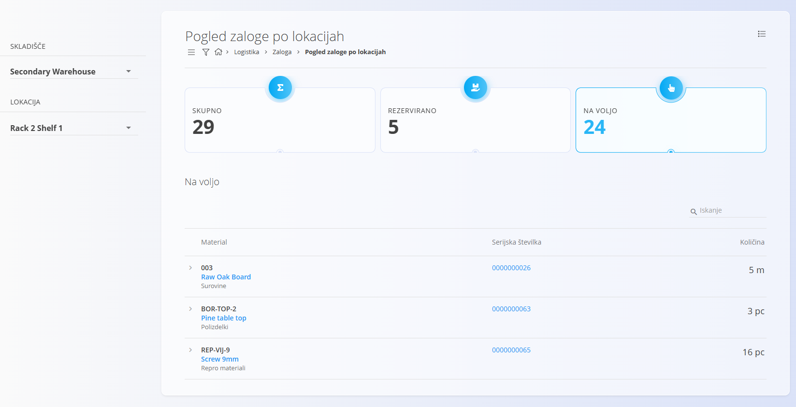
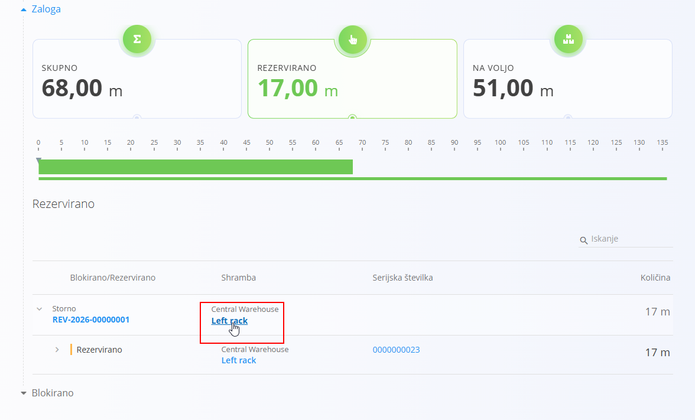

<!-- app_route: /warehouse/stock/location -->
<!-- app_label: Pogled zaloge po lokacijah -->
<!-- canonical_source_url: https://github.com/Tom-PIT/Connected.Docs/blob/main/sl/Domene/Logistika/Pregledi/PogledZalogePoLokacijah.md -->
<!-- canonical_source_title: Pogled zaloge po lokacijah -->

# Pogled zaloge po lokacijah

Pogled **Pogled zaloge po lokacijah** prikazuje vse materiale, shranjene na določeni [skladiščni lokaciji](../Upravljanje/Lokacije.md). Zagotavlja jasen pregled **skupnih**, **rezerviranih**, **blokiranih** in **razpoložljivih** količin na izbrani lokaciji. To pomaga razumeti porazdelitev zaloge ter ugotoviti, ali je potrebno prilagoditi kapaciteto ali organizacijo skladiščenja.

Do povezanih pogledov – kot sta **[Pogled zaloge po materialu](Zaloga.md#pogled-zaloge-po-materialu)** ali **[Pogled zaloge po serijski številki](Zaloga.md#pogled-zaloge-po-serijski-stevilki)** – lahko dostopate za vpogled v to, kako so postavke prispele na to lokacijo ali kje drugje so še shranjene. Pravila minimalne in maksimalne zaloge je mogoče določiti v šifrantu **[Meje zaloge](../Upravljanje/MejeZaloge.md)**, širše stanje zaloge pa si lahko ogledate na **[Nadzorni plošči](NadzornaPlosca.md)**.

> [!TIP]
> Za celoten prikaz si oglejte video vodič
> **[Pogled zaloge po lokacijah](https://www.youtube.com/watch?v=_3bZBZ89hds)**.

Za dostop do tega pogleda pojdite na  
**Logistika / Pregledi / Pogled zaloge po lokacijah** v [navigaciji](../../../Skupno/UI/Navigacija.md),  
ali kliknite **ime lokacije** na drugih zaslonih, povezanih z zalogo, kot je **Pogled zaloge po materialu**.

## Pregled

Pogled zaloge po lokacijah sestavljajo:

- **Izbira skladišča**
- **Izbira lokacije**
- **Trije kazalniki:**  
  - **Skupaj** – vse enote, shranjene na lokaciji  
  - **Rezervirano** – enote, dodeljene odprtim dokumentom  
  - **Na voljo** – enote, ki jih je mogoče izdati ali premakniti  
- **Seznam materialov**, shranjenih na izbrani lokaciji

## Izbira skladišča in lokacije

Z uporabo levega panela izberite:

- **Skladišče**
- **Lokacijo** (znotraj izbranega skladišča)

Ko izberete lokacijo, sistem naloži pripadajoče stanje zaloge:

## Kazalniki

Zgornji del zaslona prikazuje tri ključne kazalnike:
- Skupno
- Rezervirano
- Na voljo

Klik na katerikoli kazalnik filtrira seznam materialov in prikaže samo postavke, ki ustrezajo izbrani kategoriji.

### Skupno
Prikazuje **skupno količino** vseh materialov, shranjenih na izbrani lokaciji.

### Rezervirano
Prikazuje **količino, rezervirano** prek odprtih dokumentov **Izdaje** ali **Medskladiščnih prenosov**.

### Na voljo
Prikazuje **količino, ki je na voljo** za uporabo (**Skupno – Rezervirano**).

## Seznam materialov

Pod kazalniki je prikazan podroben seznam zaloge, shranjene na lokaciji.

Vsaka vrstica vsebuje:

- **Šifro in ime materiala**
- **Vrsto materiala**
- **Serijsko številko**
- **Količino na lokaciji**

## Dostop do pogleda zaloge po lokacijah iz drugih zaslonov

Ta pogled lahko odprete tudi s klikom na **ime lokacije** na drugih zaslonih, povezanih z zalogo. Sistem samodejno naloži ustrezno skladišče in lokacijo ter prikaže samo zalogo, shranjeno tam.
Primer iz pogleda **Pogled zaloge po materialu**:

