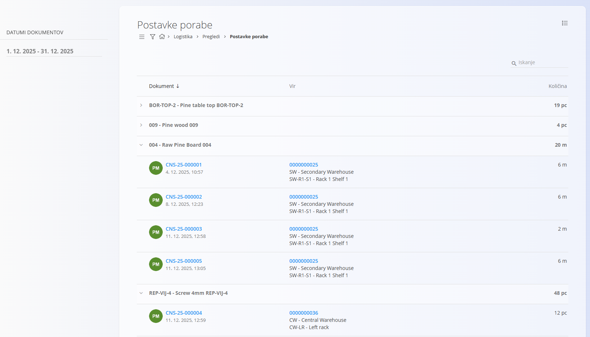
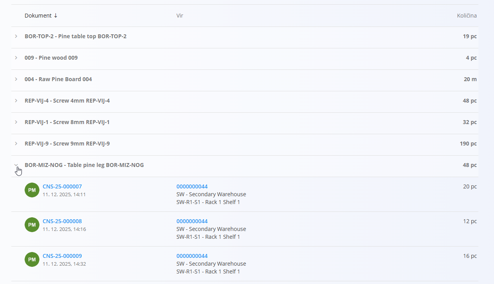
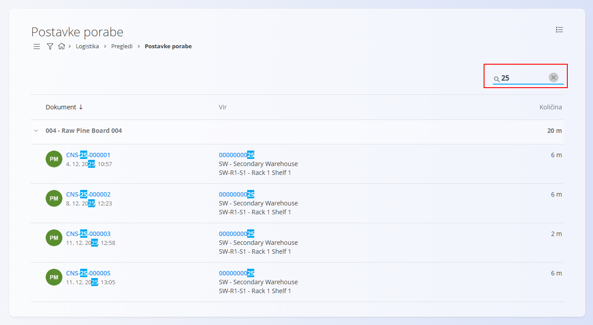

<!-- app_route: /warehouse/views/consumption-details -->
<!-- app_label: Postavke porabe -->
<!-- canonical_source_url: https://tom-pit.github.io/Connected.Docs/sl/Domene/Logistika/Pregledi/PostavkePorabe/ -->
<!-- canonical_source_title: Postavke porabe -->

# Postavke porabe

Pogled **Postavke porabe** nudi analitični pregled vseh **materialov, porabljenih med proizvodnjo**, v izbranem časovnem obdobju. Namesto osredotočanja na proizvodne dokumente ta pogled združuje **porabljene materiale** in jasno prikazuje, **kateri [dokumenti porabe](../../Proizvodnja/Dokumenti/Poraba.md)** so bili uporabljeni ter **iz katerih skladiščnih lokacij** so bili materiali črpani.

Za dostop do tega pogleda pojdite na **Logistika / Pregledi / Postavke porabe** v [navigaciji](../../../Skupno/UI/Navigacija.md).

## Seznam postavk porabe

Seznam prikazuje **vse porabljene materiale**, združene po materialu. Vsaka vrstica prikazuje **skupno porabljeno količino** za posamezen material v izbranem časovnem obdobju.

Vrstico materiala lahko razširite in si ogledate **posamezne dokumente porabe**, ki sestavljajo skupno količino.

### Hierarhija

Seznam je strukturiran na naslednji način:

- **Material** – porabljen material in skupna porabljena količina  
  - **Dokument porabe** – posamezen zapis porabe, uporabljen v proizvodnji  
    - **Vir** – skladišče in lokacija, iz katere je bil material črpan  
    - **Količina** – količina, porabljena v tem dokumentu  

Ko je dokument porabe razširjen, so prikazani naslednji podatki:

- **Številka dokumenta** – klikljiva, odpre [dokument porabe](../../Proizvodnja/Dokumenti/Poraba.md). Isti dokument je dostopen tudi iz povezanega [proizvodnega naloga](../../Proizvodnja/Dokumenti/ProizvodniNalogi.md) v razdelku *Povezani dokumenti*.  
- **Datum in čas dokumenta**  
- **Vir** – skladišče in lokacija (klikljivo)  
- **Porabljena količina**

## Navigacija po viru

Stolpec **Vir** prikazuje:

- **Skladišče**
- **Točno skladiščno lokacijo**

Klik na vir odpre zaslon **[Pogled zaloge po lokacijah](PogledZalogePoLokacijah.md)**, filtriran na lokacijo, iz katere je bil material porabljen. To omogoča pregled razpoložljive zaloge in drugih materialov, shranjenih na tej lokaciji.

## Filtri

Leva stranska vrstica vsebuje naslednji filter:

- **Datumi dokumentov** – omeji prikaz na dokumente porabe znotraj izbranega časovnega obdobja

Ko izberete časovno obdobje, se seznam samodejno ponovno naloži.

## Iskanje

Uporabite **iskalno polje** v zgornjem desnem kotu za hitro filtriranje rezultatov. Iskanje deluje po:

- kodah materialov  
- imenih materialov  
- številkah dokumentov  
- kodah skladišč in lokacij  

To omogoča hitro iskanje porabe, povezane z določenim materialom, dokumentom ali skladiščno lokacijo.

## Namen

Pogled **Postavke porabe** je uporaben za:

- analizo porabe materialov v proizvodnji  
- sledenje, kateri materiali so bili porabljeni in od kod  
- revizijo količin porabe po materialih  
- preiskovanje premikov zaloge, povezanih s proizvodnjo  

Ta pogled je **zgolj analitičen**. Ne omogoča ustvarjanja, urejanja ali brisanja dokumentov.

> [!NOTE]
> - Količine so prikazane v osnovni merski enoti materiala (npr. kos, meter).  
> - V seznamu so prikazani samo materiali, ki so bili dejansko porabljeni v proizvodnji.  
> - Izdani materiali (npr. dobave kupcem) tukaj **niso** prikazani; ta pogled je namenjen izključno **proizvodni porabi**.

## Povezani pogledi

- **[Proizvodni nalogi](../../Proizvodnja/Dokumenti/ProizvodniNalogi.md)** – pregled proizvodnih procesov, ki ustvarjajo porabo materialov  
- **[Poraba](../../Proizvodnja/Dokumenti/Poraba.md)** – vnos in pregled dokumentov porabe v proizvodnji  
- **[Pogled zaloge po lokacijah](PogledZalogePoLokacijah.md)** – pregled zaloge na posamezni skladiščni lokaciji  
- **[Pogled zaloge po materialu](Zaloga.md#pogled-zaloge-po-materialu)** – pregled stanja in premikov zaloge po materialih
