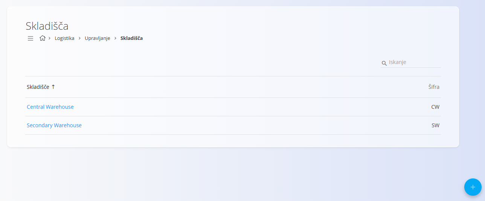
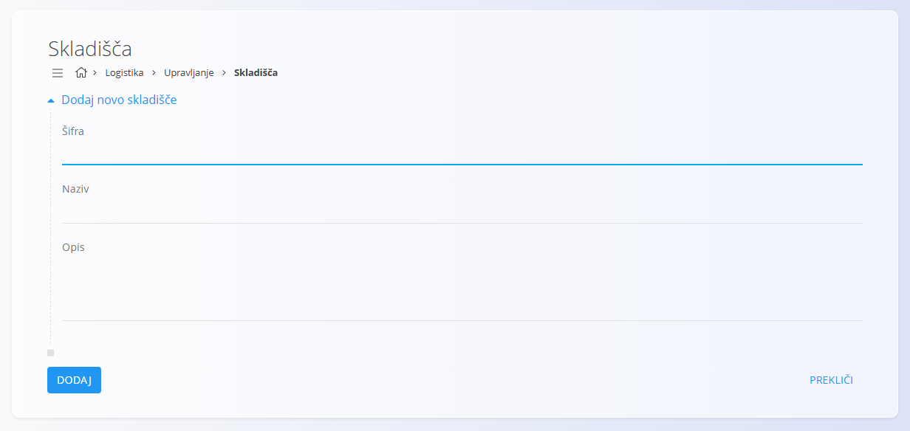

<!-- app_route: /management/warehouse/warehouses -->
<!-- app_label: Skladišča -->
<!-- canonical_source_url: https://github.com/Tom-PIT/Connected.Docs/blob/main/sl/Domene/Logistika/Upravljanje/Skladisca.md -->
<!-- canonical_source_title: Skladišča -->

# Skladišča

Ta šifrant predstavlja **skladišča**, ki se uporabljajo v celotnem sistemu. Vsako skladišče določa fizično ali logično mesto shranjevanja, ki podpira ravnanje z materiali, zalogovne operacije in logistične procese.

Za dostop do tega šifranta pojdite na **Logistika / Upravljanje / Skladišča** v [navigaciji](../../../Skupno/UI/Navigacija.md).

> [!TIP]
> Za celovit prikaz si oglejte video vodič **[Skladišča in skladiščne lokacije](https://www.youtube.com/watch?v=3sEE9Mrtx6M)**.

## Shema

| Polje | Opis |
|-------|------|
| [**Šifra**](../../../Skupno/UI/SifreDokumentov.md) | Enolični identifikator skladišča. Koda mora biti enolična v celotnem seznamu. |
| **Naziv** | Ime skladišča. |
| **Opis** | Neobvezen kratek opis skladišča. |
| **Aktiven** | Določa, ali je skladišče aktivno. Neaktivnih skladišč ni mogoče uporabljati v novih vnosih, ostanejo pa vidna v zgodovini. |

## Upravljanje

### Seznam skladišč

Uporabniški vmesnik vsebuje seznam skladišč. Če zapisi še ne obstajajo, je seznam prazen.

Seznam prikazuje osnovne podatke o skladiščih, vključno s **šifro** in **imenom** skladišča.

## Dejanja

Kliknite [akcijski gumb](../../../Skupno/UI/AkcijskiGumb.md) za dodajanje novega skladišča.

Obrazec vključuje naslednja polja:
- **Šifra**
- **Naziv**
- **Opis**
- **Aktiven**

Po vnosu zahtevanih podatkov kliknite **Dodaj**, da shranite skladišče, ali **Prekliči**, da se vrnete na seznam.

## Urejanje

Za urejanje obstoječega skladišča kliknite njegovo **Naziv** v seznamu.  
Vmesnik se preklopi v način urejanja in prikaže obstoječe vrednosti za spremembo.

Kliknite **Shrani** za potrditev sprememb ali **Prekliči** za zavrnitev.

## Brisanje

Kliknite **Izbriši** na zaslonu za urejanje, da odprete potrditveno pogovorno okno:

**Ali ste prepričani, da želite izbrisati ta zapis?**

Če potrdite, se skladišče trajno odstrani; v nasprotnem primeru sistem ohrani zapis nespremenjen.

> [!NOTE]
> Skladišče je mogoče izbrisati le, če ni uporabljeno v odvisnih zapisih, kot so zalogovne transakcije ali premiki materialov.
