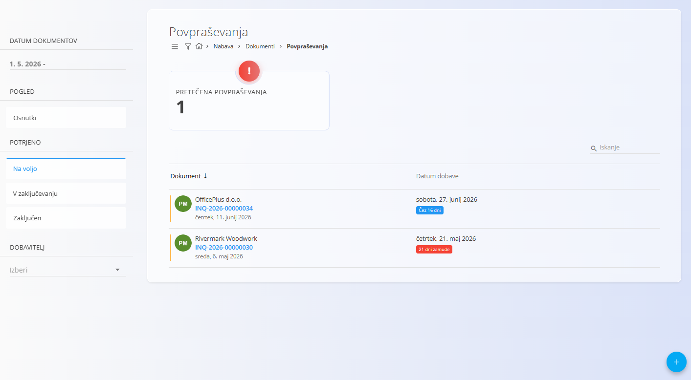
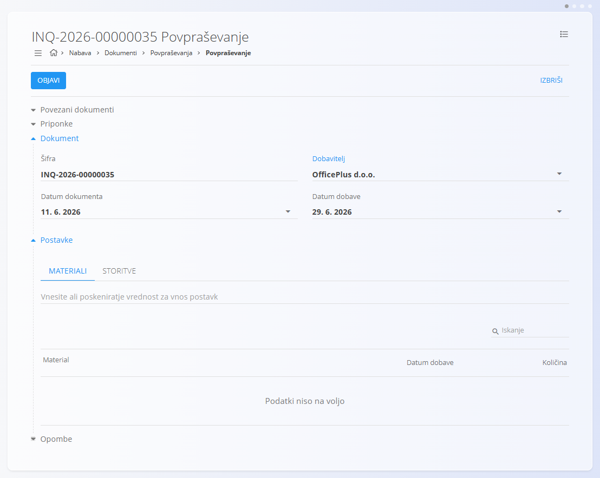
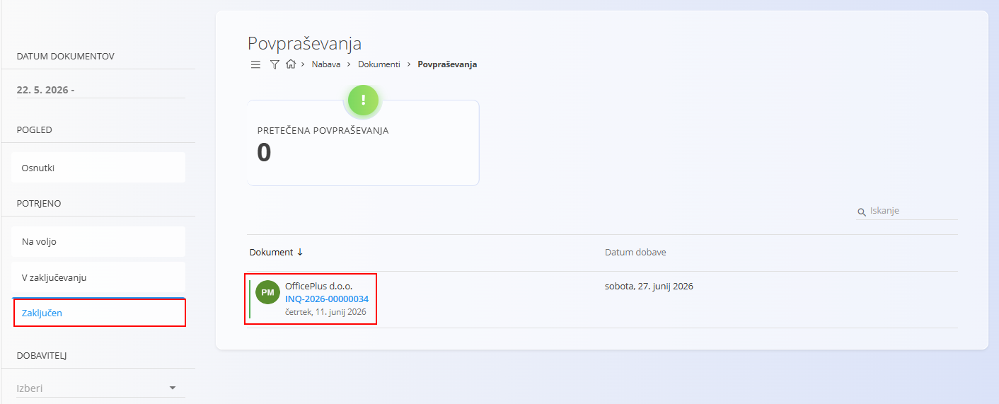

<!-- app_route: /supply/documents/inquiries -->
<!-- app_label: Povpraševanja -->
<!-- canonical_source_url: https://github.com/Tom-PIT/Connected.Docs/blob/main/sl/Domene/Nabava/Dokumenti/Povprasevanja.md -->
<!-- canonical_source_title: Povpraševanja -->

# Povpraševanja

**Povpraševanje** je nabavni dokument, ki se uporablja za pridobivanje informacij o **cenah**, **razpoložljivosti** in **dobavnih rokih** pri dobaviteljih, še preden se odda formalno naročilo. Povpraševanja omogočajo primerjavo ponudb dobaviteljev, načrtovanje prihodnjih nabav ter nemoten prehod v nadaljnje dokumente, kot so **[nabavni nalogi](NabavniNalogi.md)**.

Za dostop do **Povpraševanj** pojdite na **Nabava / Dokumenti / Povpraševanja** v [navigaciji](../../../Skupno/UI/Navigacija.md).

## Kako se povpraševanja vključujejo v nabavni proces

Tipičen potek:

1. Ustvarite **Povpraševanje** in ga pošljete dobavitelju.  
2. Dobavitelj odgovori s cenami, razpoložljivostjo in dobavnimi roki.  
3. Po odobritvi povpraševanje pretvorite v **[Nabavni nalog](NabavniNalogi.md)** prek razdelka **Povezani dokumenti**.  
4. Iz nabavnega naloga lahko nato ustvarite **[Prevzem](../../Logistika/Dokumenti/Prevzemi.md)** (delni ali celotni), ko material prispe.

> [!NOTE]
> Povpraševanja niso obvezna — **nabavne naloge** je mogoče ustvariti tudi neposredno, brez predhodnega povpraševanja. Organizacija lahko uporablja vse ali le nekatere korake, odvisno od nabavnega procesa.

## Shema

<strong>Dokument</strong>

| Polje | Opis |
|------|------|
| [**Šifra**](../../../Skupno/UI/SifreDokumentov.md) | Sistemsko generiran enolični identifikator povpraševanja. |
| **Dobavitelj** | Dobavitelj, ki prejme povpraševanje, izbran iz **[Poslovnega imenika](../../../Skupno/Upravljanje/PoslovniImenik.md)** (obvezno). |
| **Datum dokumenta** | Datum nastanka povpraševanja. |
| **Datum opravljene storitve** | Rok, do katerega je povpraševanje veljavno (podobno datumu poteka). |

<strong>Postavke</strong>

| Polje | Opis |
|------|------|
| [**Material**](../../Sredstva/Materiali.md) | Material, za katerega se zahteva informacija. |
| **Datum opravljene storitve** | Predviden ali ponujen dobavni datum. |
| **Količina** | Zahtevana količina izbranega materiala. |
| **Dobaviteljeva šifra** | Interna oznaka materiala pri dobavitelju (neobvezno). |

## Upravljanje

### Stanja dokumenta

Dokumenti se v svojem življenjskem ciklu pomikajo skozi več stanj:

- **Osnutki** – povpraševanje še ni objavljeno. Vsa polja je mogoče prosto urejati.
- **Potrjeno** – povpraševanje je objavljeno in ga ni več mogoče izbrisati ali prosto spreminjati.
  - **Na voljo** – povpraševanje je veljavno in pripravljeno za nadaljnjo obdelavo.
  - **V zaključevanju** – povpraševanje je delno obdelano (npr. delno pretvorjeno ali uporabljeno).
  - **Zaključen** – vsa dejanja, povezana s povpraševanjem, so bila v celoti izvedena.

### Seznam dokumentov

Seznam **Povpraševanj** omogoča pregled vseh nabavnih zahtevkov, razdeljenih v poglede **Osnutki**, **Na voljo**, **V obdelavi** in **Zaključeno**.

### Indikatorji

Na vrhu seznama sistem prikaže indikator **Zamujena povpraševanja**:

- **Zamujena povpraševanja** – povpraševanja, katerih datum veljavnosti je potekel in še niso zaključena.  
  S klikom na indikator se seznam filtrira tako, da prikaže samo zamujena povpraševanja.

### Filtri

Filtri na levi strani omogočajo zoženje rezultatov po:

- **Datumih dokumentov**
- **Pogledu**
  - Osnutki
- **Objavljeno**
  - Na voljo
  - V zaključevanju
  - Zaključen
- **Dobavitelju**
- Iskalnem polju

Filtri omogočajo hitro navigacijo med povpraševanji različnih dobaviteljev, stanj in časovnih obdobij.

## Dejanja

### Ustvariti novo povpraševanje

1. Uporabite [akcijski gumb](../../../Skupno/UI/AkcijskiGumb.md) za ustvarjanje novega osnutka povpraševanja.

2. Izpolnite polja **Dobavitelj**, **Datum dokumenta** in **Datum veljavnosti**.

   

3. V razdelku **Postavke** vnesite ali skenirajte **serijsko številko**, **EAN** ali **ime materiala**.  
   - Sistem prikaže **vsa ujemanja materialov in serijskih številk**.  
   - Prilagodite količino glede na potrebe.

   Za informacije o delu s postavkami dokumenta glejte [**Postavke dokumenta**](../../../Skupno/Koncepti/PostavkeDokumenta.md).

4. Shranite dodane postavke.

5. Ko ste pripravljeni, kliknite **Objavi**, da zaključite osnutek in premaknete povpraševanje v stanje **Na voljo**.

### Urediti povpraševanje

Kliknite katerokoli povpraševanje v seznamu, da ga odprete. Povpraševanja v stanju **Osnutek** je mogoče prosto urejati.

Dokument vsebuje več razširljivih razdelkov:
- Povezani dokumenti  
- Priponke  
- Dokument  
- Postavke  

#### Priponke

Razdelek **Priponke** uporabite za nalaganje in upravljanje datotek, povezanih z dokumentom, kot so fotografije, PDF datoteke, certifikati ali podporni dokumenti.

Za podrobna navodila glejte [**Priponke**](../../../Skupno/Koncepti/Priponke.md).

#### Povezani dokumenti

Razdelek **Povezani dokumenti** omogoča ustvarjanje in sledenje nadaljnjih nabavnih dokumentov.

Za podrobnosti o povezavah med dokumenti, sledljivosti in ustvarjanju povezanih dokumentov glejte [**Povezani dokumenti**](../../../Skupno/Koncepti/PovezaniDokumenti.md).

> [!NOTE]
> Razpoložljiva dejanja v razdelku **Povezani dokumenti** so odvisna od vrste dokumenta in njegovega stanja.

Razpoložljiva dejanja vključujejo:

- **Dodaj projekt** – dodelitev povpraševanja projektu  
- **+ Nabavni nalog** – ustvarjanje **[nabavnega naloga](NabavniNalogi.md)** neposredno iz povpraševanja  

> [!TIP]
> Ko se **nabavni nalog** ustvari iz povpraševanja, se večina pomembnih polj samodejno predizpolni.

### Zaključiti povpraševanje

Ko je povpraševanje v stanju **Na voljo** odobreno, kliknite **Zaključi** na vrhu strani. Dokument se nato prikaže v pogledu **Zaključeno**.

> [!NOTE]
> Povpraševanje se samodejno premakne v stanje **Zaključeno**, ko se iz njega neposredno ustvari **[nabavni nalog](NabavniNalogi.md)** prek razdelka **Povezani dokumenti**.

## Brisanje

Povpraševanja je mogoče izbrisati na zaslonu za urejanje. Za brisanje odprite dokument s klikom nanj v seznamu in nato izberite **Izbriši** v zgornjem desnem kotu.

Potrdite brisanje, da trajno odstranite dokument.

> [!NOTE]
> Izbrisati je mogoče samo povpraševanja v stanju **Osnutek**.

## Meni

Meni omogoča dodatna dejanja, ki so na voljo na tej strani.

Na voljo sta naslednji dejanji:

- **Tiskanje**
- **Izvoz v PDF**

Za podrobnosti o dejanjih menija glejte [**Dejanja menija**](../../../Skupno/Koncepti/MeniDejanja.md).