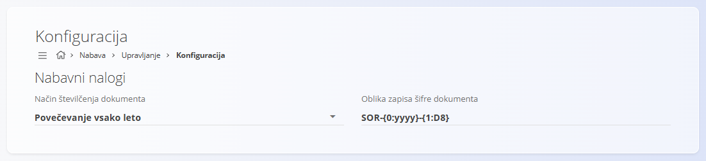

<!-- app_route: /management/supply/configuration -->
<!-- app_label: Konfiguracija nabave -->
<!-- canonical_source_url: https://github.com/Tom-PIT/Connected.Docs/blob/main/sl/Domene/Nabava/Upravljanje/KonfiguracijaNabave.md -->
<!-- canonical_source_title: Konfiguracija nabave -->

# Konfiguracija nabave

Zaslon **Konfiguracija nabave** omogoča nastavitev pravil, ki vplivajo na **številčenje dokumentov nabave**. Vse spremembe se **samodejno shranijo** ob spremembi vrednosti.

Za dostop do **Konfiguracije nabave** pojdite na **Nabava / Šifranti / Konfiguracija nabave** v [navigaciji](../../../Skupno/UI/Navigacija.md).

## Nastavitve številčenja dokumentov

V tem razdelku določite model številčenja in obliko šifre za **[nabavne naloge](../Dokumenti/NabavniNalogi.md)**.

| Polje | Opis |
|------|------|
| **Način številčenja dokumenta** | • **Povečevanje vsako leto:** zaporedje se vsako leto ponastavi.   • **Povečevanje:** enotno zaporedje, ki se nikoli ne ponastavi. |
| **Oblika zapisa šifre dokumenta** | Vzorec, ki določa strukturo šifre (npr. `PREDPONA-LETO-ZAPOREDNA`). |
