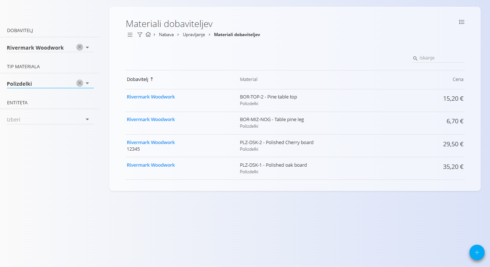
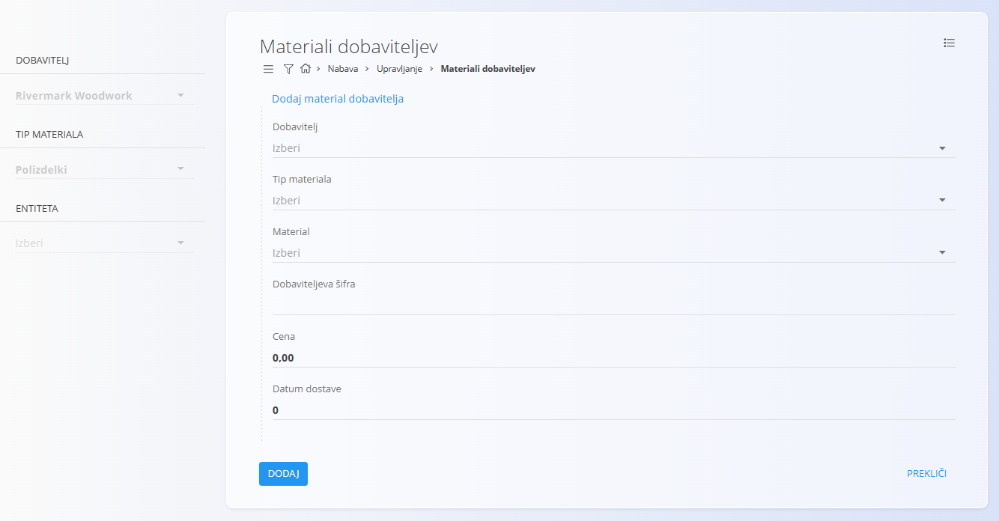
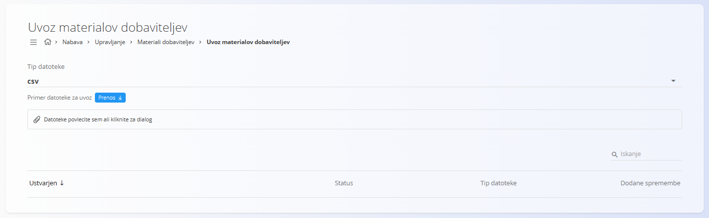

<!-- app_route: /management/supply/supplier-materials -->
<!-- app_label: Materiali dobaviteljev -->
<!-- canonical_source_url: https://github.com/Tom-PIT/Connected.Docs/blob/main/sl/Domene/Nabava/Upravljanje/MaterialiDobaviteljev.md -->
<!-- canonical_source_title: Materiali dobaviteljev -->

# Materiali dobaviteljev

**Materiali dobaviteljev** predstavljajo seznam materialov, ki jih posamezni dobavitelji ponujajo vaši organizaciji. Vsak zapis povezuje obstoječ material iz področja **[Materiali](../../Sredstva/Materiali/README.md)** z določenim dobaviteljem ter vključuje dodatne informacije, kot so dobaviteljeva interna šifra materiala, cena in dobavni rok.

Ta šifrant zagotavlja, da procesi nabave pravilno prepoznajo, **kateri materiali so na voljo pri posameznem dobavitelju** in **pod kakšnimi pogoji**.

Za dostop do **Materialov dobaviteljev** pojdite na **Nabava / Šifranti / Materiali dobaviteljev** v [navigaciji](../../../Skupno/UI/Navigacija.md).

## Shema

| Polje | Opis |
|------|------|
| **Dobavitelj** | Dobavitelj, ki ponuja material. Mora obstajati v **[Poslovnem imeniku](../../../Skupno/Upravljanje/PoslovniImenik.md)** (obvezno). |
| [**Tip materiala**](../../Sredstva/Materiali/README.md) | Tip materiala ([**Surovina**](../../Sredstva/Materiali/Surovine.md), [**Polizdelek**](../../Sredstva/Materiali/Polizdelki.md), [**Izdelek**](../../Sredstva/Materiali/Izdelki.md), [**Repro material**](../../Sredstva/Materiali/ReproMateriali.md)). Mora ustrezati obstoječi vrsti materiala (obvezno). |
| [**Material**](../../Sredstva/Materiali/README.md) | Material, ki ga dobavitelj ponuja. Mora že obstajati v področju **Materiali** (obvezno). |
| **Dobaviteljeva šifra** | Interna oznaka materiala pri dobavitelju. |
| **Cena** | Neto cena, po kateri dobavitelj dobavlja material. |
| **Dobavni dostave (dni)** | Dobavni čas, izražen v številu dni. |

## Upravljanje

### Seznam materialov dobaviteljev

Uporabniški vmesnik prikazuje seznam vseh materialov dobaviteljev z naslednjimi podatki:

- Dobavitelj  
- Material (koda in ime)  
- Cena  

Na voljo je iskalno polje v zgornjem desnem kotu.



### Filtri

Leva stranska vrstica vsebuje naslednje filtre:

- **Dobavitelj**  
- **Tip materiala**  
- **Entiteta**

Filtri omogočajo zoženje rezultatov glede na dobavitelja in kategorijo materiala.

## Dejanja

Kliknite [akcijski gumb](../../../Skupno/UI/AkcijskiGumb.md) za prikaz razpoložljivih dejanj:

- **Novo**  
- **Uvoz**

### Ustvariti nov material dobavitelja

Kliknite [akcijski gumb](../../../Skupno/UI/AkcijskiGumb.md) in izberite **Novo**, da odprete obrazec za ustvarjanje novega zapisa materiala dobavitelja.

Vnosni obrazec vključuje naslednja polja:

- Dobavitelj  
- Tip materiala  
- Material  
- Dobaviteljeva šifra  
- Cena  
- Dobavni dostave



Po vnosu zahtevanih podatkov kliknite **Dodaj**, da shranite zapis, ali **Prekliči**, da se vrnete na seznam.

### Uvoziti materialov dobaviteljev

Kliknite [akcijski gumb](../../../Skupno/UI/AkcijskiGumb.md) in izberite **Uvoz** za množično ustvarjanje ali posodabljanje materialov dobaviteljev z uporabo preglednice. Funkcionalnost omogoča množično ustvarjanje ali posodabljanje materialov dobaviteljev z uporabo preglednice.

Ta zaslon deluje podobno kot stran **[Uvoz materialov](../../Sredstva/Materiali/UvozMaterialov.md)** in vključuje:

- izbiro vrste datoteke (CSV ali XLSX),  
- prenos vzorčne datoteke,  
- območje za povleci-in-spusti nalaganje,  
- predogled preteklih uvozov.



#### Struktura preglednice

Datoteka za uvoz materialov dobaviteljev mora vsebovati naslednje stolpce:

```
SupplierName,MaterialCode,Price,SupplierCode,DeliveryDate
```

Primer vrstice:

```
Rivermark Woodwork,CODE003,20,SupplierMaterial001,0
```

### Urediti material dobavitelja

Za urejanje obstoječega zapisa kliknite njegovo vrstico v seznamu. Sistem odpre pogled za urejanje, kjer lahko spremenite vsa polja.

Ko končate z urejanjem, kliknite **Shrani**. Če sprememb ne želite shraniti, kliknite **Prekliči**.

## Brisati material dobavitelja

Kliknite na dobaviteljev material in nato kliknite **Izbriši**, da ga odstranite iz sistema. Prikazalo se bo potrditveno pojavno okno. Po potrditvi se zapis trajno odstrani.

> [!NOTE]
> Zapis materiala dobavitelja je mogoče izbrisati samo, če nanj ne kažejo drugi zapisi.

## Meni

Na tej strani so dejanja menija na voljo na dveh mestih.

### Meni seznama

Meni seznama omogoča dejanja za trenutno prikazan seznam.

Na voljo je naslednje dejanje:

- **Izvoz v CSV**

### Meni dokumenta

Meni dokumenta omogoča dejanja za trenutno odprt dokument.

Na voljo je naslednje dejanje:

- **Izvoz v CSV**

Za podrobnosti o dejanjih menija glejte [**Dejanja menija**](../../../Skupno/Koncepti/MeniDejanja.md).
