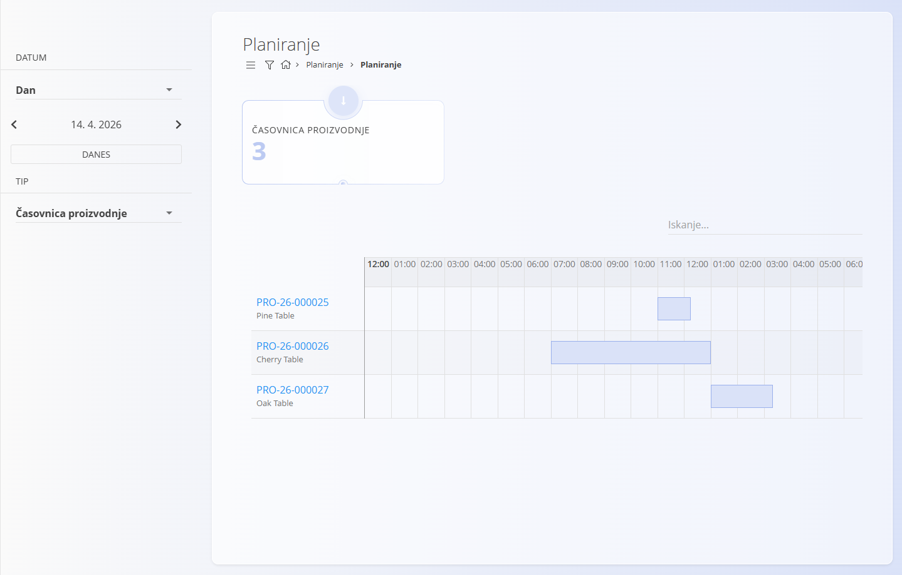
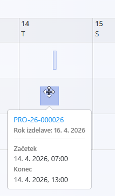

<!-- app_route: /planning -->
<!-- app_label: Planiranje -->
<!-- canonical_source_url: https://tom-pit.github.io/Connected.Docs/sl/Domene/Planiranje/Pregledi/Planiranje/ -->
<!-- canonical_source_title: Planiranje -->

# Planiranje

Zaslon **Planiranje** omogoča vizualni pregled **planiranih proizvodnih nalogov** v obliki koledarja. Uporabnikom omogoča spremljanje razporeda in prilagajanje časovnic proizvodnje.

Do tega zaslona dostopate preko **Proizvodnja / Planiranje / Planiranje**.

## Pregled

Proizvodni nalogi so prikazani na koledarju glede na njihov **planiran začetek** in **planiran konec**.

> [!IMPORTANT]
> Proizvodni nalog bo viden v Planiranju samo, če sta določena tako **planiran začetek** kot **planiran konec**.  
> Ti vrednosti se nastavita ob ustvarjanju ali urejanju proizvodnega naloga. Glej [**Proizvodni nalogi**](../../Proizvodnja/Dokumenti/ProizvodniNalogiUstvarjanje.md#datumi).

Vsak element na koledarju predstavlja planiran proizvodni nalog in prikazuje njegovo trajanje v izbranem časovnem obdobju.

## Filtri

Za filtriranje prikaza uporabite filtre na levi strani:

- **Datum** – izbira želenega časovnega obdobja  
- **Tip** – filtriranje po tipu planiranja (npr. časovnica proizvodnje)

Gumb **Danes** omogoča hitro vrnitev na trenutni datum.

## Pogledi koledarja

Koledar lahko prikažete v različnih načinih:

- **Dan** – podroben urni prikaz enega dne  
- **Teden** – pregled izbranega tedna  
- **Mesec** – pregled celotnega meseca  

Za premikanje med datumi uporabite izbirnik datuma na levi strani.

## Dejanja

### Ogled podrobnosti

Klik na **kodo proizvodnega naloga** odpre njegov podroben pogled.

### Premakniti planirane naloge

Planirane naloge lahko **prestavite** neposredno v koledarju z metodo povleci in spusti (drag & drop).

- Povlecite nalog na nov časovni termin za prilagoditev razporeda  
- Sistem samodejno posodobi planirane datume  

> [!NOTE]
> Proizvodnega naloga ni mogoče prestaviti preko njegovega **roka izdelave**, ki je določen v [proizvodnem nalogu](../../Proizvodnja/Dokumenti/ProizvodniNalogi.md#datumi).

### Pregledati informacijo o nalogu

Ob premiku miške nad planiranim nalogom se prikažejo dodatne informacije:

- Koda proizvodnega naloga  
- Naziv izdelka  
- Planiran začetek  
- Planiran konec  