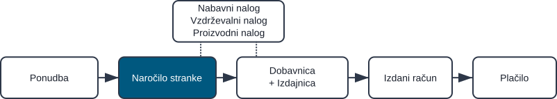
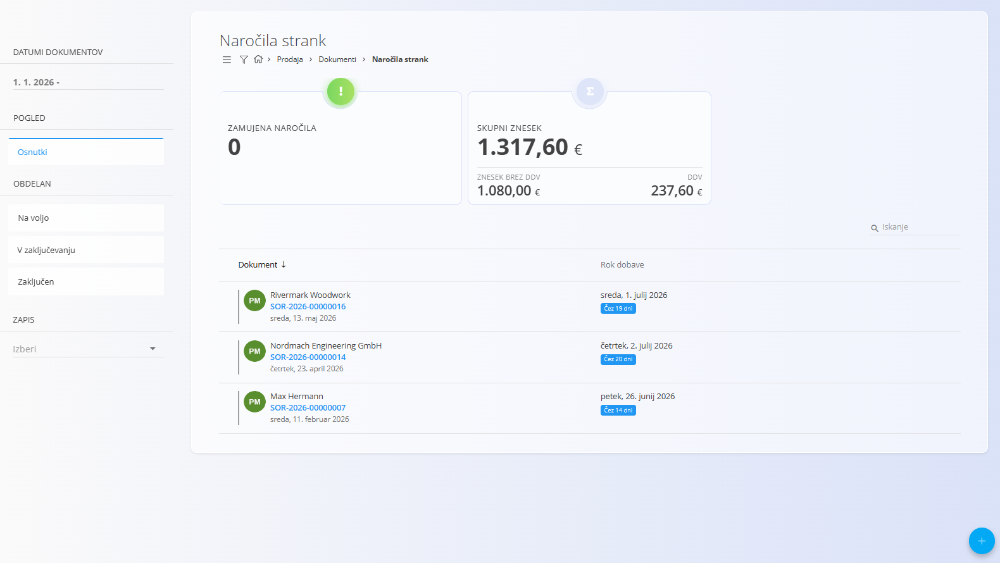
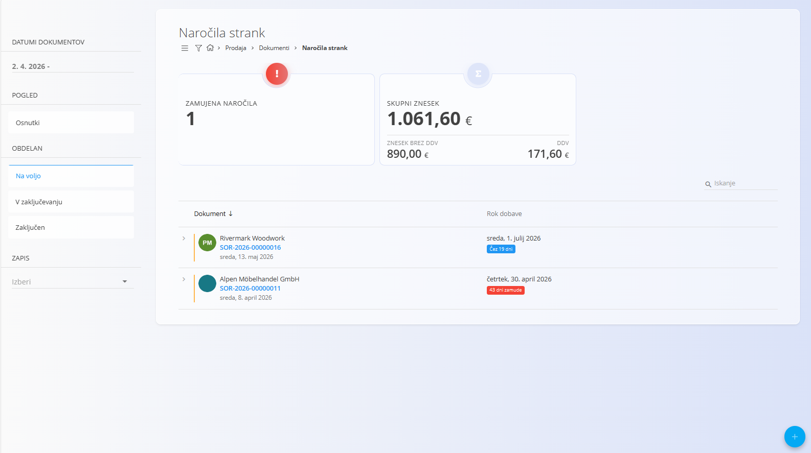
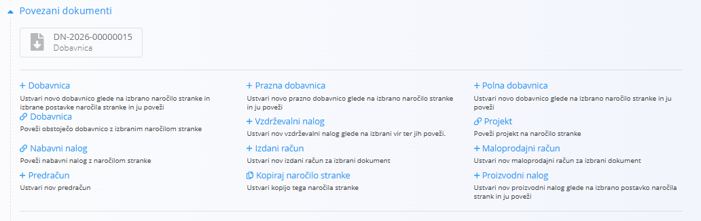
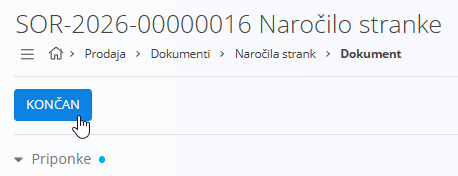

<!-- app_route: /sales/documents/sales-orders -->
<!-- app_label: Naročila strank -->
<!-- canonical_source_url: https://github.com/Tom-PIT/Connected.Docs/blob/main/sl/Domene/Prodaja/Dokumenti/NarocilaStrank.md -->
<!-- canonical_source_title: Naročila strank -->

# Naročila strank

**Naročilo stranke** predstavlja potrjeno namero stranke za nakup blaga ali storitev. Najpogosteje se ustvari na podlagi potrjene **Ponudbe**, lahko pa se ustvari tudi samostojno.  
Naročila strank določajo, *kaj* bo stranka prejela, *kdaj* in *pod kakšnimi pogoji*, ter predstavljajo osnovo za procese dostave, proizvodnje, nabave in izdajanja računov.

Za dostop do tega dokumenta pojdite na **Prodaja / Dokumenti / Naročila strank** v [navigaciji](../../../Skupno/UI/Navigacija.md).

## Vloga naročil strank v prodajnem procesu

Naročila strank so eden ključnih korakov v prodajni verigi:

1. Ponudba se pripravi v dokumentu **[Ponudba](Ponudbe.md)**.  
2. Ko stranka potrdi ponudbo, se iz nje ustvari **Naročilo stranke** (prek razdelka [**Povezani dokumenti**](Ponudbe.md#povezani-dokumenti)).  
3. Naročilo stranke sproži nadaljnje operativne procese:
   - [**Dobavnice**](Dobavnice.md)
   - [**Proizvodni nalogi**](../../Proizvodnja/Dokumenti/ProizvodniNalogi.md)
   - [**Vzdrževalni nalogi**](../../Vzdrzevanje/Dokumenti/VzdrzevalniNalogi.md)
   - [**Nabavni nalogi**](../../Nabava/Dokumenti/NabavniNalogi.md)
   - [**Izdani računi**](IzdaniRacuni.md)

  

Ko je naročilo stranke v celoti izpolnjeno in obračunano, se premakne v zaključeno stanje.

> [!NOTE]
> Podjetje lahko uporablja vse ali le nekatere korake, odvisno od vrste dejavnosti (npr. storitvena podjetja morda ne uporabljajo dobavnic).

## Shema

  
<strong>Dokument</strong>

| Polje | Opis |
|------|------|
| [**Šifra**](../../../Skupno/UI/SifreDokumentov.md) | Sistemsko generiran identifikator naročila stranke. |
| **Stranka** | Stranka, ki odda naročilo, izbrana iz šifranta [Poslovni imenik](../../../Skupno/Upravljanje/PoslovniImenik.md) (obvezno). |
| **Datum dokumenta** | Datum nastanka naročila stranke. |
| **Datum prodaje** | Predviden datum dobave naročila (obvezno). |
| **Rabat** | Neobvezen popust na celotno naročilo stranke. |
| **Številka naročilnice** | Neobvezna povezava na povezani [nabavni nalog](../../Nabava/Dokumenti/NabavniNalogi.md). |
| [**Način plačila**](../Upravljanje/NacinPlacila.md) | Načini plačila, povezani z naročilom stranke. |

  
<strong>Transport, alternativna valuta in dostava</strong>

| Polje | Opis |
|--------|-------------|
| **[Pogoj dobave](../../../Skupno/Upravljanje/PogojiDobave.md)** | Dobavni pogoji, dogovorjeni s stranko. |
| **[Vrsta transporta](../../../Skupno/Upravljanje/VrstaTransporta.md)** | Način transporta, dogovorjen s stranko. |
| [**Alternativna valuta**](../../../Skupno/Upravljanje/Valute.md) | Alternativna valuta glede na privzeto valuto, uporabljeno v dokumentu. |
| [**Tečaj**](../Upravljanje/MenjalniTecaji.md) | Tečaj alternativne valute glede na privzeto valuto. |
| **Dobava – Podjetje / Naslov** | Dobavni podatki stranke, povzeti iz [Poslovnega imenika](../../../Skupno/Upravljanje/PoslovniImenik.md). |

  
<strong>Intrastat</strong>

| Polje | Opis |
|------|------|
| [**Država odpošiljanja**](../../../Skupno/Upravljanje/Drzave.md) | Država, iz katere je bilo blago odposlano. Ta vrednost je običajno določena na podlagi Intrastat konfiguracije materiala. |
| [**Vrsta posla**](../../Racunovodstvo/Upravljanje/Intrastat/VrstaPosla.md) | Klasifikacija vrste transakcije za Intrastat poročanje (npr. neposredna prodaja ali nakup). |
| [**Lega kraja**](../../Racunovodstvo/Upravljanje/Intrastat/LegaKraja.md) | Označuje kraj dostave blaga v skladu z Intrastat definicijami. |

  
<strong>Postavke</strong>

| Polje | Opis |
|------|------|
| **Sredstvo** | Izdelek ali storitev, ki se prodaja. |
| **Datum dobave** | Načrtovan datum dobave za posamezno postavko. |
| **Količina** | Količina izbranega sredstva. |
| **Cena brez DDV (na enoto)** | Uporabljena cena na enoto (iz nastavitev sredstva ali cenikov). |
| **Popust (%)** | Popust za posamezno postavko. |
| [**Davčna stopnja**](../../../Skupno/Upravljanje/DavcneStopnje.md) | Uporabljena davčna stopnja. |
| **Vrednost** | Končna vrednost postavke (količina × cena − popust). |
| **[Intrastat – Tarifa](../../Racunovodstvo/Upravljanje/Intrastat/Tarife.md)** | Tarifna oznaka blaga, uporabljena za Intrastat poročanje. |
| **Intrastat – Država porekla** | Država, iz katere blago izvira. |
| **Intrastat – Neto teža (kg)** | Neto teža, uporabljena za statistično poročanje. |
| **Intrastat – Statistična vrednost** | Prijavljena statistična vrednost blaga za Intrastat poročanje. |

## Upravljanje

### Statusi dokumenta

Dokumenti v svojem življenjskem ciklu prehajajo skozi naslednje statuse:

- **Osnutki** – Dokument še ni objavljen; vsa polja so prosto uredljiva.
- **Obdelan** – Dokument je objavljen; ni ga mogoče izbrisati ali prosto spreminjati.
  - **Na voljo** – Dokument je veljaven in pripravljen za nadaljnjo obdelavo.
  - **V zaključevanju** – Dokument je delno obdelan (npr. delno dobavljen).
  - **Zaključen** – Vsa dejanja, povezana z dokumentom, so zaključena.

### Seznam

Seznam prikazuje vsa naročila strank z njihovim trenutnim statusom in datumi dobave.

Na vrhu seznama sistem prikazuje povzetne kazalnike glede na trenutno uporabljene filtre:

- **Zamujena naročila** – Naročila strank, katerih predviden datum dobave je potekel in še niso zaključena.
- **Skupna cena vseh naročil** – Skupna cena vseh naročil strank v aktivnem filtru.

**Osnutki:**

**Na voljo (potrjena):**

Filtri vključujejo:
- **Datumi dokumentov**
- **Osnutki**
- **Obdelan:** Na voljo, V zaključevanju, Zaključen
- **Stranka**
- **Poslovni vnos**
- **Iskalno polje**

## Dejanja

### Ustvariti novo naročilo stranke

Za ustvarjanje novega naročila stranke kliknite [akcijski gumb](../../../Skupno/UI/AkcijskiGumb.md).

Za podroben postopek ustvarjanja si oglejte vodnik [**Kako ustvariti naročilo stranke**](NarocilaStrankUstvarjanje.md).

### Urediti naročilo stranke

Naročilo stranke je razdeljeno v več razširljivih razdelkov. Razpoložljiva dejanja so odvisna od stanja dokumenta. Medtem ko je naročilo v stanju **Osnutek**, lahko urejate vse razdelke:

- Polja glave (datumi, stranka)
- [**Alternativna valuta**](NarocilaStrankUstvarjanje.md#alternativna-valuta)
- [**Dobava**](NarocilaStrankUstvarjanje.md#dobava)
- [**Transport in Intrastat**](NarocilaStrankUstvarjanje.md#razdelka-transport-in-intrastat)
- [**Podrobnosti**](NarocilaStrankUstvarjanje.md#korak-3--dodajanje-postavk) – dodajanje, odstranjevanje ali spreminjanje postavk računa
- [**Načini plačila**](NarocilaStrankUstvarjanje.md#načini-plačila) – določanje načina plačila stranke

#### Povezani dokumenti

Razdelek **Povezani dokumenti** omogoča ustvarjanje in pregled povezanih dokumentov.

Za podrobnosti o povezavah med dokumenti, sledljivosti in ustvarjanju povezanih dokumentov glejte [**Povezani dokumenti**](../../../Skupno/Koncepti/PovezaniDokumenti.md).

> [!NOTE]
> Razpoložljiva dejanja v razdelku **Povezani dokumenti** so odvisna od tipa in statusa dokumenta.

Razpoložljiva dejanja vključujejo:

- [**+ Dobavnica**](Dobavnice.md)
- **+ Prazna dobavnica**
- **Poveži obstoječo dobavnico**
- [**+ Proizvodni nalog**](../../Proizvodnja/Dokumenti/ProizvodniNalogi.md)
- [**+ Vzdrževalni nalog**](../../Vzdrzevanje/Dokumenti/VzdrzevalniNalogi.md)
- [**+ Izdani račun**](IzdaniRacuni.md)
- **Poveži s projektom**
- **Kopiraj naročilo stranke**

### Objavljati naročilo stranke

Ko je osnutek pripravljen, kliknite **Objavi** na vrhu strani, da potrdite naročilo. Potrjeno naročilo stranke se premakne v stanje **Na voljo** in omogoči dodatna dejanja dokumenta.

> [!NOTE]
> Ko kliknete **Objavi**, se dokument potrdi in premakne iz stanja **Osnutek** v skupino stanj **Obdelan**.

Zaključevanje naročila stranke ima naslednje učinke:

- Dokument se premakne iz stanja _Na voljo_ v stanje _Zaključen_.
- Urejanje dokumenta je omejeno.
- Večina dejanj v razdelku **Povezani dokumenti** ni več na voljo.

> [!NOTE]
> Zaključevanje naročila stranke je administrativno dejanje, ki zaključi življenjski cikel dokumenta. Ne povzroči dodatnih premikov zaloge ali finančnih knjiženj — ta se izvajajo v povezanih dokumentih, kot so dobavnice ali izdani računi.

### Zaključiti naročila stranke

Ko je potrjeno naročilo stranke zaključeno, na primer po izdaji [**dobavnice**](Dobavnice.md) ali [**izdanega računa**](IzdaniRacuni.md), kliknite **Zaključi**:

### Brisati naročilo stranke

Dokumente v stanju **Osnutek** je mogoče izbrisati v pogledu za urejanje, **samo če ne vsebujejo postavk**.

Če osnutek še vedno vsebuje vrstice v razdelku **Postavke**:

1. Odprite meni dokumenta (zgornji desni kot).
2. Izberite **Izbriši vse postavke**, da odstranite vse vrstice hkrati.
3. Ko dokument ne vsebuje več postavk, kliknite **Izbriši**, da odstranite osnutek.

Če želite odstraniti samo določen material in ne vseh postavk:

1. Kliknite serijsko številko materiala, da odprete zaslon **Uredi postavko**.
2. V oknu za urejanje kliknite **Izbriši**.

Za informacije o delu s postavkami dokumenta glejte [**Postavke dokumenta**](../../../Skupno/Koncepti/PostavkeDokumenta.md).

> [!NOTE]
> - Izbrisati je mogoče samo **osnutke**.  
> - Po objavi naročila stranke ni več mogoče izbrisati; uporabite **Vrni v osnutek**.

## Meni

Meni omogoča dodatna dejanja, ki so na voljo na tej strani.

Na voljo so naslednja dejanja:

- **Tiskanje**
- **Izvoz**
- **Pošlji preko e-pošte**
- **Uvozi postavke** (če je dokument v stanju Osnutek)
- **Izbriši vse postavke** (če je dokument v stanju Osnutek)
- **Vrni v osnutek** (če je dovoljeno)

Za podrobnosti o dejanjih menija glejte [**Dejanja menija**](../../../Skupno/Koncepti/MeniDejanja.md).

> [!NOTE]
> Storniranje naročila stranke izniči njegov finančni učinek. Za podrobnosti glejte **[Storno](../../Logistika/Dokumenti/Storno.md)**.
