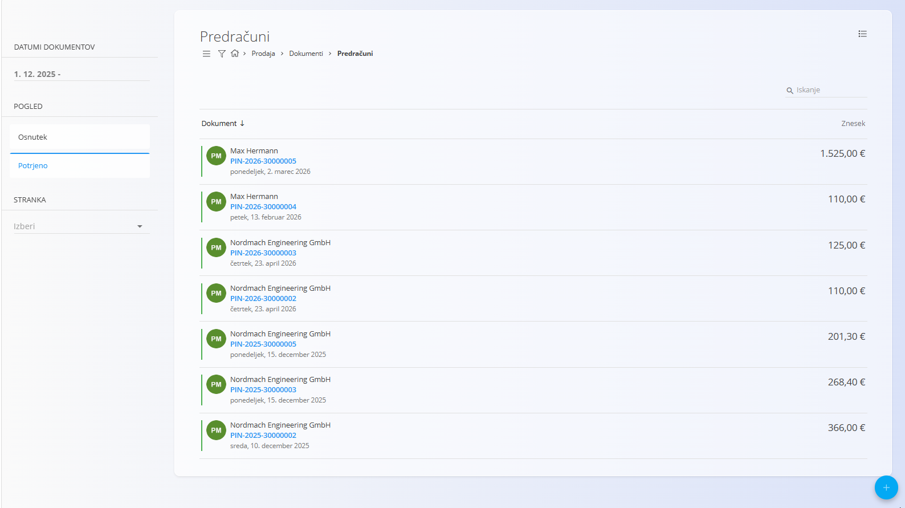
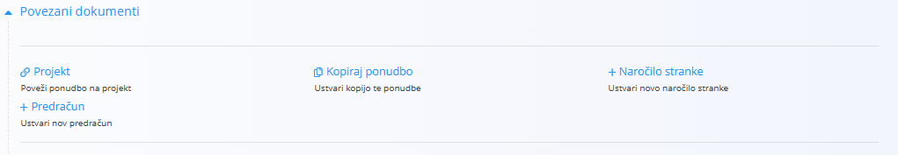
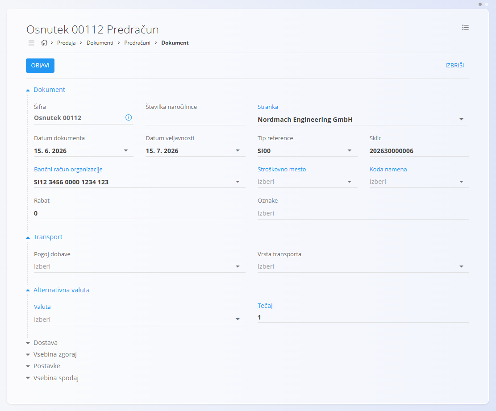
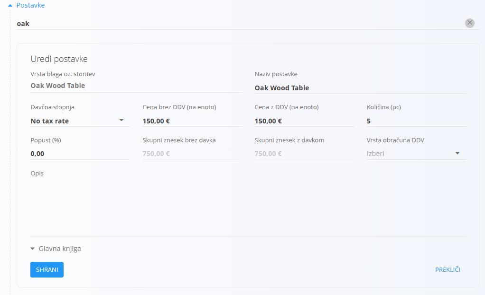
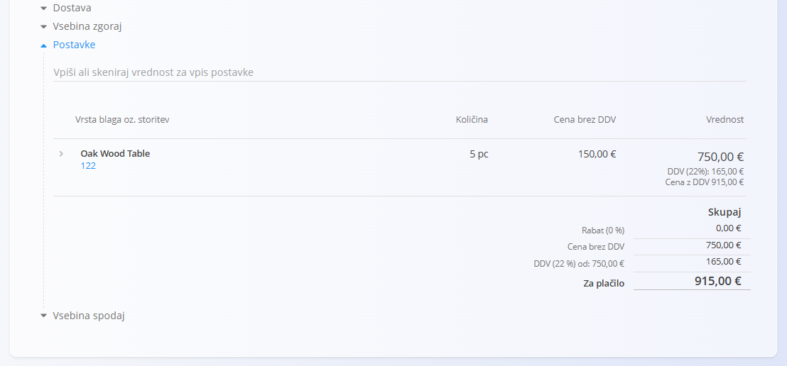
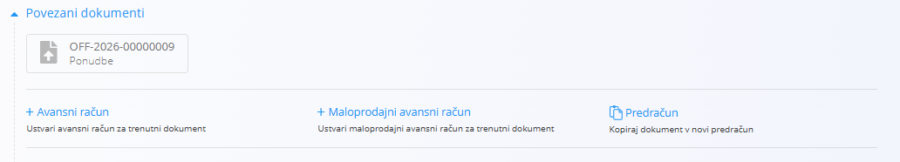
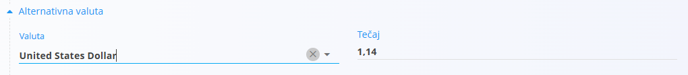
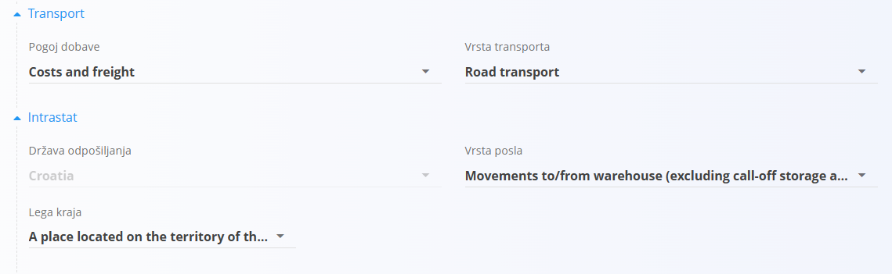
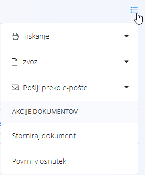

<!-- app_route: /sales/documents/proforma-invoices -->
<!-- app_label: Predračuni -->
<!-- canonical_source_url: https://tom-pit.github.io/Connected.Docs/sl/Domene/Prodaja/Dokumenti/Predracuni/ -->
<!-- canonical_source_title: Predračuni -->

# Predračuni

**Predračun** je informativni prodajni dokument, ki se uporablja za posredovanje podrobne cenovne ponudbe stranki, preden je blago ali storitev dobavljena.  
Predračun **ne sproži** računovodskih ali skladiščnih knjiženj, vendar predstavlja potrjeno komercialno ponudbo.

Predračuni se najpogosteje ustvarijo iz potrjene **[Ponudbe](Ponudbe.md)**, lahko pa se ustvarijo tudi samostojno z uporabo [**akcijskega gumbа**](../../../Skupno/UI/AkcijskiGumb.md).

Za dostop do tega dokumenta pojdite na **Prodaja / Dokumenti / Predračuni** v [navigaciji](../../../Skupno/UI/Navigacija.md).

## Vloga predračunov v prodajnem procesu

Predračuni se uporabljajo kot vmesni korak pri potrjevanju komercialnih pogojev s stranko:

1. Ustvarite **[Ponudbo](Ponudbe.md)** in jo po potrditvi objavite.  
2. Pretvorite potrjeno ponudbo v **Predračun** prek *Povezani dokumenti → + Predračun* ali ustvarite predračun ročno.  
3. Predračun pošljete stranki kot formalno ponudbo.  
4. (Neobvezno) Iz potrjenega predračuna ustvarite enega ali več **[Predplacila](AvansniRacuni.md)**.  
5. Po dobavi blaga ali storitev predračun pretvorite v končni **[Izdani račun](IzdaniRacuni.md)**.  
6. Po potrebi predračun stornirate z dejanjem **[Storno](../../Logistika/Dokumenti/Storno.md)**.

Potrjeni predračuni so informativni in ne vplivajo na finančna ali skladiščna stanja.

## Shema

<strong>Dokument</strong>

| Polje | Opis |
|------|------|
| [**Šifra**](../../../Skupno/UI/SifreDokumentov.md) | Sistemsko generiran identifikator predračuna. |
| **Številka naročilnice** | Neobvezna referenca na naročilo stranke. |
| **Stranka** | Prejemnik dokumenta, izbran iz šifranta [**Poslovni imenik**](../../../Skupno/Upravljanje/PoslovniImenik.md) (obvezno). |
| **Datum dokumenta** | Datum nastanka predračuna. |
| **Datum veljavnosti** | Datum, do katerega so cene in pogoji veljavni (obvezno). |
| **Tip reference** | Vrsta plačilnega sklica (obvezno). |
| **Sklic** | Sklicna številka glede na izbrano vrsto sklica. |
| [**Bančni račun organizacije**](../Upravljanje/BancniRacuniOrganizacije.md) | Bančni račun, prikazan na dokumentu (obvezno). |
| [**Stroškovno mesto**](../../../Skupno/Upravljanje/StroskovnaMesta.md) | Neobvezna razporeditev na stroškovno mesto. |
| **Koda namena** | Neobvezni opis namena dokumenta. |
| **Rabat** | Skupni rabat, uporabljen na celoten znesek. |
| **Vsebina zgoraj** | Uvodno besedilo iz [**Vnaprej določenih besedil**](../../../Skupno/Upravljanje/VnaprejDolocenaBesedila.md). |
| **Vsebina spodaj** | Zaključna ali pravna besedila iz [**Vnaprej določenih besedil**](../../../Skupno/Upravljanje/VnaprejDolocenaBesedila.md). |

<strong>Transport, alternativna valuta in dostava</strong>

| Polje | Opis |
|--------|-------------|
| **[Pogoj dobave](../../../Skupno/Upravljanje/PogojiDobave.md)** | Dobavni pogoji, dogovorjeni s stranko. |
| **[Vrsta transporta](../../../Skupno/Upravljanje/VrstaTransporta.md)** | Način transporta, dogovorjen s stranko. |
| [**Alternativna valuta**](../../../Skupno/Upravljanje/Valute.md) | Alternativna valuta glede na privzeto valuto, uporabljeno v dokumentu. |
| [**Tečaj**](../Upravljanje/MenjalniTecaji.md) | Tečaj alternativne valute glede na privzeto valuto. |
| **Dobava – Podjetje / Naslov** | Dobavni podatki stranke, povzeti iz [Poslovnega imenika](../../../Skupno/Upravljanje/PoslovniImenik.md). |

<strong>Postavke</strong>

| Polje | Opis |
|--------|-------------|
| **Vrsta blaga oz. storitev** | Izdelek, storitev ali sredstvo, izbrano za to postavko. |
| **Naziv postavke** | Prikazni naziv izbrane postavke (po potrebi ga je mogoče urediti). |
| **[Davčna stopnja](../../../Skupno/Upravljanje/DavcneStopnje.md)** | Davčna stopnja, uporabljena na postavki (nastavljena v konfiguraciji davkov). |
| **Cena brez DDV (na enoto)** | Cena na enoto brez davka. |
| **Cena z DDV (na enoto)** | Cena na enoto z davkom (samodejno izračunana glede na davčno stopnjo). |
| **Količina** | Količina izbrane postavke. |
| **Popust (%)** | Odstotek popusta, uporabljen na neto ceno. |
| **Skupni znesek brez davka** | Izračunan neto znesek (Cena brez DDV × Količina − Popust). |
| **Skupni znesek z davkom** | Skupni znesek z vključenim davkom. |
| **Vrsta obračuna DDV** | Določa način obračuna DDV v posebnih primerih: • **Tristranske dobave** – Za trikotne EU transakcije, kjer DDV obračuna končni kupec (obrnjena davčna obveznost). • **DDV obračuna kupec** – Uporaba obrnjene davčne obveznosti; DDV obračuna kupec namesto prodajalca. • **Izvozne storitve** – Za storitve, opravljene kupcem zunaj EU (običajno oproščene DDV). • **Prevozne storitve** – Posebna davčna obravnava za prevoz blaga. • **Prevoz potnikov** – Posebna pravila DDV za prevoz potnikov. • **Potovalne agencije** – Uporaba posebne maržne sheme za potovalne agencije. • **Po carinskih postopkih 42 in 63** – Za uvoz, kjer je DDV odložen v namembno državo EU. • **Prodaja odpoklicanega blaga iz EU** – Posebna davčna obravnava za vrnjeno ali odpoklicano blago znotraj EU. |
| **Opis** | Dodatne informacije o postavki (neobvezno). |
| **Alternativna valuta** | Možnost prikaza zneska postavke v izbrani alternativni valuti. Ob izbiri se znesek preračuna glede na tečaj, določen v dokumentu. |

<strong>Glavna knjiga in Intrastat postavke</strong>

| Polje | Opis |
|--------|-------------|
| **Glavna knjiga – Konto prihodka** | [Konto](../../Racunovodstvo/Upravljanje/GlavnaKnjiga/Konti.md) za knjiženje prihodkov ali odhodkov postavke. |
| **Glavna knjiga – Konto davka** | [Konto](../../Racunovodstvo/Upravljanje/GlavnaKnjiga/Konti.md) za knjiženje davka, vezanega na postavko dokumenta. |
| **[Intrastat – Tarifa](../../Racunovodstvo/Upravljanje/Intrastat/Tarife.md)** | Tarifna oznaka (šifra blaga) za poročanje Intrastat. |
| **Intrastat – Država porekla** | Država, iz katere blago izvira. |
| **Intrastat – Neto teža (kg)** | Neto teža za statistično poročanje. |
| **Intrastat – Statistična vrednost** | Prijavljena statistična vrednost blaga za poročanje Intrastat. |

## Upravljanje

Predračuni imajo lahko status **Osnutek** ali **Potrjeno**.

### Seznam

Seznam predračunov je mogoče filtrirati po:
- **Datumih dokumentov**
- **Pogledu** (Osnutek / Potrjeno)
- **Stranki**

Vsaka vrstica prikazuje:
- Stranko  
- Kodo dokumenta  
- Datum dokumenta  
- Znesek dokumenta  

Osnutke je mogoče urejati, potrjeni predračuni pa so dokončni, razen če so stornirani.

## Dejanja

### Ustvariti nove predračune

Predračune je mogoče ustvariti na dva načina:

- Neposredno na zaslonu **Predračuni** z uporabo [**akcijskega gumbа**](../../../Skupno/UI/AkcijskiGumb.md).  
- Iz potrjene **[Ponudbe](Ponudbe.md)** prek **Povezani dokumenti → + Predračun**.  
  V tem primeru se večina polj samodejno izpolni.

Koraki:

1. Ustvarite osnutek predračuna z akcijskim gumbom ali prek povezanih dokumentov.  
2. Izpolnite ali preverite:
   - **Stranko**  
   - **Datum dokumenta**  
   - **Datum veljavnosti**  
   - **Rabat** (neobvezno)  
   - **Tip reference / Sklic**  
   - **Bančni račun organizacije**

   

3. V razdelku **Postavke** dodajte postavke z vnosom ali skeniranjem **serijske številke**, **EAN** ali **naziva sredstva**.

   

   Za informacije o delu s postavkami dokumenta glejte [**Postavke dokumenta**](../../../Skupno/Koncepti/PostavkeDokumenta.md).

4. Shranite postavko.

   

5. Ko je dokument pripravljen, kliknite **Objavi**.

> [!NOTE]  
> Potrjenih predračunov ni mogoče urejati, lahko pa služijo kot osnova za **avansna plačila** ali končni račun.

## Urediti predračune

Osnutek predračuna je mogoče prosto urejati.  
Spremenite lahko:

- Dokument 
- Alternativna valuta
- Podatki o dobavi  
- Transport  
- Postavke (sredstva, količine, cene)  
- Vsebina zgoraj/spodaj  

Po objavi dokument preide v stanje **Potrjeno** in urejanje ni več dovoljeno.

#### Priponke

Razdelek **Priponke** uporabite za nalaganje in upravljanje datotek, povezanih z dokumentom, kot so fotografije, PDF datoteke, certifikati ali podporni dokumenti.

Za podrobna navodila glejte [**Priponke**](../../../Skupno/Koncepti/Priponke.md).

### Povezani dokumenti

Razdelek **Povezani dokumenti** omogoča ustvarjanje nadaljnjih dokumentov in prikazuje obstoječe povezave.

Za podrobnosti o povezavah med dokumenti, sledljivosti in ustvarjanju povezanih dokumentov glejte [**Povezani dokumenti**](../../../Skupno/Koncepti/PovezaniDokumenti.md).

Pogosta dejanja:
- **[+ Avansni račun](AvansniRacuni.md)** – ustvari avansni račun iz potrjenega predračuna  
  Zaloga: brez vpliva. Finance: evidentiranje avansnega plačila.
- **Predračun** – kopira vsebino v nov predračun  
- **[Ponudba](Ponudbe.md)** – prikaže izvorno ponudbo (če obstaja); omogoča sledljivost od ponudbe → predračun.

> [!NOTE]
> Razpoložljiva dejanja so odvisna od statusa dokumenta.

#### Alternativna valuta

Razdelek Alternativna valuta omogoča izražanje cen v dokumentu v valuti, ki je različna od privzete sistemske valute. To se običajno uporablja pri mednarodni prodaji. Tečaji se povzemajo iz šifranta [Devizni tečaji](../Upravljanje/MenjalniTecaji.md).

Ko je izbrana alternativna valuta, se cene v dokumentu samodejno preračunajo z uporabo navedenega deviznega tečaja.

#### Razdelka Transport in Intrastat

Ko je **Intrastat** nastavljen na **Obvezno** v **Sistem / Konfiguracija / Intrastat**, se v obrazcu dokumenta prikažeta dodatna razdelka.

- **Transport** – Uporablja se za zajem logističnih informacij o načinu dostave blaga.
- **Intrastat** – Uporablja se za zbiranje podatkov, potrebnih za Intrastat poročanje. Ta polja so prikazana samo, kadar je Intrastat poročanje omogočeno v sistemu.

> [!NOTE]  
> Več vrednosti, povezanih z Intrastat, je prevzetih iz **šifrantov materialov** (Intrastat konfiguracija), kot sta država in vrsta posla. Ta polja niso prosto nastavljiva na ravni dokumenta in so odvisna od predhodno definiranih matičnih podatkov.

#### Dostava

Razdelek **Dostava** določa naslov dostave. Privzeto se izpolni iz podatkov stranke, vendar ga je mogoče prilagoditi.

Ti podatki vplivajo na izpis dokumenta in nadaljnje logistične dokumente, ne spreminjajo pa osnovnih podatkov.

#### Postavke

Postavke določajo naročene artikle ter njihove količine, cene, davke in popuste. Vsaka postavka predstavlja določen izdelek, storitev ali sredstvo.

##### Glavna knjiga

Razdelek **Glavna knjiga** določa, kako se dokument knjiži v glavno knjigo. Opredeljuje, kateri konti se uporabijo za knjiženje prihodkov, odhodkov in davkov ob shranjevanju in knjiženju dokumenta.

Ob knjiženju dokumenta:

- **Neto znesek** se knjiži na izbrani konto prihodka ali odhodka.
- **Znesek davka** se knjiži na izbrani konto davka.
- Sistem samodejno ustvari ustrezne temeljnice v glavni knjigi.

Razpoložljivi konti so določeni v **[Kontnem načrtu](../../Racunovodstvo/Upravljanje/GlavnaKnjiga/Konti.md)**.

##### Intrastat

Če je omogočeno poročanje Intrastat in transakcija vključuje kupca iz druge države EU, se v obrazcu za urejanje postavke prikaže dodatni razdelek **Intrastat**.

Ta razdelek vsebuje statistične podatke, ki so potrebni za poročanje Intrastat.

Polja so obvezna pri čezmejnih EU transakcijah, kadar je organizacija zavezana k poročanju Intrastat.

## Izbrisati predračune

Dokumente v stanju **Osnutek** je mogoče izbrisati v pogledu za urejanje, **samo če ne vsebujejo postavk**.

Če osnutek še vedno vsebuje vrstice v razdelku **Postavke**:

1. Odprite meni dokumenta (zgornji desni kot).
2. Izberite **Izbriši vse postavke**, da odstranite vse vrstice hkrati.
3. Ko dokument ne vsebuje več postavk, kliknite **Izbriši**, da odstranite osnutek.

Če želite odstraniti samo določen material in ne vseh postavk:

1. Kliknite serijsko številko materiala, da odprete zaslon **Uredi postavko**.
2. V oknu za urejanje kliknite **Izbriši**.

> [!NOTE]  
> Objavljenih predračunov **ni mogoče izbrisati**, lahko pa jih [stornirate](../../Logistika/Dokumenti/Storno.md) ali **vrnete v osnutek**.

### Meni

Meni dokumenta omogoča naslednja dejanja:

- **Tiskanje**
- **Izvoz**
- **Pošlji preko e-pošte**
- **Izbriši vse postavke** (če je dokument v stanju Osnutek)
- [**Storniranje dokument**](../../Logistika/Dokumenti/Storno.md)  
- **Vrni v osnutek** (če sistemska pravila dovoljujejo)

Storniranje predračuna razveljavi njegov potrjeni učinek in ustvari storno dokument. Za več informacij glejte **[Storno](../../Logistika/Dokumenti/Storno.md)**.

