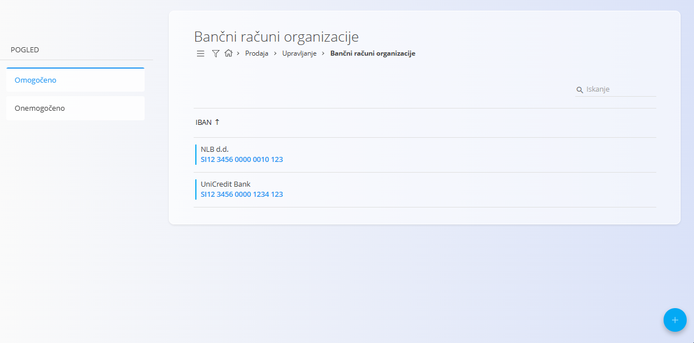
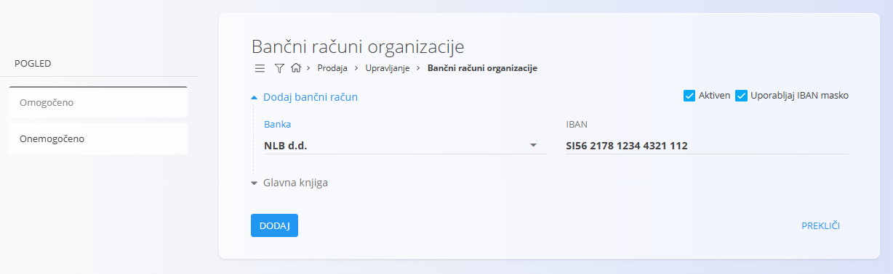

<!-- app_route: /management/common-types/organization-bank-accounts -->
<!-- app_label: Bančni računi organizacije -->
<!-- canonical_source_url: https://github.com/Tom-PIT/Connected.Docs/blob/main/sl/Domene/Prodaja/Upravljanje/BancniRacuniOrganizacije.md -->
<!-- canonical_source_title: Bančni računi organizacije -->

# Bančni računi organizacije

Šifrant **Bančni računi organizacije** hrani IBAN račune, ki jih vaše podjetje uporablja za izdajanje računov, prejemanje plačil in druge finančne procese. Ta zaslon omogoča pregled, dodajanje, omogočanje ali onemogočanje IBAN računov, ki jih uporablja organizacija.  
Vsak zapis določa banko, IBAN številko ter ali je račun aktiven in ali se uporablja maska za vnos IBAN-a.

Za dostop do tega zaslona pojdite na **Prodaja / Šifranti / Bančni računi organizacije** v [navigaciji](../../../Skupno/UI/Navigacija.md).

> [!NOTE]  
> **Predpogoji**  
> Pred upravljanjem bančnih računov zagotovite, da je šifrant [**Banke**](../../../Skupno/Upravljanje/BancniRacuni.md) pravilno nastavljen.

## Shema

| Polje | Opis |
|------|------|
| [**Banka**](../../../Skupno/Upravljanje/BancniRacuni.md) | Banka, pri kateri je odprt račun (obvezno). |
| **IBAN** | Mednarodna številka bančnega računa (obvezno). |
| **Aktiven** | Določa, ali je račun na voljo za uporabo v dokumentih (privzeto označeno). |
| **Uporabljaj IBAN masko** | Določa, ali se IBAN prikazuje in vnaša z vnosno masko za boljšo berljivost. |

## Upravljanje

### Seznam bančnih računov

Zaslon prikazuje seznam bančnih računov. Na levi strani lahko račune filtrirate glede na stanje:
- **Omogočeno**
- **Onemogočeno**

S klikom na IBAN številko odprete urejanje izbranega bančnega računa.

## Dejanja

### Ustvariti nov bančni račun organizacije

Za dodajanje novega bančnega računa kliknite [Akcijski gumb](../../../Skupno/UI/AkcijskiGumb.md).

Vnesite zahtevane podatke:
- **Banka**
- **IBAN**
- **Aktiven**
- **Uporabljaj IBAN masko** (neobvezno)
- **Glavna knjiga**

#### Glavna knjiga

Razdelek **Glavna knjiga** določa, kateri [konto](../../Racunovodstvo/Upravljanje/GlavnaKnjiga/Konti.md) glavne knjige predstavlja **bančni račun organizacije** v računovodskih transakcijah.

Izbrani konto glavne knjige se uporablja pri knjiženju **plačil**, **prejemkov**, **bančnih izpiskov** in **uskladitev**. Vsi finančni premiki, povezani s tem bančnim računom, se knjižijo na izbrani konto.

> [!NOTE]
> Nastavitev glavne knjige je potrebna za natančno davčno računovodstvo, poročanje in skladnost s predpisi.

### Urejati bančni račun organizacije

Kliknite številko IBAN računa, ki ga želite urediti. Po potrebi lahko posodobite katerokoli polje.

### Izbrisati bančni račun organizacije

Kliknite številko IBAN računa, ki ga želite izbrisati, nato na zaslonu za urejanje kliknite **Izbriši**.

Po potrditvi se zapis trajno odstrani. Če brisanja ne potrdite, ostane zapis nespremenjen.

> [!NOTE]
> Bančni račun je mogoče izbrisati samo, če ni uporabljen v drugih entitetah sistema.
