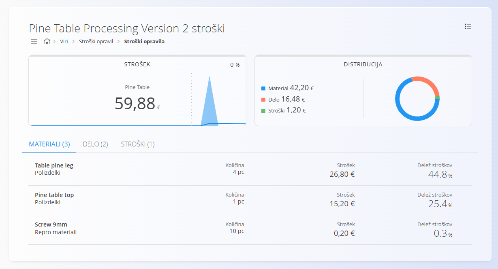

<!-- app_route: /management/processes -->
<!-- app_label: Procesi -->
<!-- app_navigation_hint: Odpri proces, klikni na vrednost stroška želene verzije. -->
<!-- canonical_source_url: https://tom-pit.github.io/Connected.Docs/sl/Domene/Proizvodnja/Analiza/AnalizaStroskaVerzije/ -->
<!-- canonical_source_title: Analiza stroška verzije -->

# Analiza stroška verzije

Zaslon **Analiza stroška verzije** prikazuje **ocenjeni strošek proizvodnje na kos** za izbrano **verzijo procesa**.

Ta pogled se odpre s klikom na **vrednost stroška** v stolpcu **Strošek** na zaslonu **[Verzije](../Upravljanje/Procesi.md#verzije)**.

Stran prikazuje podrobno razčlenitev, kako je izračunan skupni strošek proizvodnje, vključno z materiali, delom in dodatnimi stroški.

> [!NOTE]
> Enako analizo stroškov lahko odprete tudi v pogledu [**Stroški opravil**](../../Viri/Pregledi/StroskiOpravil.md), če v filtru **Pogled** izberete **Procese**.

## Povzetek stroška

Panel **Strošek** prikazuje **skupni ocenjeni strošek na proizveden kos** za izbrano verzijo.

Prikazane informacije vključujejo:

- **Ime izdelka** – izhodni izdelek, povezan z verzijo procesa
- **Skupni ocenjeni strošek**
- **Kazalnik trenda**, ki prikazuje razliko glede na prejšnjo izračunano vrednost

Strošek je izračunan na podlagi vseh materialov in virov, ki so določeni v operacijah te verzije.

## Distribucija stroškov

Panel **Distribucija** prikazuje vizualno razčlenitev skupnega stroška.

**Graf in legenda** prikazujeta, kako je strošek razdeljen med:

- **Material** – strošek vseh vhodnih materialov, porabljenih v operacijah
- **Delo** – strošek človeškega in strojnega dela, potrebnega za izvedbo operacij

Ta pogled omogoča hitro razumevanje, kateri elementi največ prispevajo k skupnemu strošku.

## Materiali

Razdelek **[Materiali](../../Sredstva/Materiali/README.md)** prikazuje vse materiale, ki se porabijo v operacijah procesa. Za izračun stroška posameznega materiala se uporabljajo cene iz [**Material dobavitelja**](../../Nabava/Upravljanje/MaterialiDobaviteljev.md).

Vsaka vrstica prikazuje:

- **Ime materiala**
- **Tip materiala** (npr. polizdelek, surovina, repro material)
- **Potrebno količino**
- **Prispevek k strošku**
- **Delež stroška** glede na skupni strošek izdelka

Cene materialov so prevzete iz **trenutne konfiguracije cen materialov** v sistemu.

## Delo

Razdelek **Delo** prikazuje strošek dela virov, ki sodelujejo pri izvedbi procesa. Strošek se izračuna na podlagi **trajanja dela** in **urne postavke** dodeljenih virov. Podatki se črpajo iz šifranta [**Stroški virov**](../../Viri/Upravljanje/PostavkeVirov.md).

To lahko vključuje:

- **Človeške vire** (operaterji, delavci)
- **Nečloveške vire** (stroji, delovne postaje)

Vsaka vrstica prikazuje:

- **Ime vira**
- **Trajanje dela**
- **Izračunan strošek**
- **Delež stroška** glede na skupni strošek

Stroški dela se izračunajo na podlagi konfiguriranih **urnih postavk virov**.

## Stroški

Razdelek **Stroški** prikazuje **dodatne stroške**, povezane z verzijo procesa. Stroški so definirani v šifrantu [**Stroški**](../../Nabava/Upravljanje/Stroski.md) in se lahko povežejo z verzijo procesa za evidentiranje stroškov, ki niso neposredno povezani z materiali ali viri.

Primeri:

- zunanje storitve
- poraba energije
- operativni stroški

Če v procesu niso definirani dodatni stroški, razdelek prikazuje **Ni stroškov**.

## Skupni strošek

Vrednost **Skupaj** na dnu strani prikazuje končni **ocenjeni strošek proizvodnje na kos**, ki je izračunan kot vsota:

- materialov
- dela
- dodatnih stroškov

Ta vrednost ustreza **strošku, prikazanemu v seznamu verzij**.

Če se operacije, materiali ali viri v verziji procesa spremenijo, je treba strošek ponovno izračunati s klikom na **Izračunaj** na strani **[Verzije](../Upravljanje/Procesi.md#verzije)**.

## Meni

Meni omogoča dodatna dejanja, ki so na voljo na tej strani.

Na voljo so naslednja dejanja:

- **Izvoz v PDF**
- **Ponovno izračunaj** – ponovno izračuna stroške izbranega opravila ali verzije procesa na podlagi trenutnih materialov, virov in stroškov.

Za več informacij o dejanjih v meniju glejte [**Dejanja menija**](../../../Skupno/Koncepti/MeniDejanja.md).