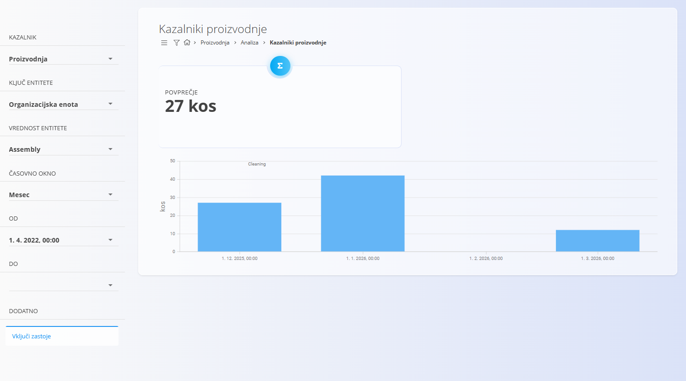
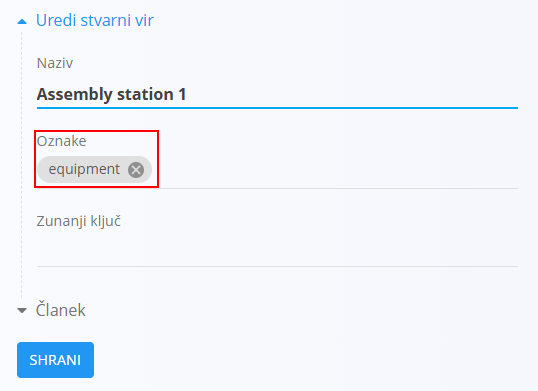
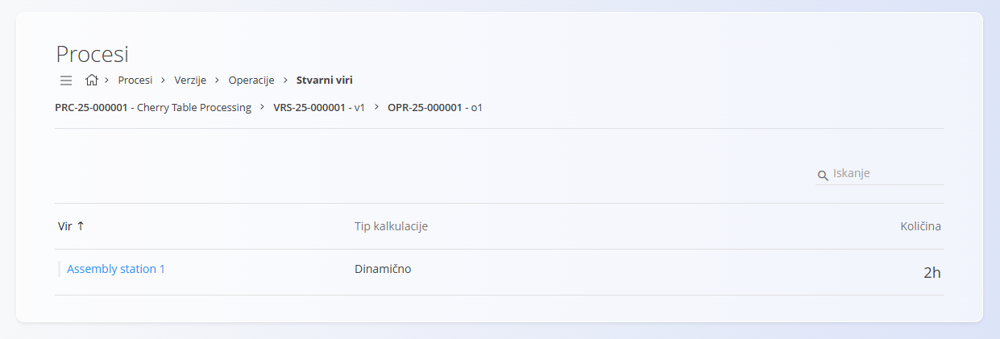

<!-- app_route: /production/analytics/kpis -->
<!-- app_label: Kazalniki proizvodnje -->
<!-- canonical_source_url: https://github.com/Tom-PIT/Connected.Docs/blob/main/sl/Domene/Proizvodnja/Analiza/KazalnikiProizvodnje.md -->
<!-- canonical_source_title: Kazalniki proizvodnje -->

# Kazalniki proizvodnje

Stran **Kazalniki proizvodnje** omogoča analitičen vpogled v uspešnost proizvodnje in učinkovitost opreme.

Kazalniki omogočajo spremljanje:
- kakovosti proizvodnje,
- razpoložljivosti opreme,
- zastojev,
- učinkovitosti proizvodnje,
- skupne učinkovitosti opreme (OEE).

Izračuni KPI temeljijo na standardni [metodologiji OEE](https://www.oee.com/calculating-oee/).

Do strani dostopate preko **Proizvodnja / Analiza / Kazalniki proizvodnje** v [navigaciji](../../../Skupno/UI/Navigacija.md).



> [!TIP]
> Za celovit pregled analitike proizvodnje si oglejte video **[Kazalniki uspešnosti](https://www.youtube.com/watch?v=zzs6wJh-tQY)**.

> [!NOTE]
> Vrednosti KPI se lahko prikažejo z manjšim časovnim zamikom po vnosu proizvodnih podatkov.

## Zahteve za opremo

Za zajem podatkov za proizvodne KPI-je:
- morajo biti nečloveški viri označeni z oznako ```equipment```

  

- mora biti oprema dodeljena proizvodnim operacijam

  

## Filtri

Levi panel vsebuje filtre, s katerimi določite, kateri KPI podatki bodo prikazani.

### KPI
Izberite proizvodni kazalnik, ki ga želite analizirati.

| KPI | Pomen |
|-----|--------|
| **Čas operacije** | Skupni čas izvajanja operacije, vključno z zastoji |
| **Čas proizvodnje** | Čas dejanske proizvodnje brez zastojev |
| **Idealna proizvodnja** | Pričakovana količina proizvodnje glede na normative |
| **Kakovost** | Odstotek ustreznih izdelkov glede na celotno proizvodnjo |
| **Neplanirani zastoji** | Skupni čas neplaniranih zastojev |
| **Neustrezna proizvodnja** | Število neustreznih izdelkov |
| **Planirani zastoji** | Skupni čas planiranih zastojev |
| **Proizvodnja** | Skupno število proizvedenih izdelkov |
| **Razpoložljivost** | Odstotek časa, ko je bila oprema na voljo za proizvodnjo |
| **Skupna učinkovitost opreme (OEE)** | Kombiniran kazalnik razpoložljivosti, učinkovitosti in kakovosti |
| **Učinkovitost** | Primerjava med pričakovano in dejansko proizvodno uspešnostjo |
| **Ustrezna proizvodnja** | Število ustreznih izdelkov |

### Ključ entitete
Določa vrsto entitete, za katero se KPI izračunava:
- **Oprema**
- **Organizacijska enota**

### Vrednost entitete
Izberite konkretno opremo ali organizacijsko enoto glede na izbran ključ entitete.

### Časovno obdobje
Določa granularnost prikaza podatkov, na primer:
- **Četrt ure**
- **Ura**
- **Dan**
- **Teden**
- **Mesec**
- **Leto**

> [!NOTE]
> Izbrano **Časovno obdobje** določa način združevanja KPI podatkov.
>
> - Ura → urne vrednosti
> - Dan → dnevne vrednosti
> - Mesec → mesečne vrednosti
>
> Bolj podrobna časovna obdobja omogočajo natančnejšo analizo, vendar so rezultati odvisni od pogostosti vnosa proizvodnih podatkov.

### Od / Do
Izberite začetni in končni datum ter čas obdobja, za katerega želite prikaz KPI podatkov.

### Dodatne nastavitve
- **Vključi zastoje** – če je omogočeno, se zastoji vključijo v izračun KPI-jev, kjer je to relevantno.

## Rezultati KPI

Rezultati KPI so prikazani na vrhu strani in vključujejo:
- **AVG** – povprečno vrednost izbranega KPI-ja za izbrano obdobje
- **Stolpčni ali linijski graf** trenda KPI skozi izbrano časovno obdobje

> [!NOTE]
> Vrednost **AVG** se izračuna iz izvornih proizvodnih podatkov in ne kot povprečje prikazanih vrednosti na grafu.
>
> Zato se lahko vrednost AVG razlikuje od vizualnega povprečja na grafu.

Glede na izbran KPI se lahko pod grafom prikažejo tudi dodatni podatki:
- za **KPI zastojev**: razlogi in trajanja zastojev,
- za **proizvodne KPI-je**: količine ustrezne in neustrezne proizvodnje,
- za **KPI opreme**: dnevni ali urni kazalniki uspešnosti.

> [!NOTE]
> Manjkajoče vrednosti na grafu ne pomenijo nujno, da je bila vrednost KPI enaka nič.
> V nekaterih primerih za izbrano obdobje ni bilo zabeleženih proizvodnih podatkov.