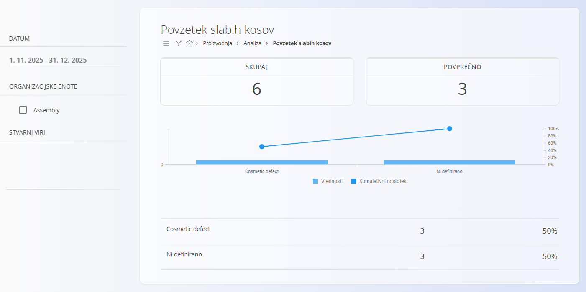

<!-- app_route: /production/analytics/loss-summary -->
<!-- app_label: Povzetek slabih kosov -->
<!-- canonical_source_url: https://github.com/Tom-PIT/Connected.Docs/blob/main/sl/Domene/Proizvodnja/Analiza/PovzetekSlabihKosov.md -->
<!-- canonical_source_title: Povzetek slabih kosov -->

# Povzetek slabih kosov

Pogled **Povzetek slabih kosov** prikazuje pregled slabih oziroma neuporabnih kosov, zabeleženih med proizvodnjo v izbranem časovnem obdobju. Omogoča prepoznavanje najpogostejših vzrokov za slabe kose ter oceno njihovega vpliva na kakovost proizvodnje.

Do pogleda dostopate prek **Proizvodnja / Analiza / Povzetek slabih kosov** v [navigaciji](../../../Skupno/UI/Navigacija.md).

## Filtri

### Datum  
Izberite časovno obdobje, za katero želite analizirati slabe kose.

### Organizacijske enote  
Omejite prikaz slabih kosov na izbrane organizacijske enote.

### Stvarni viri  
Filtrirajte slabe kose glede na stroje ali druge stvarne vire.

## Povzetne vrednosti

Na vrhu pogleda sta prikazana dva ključna kazalnika:

### Skupaj  
Skupno število zabeleženih slabih kosov v izbranem obdobju.

### Povprečno  
Povprečno število slabih kosov na operacijo oziroma na zabeležen dogodek (glede na izračun sistema).

## Graf porazdelitve slabih kosov

Pod povzetnimi vrednostmi je prikazan graf, ki vključuje:

- Stolpce, ki predstavljajo **število slabih kosov** po posamezni klasifikaciji  
- **Kumulativni odstotek**, ki prikazuje prispevek posamezne klasifikacije k skupnemu številu slabih kosov  

Graf omogoča hitro prepoznavanje najpomembnejših vzrokov za slabe kose ter podpira Pareto analizo.

## Podrobnosti slabih kosov

Pod grafom je prikazan seznam vseh klasifikacij slabih kosov skupaj s pripadajočim številom.

Primeri klasifikacij temeljijo na šifrantih, definiranih v **Oznakah klasifikacije slabega kosa**.

Izbira posamezne vrstice lahko prikaže dodatne podrobnosti, odvisno od konfiguracije sistema.