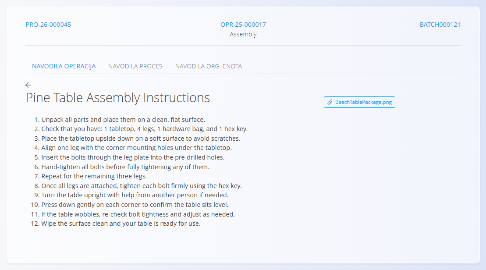

<!-- app_route: /production-orders/execution -->
<!-- app_label: Izvedba -->
<!-- app_navigation_hint: V Izvedbi, kliknite akcijski gumb in izberite Navodila. -->
<!-- canonical_source_url: https://tom-pit.github.io/Connected.Docs/sl/Domene/Proizvodnja/Dokumenti/Navodila/ -->
<!-- canonical_source_title: Navodila -->

# Navodila

Aktivnost **Navodila** prikazuje članke iz baze znanja, povezane s trenutno operacijo, procesom ali organizacijsko enoto. Namenjena je hitremu pregledu navodil med delom.

**Navodila** odprete na zaslonu [**Izvedba**](Izvedba.md) prek izbire aktivnosti (tapnite [akcijski gumb](../../../Skupno/UI/AkcijskiGumb.md) in izberite **Navodila**).

## Ogledati navodila

1. Odprite stran **Navodila** prek [**menija aktivnosti v Izvedbi**](Izvedba.md#akcijski-meni-in-aktivnosti).

   

2. Preberite vsebino, povečajte slike in sledite navodilom.  
3. Ko končate, se vrnite na zaslon [**Izvedba**](Izvedba.md) prek akcijskega gumba → **Proizvedeno**.

## Vrste navodil

Na voljo so različne vrste navodil, ki se prikazujejo v ločenih zavihkih:

- **Navodila operacije** – navodila, povezana s trenutno operacijo (npr. koraki dela, nastavitve stroja ali zahteve za posamezno operacijo).
- **Navodila procesa** – navodila, ki veljajo za celoten proizvodni proces.
- **Navodila org. enota** – navodila, povezana z organizacijsko enoto, v kateri se operacija izvaja.

Vsaka vrsta navodil se upravlja ločeno in lahko vsebuje različne članke iz [**Baze znanja**](../../Znanje/BazaZnanja/BazaZnanja.md).

## Tipična vsebina

Članki z navodili lahko vključujejo:

- korake sestave  
- varnostne postopke in opozorila  
- vizualna navodila (fotografije, risbe)  
- opombe, specifične za operacijo ali izdelek  

> [!NOTE]
> Vsebino člankov lahko posodabljajo pooblaščeni uporabniki v domeni  
> [**Baza znanja**](../../Znanje/BazaZnanja/BazaZnanja.md).

## Urediti in posodobiti navodila

Vsebina navodil se lahko upravlja na ravni operacije, procesa ali organizacijske enote.

Za posodobitev navodil povežite ustrezne članke iz [**Baze znanja**](../../Znanje/BazaZnanja/BazaZnanja.md) v konfiguraciji [operacije](../Upravljanje/Operacije.md), [procesa](../Upravljanje/Procesi.md) ali [organizacijske enote](../Upravljanje/OrganizacijskeEnote.md).