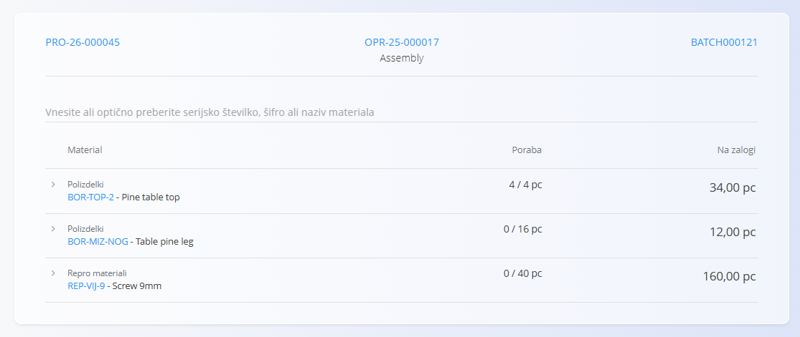
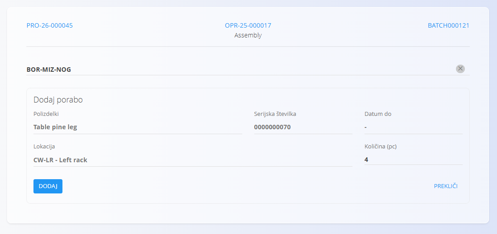

<!-- app_route: /production-orders/execution -->
<!-- app_label: Izvedba -->
<!-- app_navigation_hint: V Izvedbi, kliknite akcijski gumb in izberite Poraba. -->
<!-- canonical_source_url: https://tom-pit.github.io/Connected.Docs/sl/Domene/Proizvodnja/Dokumenti/Poraba/ -->
<!-- canonical_source_title: Poraba -->

# Poraba

Aktivnost **Poraba** beleži porabo vhodnih materialov med izvajanjem operacije. Uporablja se, ko iz zaloge vzamete materiale za izdelavo izdelkov (npr. vijake, lepilo, barvo, napeljavo ali določen serijski/serijski sklop). S tem se zagotavlja natančno stanje zalog in popolna sledljivost vhodov (materiali, serije, loti).

Zaslon **Poraba** odprete iz glavne strani [**Izvedba**](Izvedba.md) preko izbire aktivnosti (klik na [akcijski gumb](../../../Skupno/UI/AkcijskiGumb.md) in izbira **Poraba**).

## Zabeležiti porabo materiala

1. Odprite stran **Poraba** iz [**menija aktivnosti izvedbe**](Izvedba.md#akcijski-meni-in-aktivnosti).  
2. Preglejte seznam materialov za porabo (s prikazom stanja zaloge).  
3. Izberite material s seznama ali poiščite/skenirajte po nazivu, šifri, serijski številki ali EAN kodi.  
4. Na zaslonu **Dodaj porabo** vnesite količino za porabo.  

   

5. Kliknite **Dodaj**, da shranite porabo.  
6. Po potrebi ponovite postopek za druge materiale.

Porabljena količina je povezana z operacijo in se v realnem času odrazi v stanju zaloge.

### Validacije

Sistem preverja:

- razpoložljivost zaloge (zadostna količina),
- pravilno skladišče in lokacijo,
- lastništvo in status serije/lota.

Če katera koli validacija ni uspešna, sistem prikaže napako in poraba ni zabeležena.