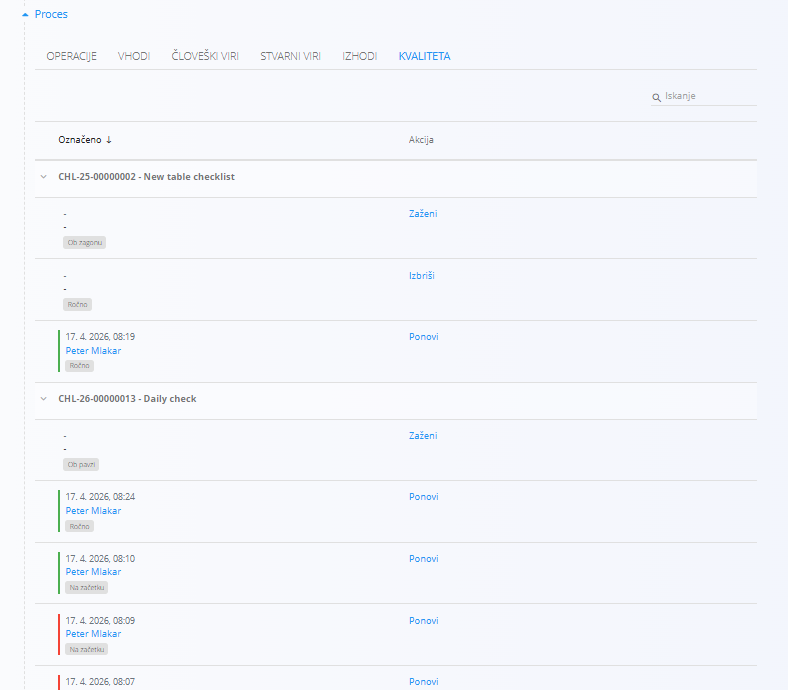

<!-- app_route: /production-orders -->
<!-- app_label: Proizvodni nalog -->
<!-- app_navigation_hint: Odprite proizvodni nalog, nato odprite zavihek **Kvaliteta**. -->
<!-- canonical_source_url: https://tom-pit.github.io/Connected.Docs/sl/Domene/Proizvodnja/Dokumenti/ProizvodniNalogiKvaliteta/ -->
<!-- canonical_source_title: Proizvodni nalogi - Kvaliteta -->

# Proizvodni nalogi - Kvaliteta

Zavihek **Kvaliteta** prikazuje vse [**kontrolne sezname**](../../Kvaliteta/Upravljanje/KontrolneListe.md), povezane z izbranim **[proizvodnim](ProizvodniNalogi.md) ali [vzdrževalnim](../../Vzdrzevanje/Dokumenti/VzdrzevalniNalogi.md) nalogom**.

Ti kontrolni seznami so dodani na določen **[proces](../Upravljanje/Procesi.md) ali [operacijo](../Upravljanje/Operacije.md)**, da se zagotovi izvajanje kontrol kakovosti med izvajanjem naloga.

## Pregled

Seznam prikazuje vse kontrolne sezname, povezane z nalogom, skupaj z njihovim imenom in kodo. Vsak kontrolni seznam prikazuje različne zapise izvajanja. Vsak zapis vsebuje:

- **Datum in čas** zaključka  
- **Operaterja**, ki je izvedel kontrolni seznam  
- **Oznako sprožitve** – označuje, kdaj je bilo izvajanje načrtovano (npr. *Na začetku*, *Ob zagonu*, *Ob pavzi*)  

Zaključeni kontrolni seznami so vizualno označeni:

- **Zeleno** – kontrolni seznam je uspešno zaključen  
- **Rdeče** – kontrolni seznam ni uspešen (npr. vrednosti izven dovoljenih meja)  

## Dejanja

Na voljo so naslednja dejanja:

- **Zaženi** – ročno zažene kontrolni seznam. Kontrolni seznami so običajno nastavljeni, da se zaženejo samodejno ob določenem dogodku (npr. *Ob začetku*, *Ob pavzi*), lahko pa jih sprožite tudi ročno.

- **Ponovi** – ponovno zažene kontrolni seznam in ustvari nov zapis izvajanja. Uporabno, kadar je potrebno kontrolni seznam ponoviti (npr. po odpravi napake).

- **Izbriši** – izbriše **trenutno izvajajoč kontrolni seznam**.

> [!IMPORTANT]
> Dejanje **Izbriši** se uporablja za **prisilno zaustavitev in odstranitev** kontrolnega seznama, ki se je zataknil in preprečuje zaključek proizvodnega naloga.