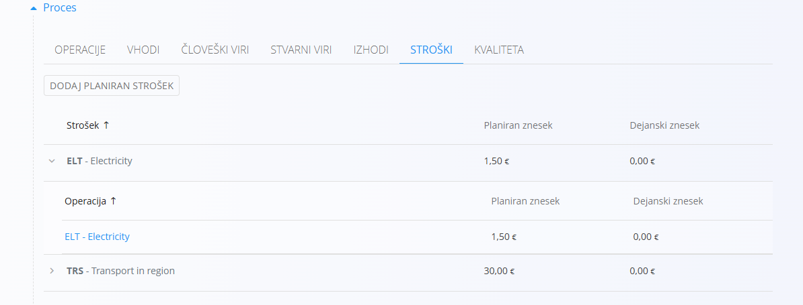
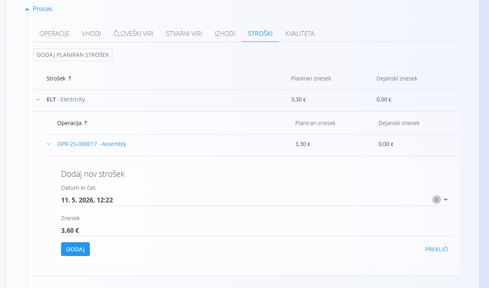
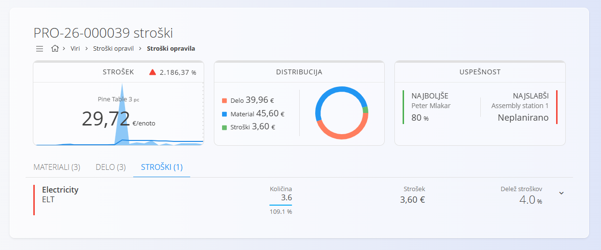

<!-- app_route: /production-orders -->
<!-- app_label: Proizvodni nalog -->
<!-- app_navigation_hint: Odprite proizvodni nalog, nato odprite zavihek **Stroški**. -->
<!-- canonical_source_url: https://github.com/Tom-PIT/Connected.Docs/blob/main/sl/Domene/Proizvodnja/Dokumenti/ProizvodniNalogiStroski.md -->
<!-- canonical_source_title: Proizvodni nalogi - Stroški -->

# Proizvodni nalogi - Stroški

[Stroške](../../Nabava/Upravljanje/Stroski.md), povezane s [proizvodnim nalogom](ProizvodniNalogi.md), je mogoče evidentirati v razdelku **Stroški** v podrobnostih naloga. To omogoča spremljanje planiranih in dejanskih stroškov proizvodnega naloga ter boljši vpogled v stroške proizvodnega procesa.

Stroški so običajno [dodani operaciji](../Upravljanje/StroskiOperacije.md) v proizvodnem procesu, lahko pa se dodajo tudi neposredno na proizvodni nalog, če niso vezani na določeno operacijo.

## Dodati ali urediti strošek

Za natančnejši izračun dejanskih stroškov proizvedenega izdelka je mogoče na zavihku **Stroški** dodajati ali urejati planirane stroške:

- Za urejanje planiranega stroška kliknite strošek na seznamu, da odprete njegove podrobnosti, izvedite želene spremembe in kliknite **Shrani**.
- Za dodajanje novega stroška:
    1. Kliknite gumb **Dodaj planiran strošek**.
    2. Izberite strošek operacije in določite strošek.
    3. Kliknite **Dodaj**, da shranite nov strošek.

> [!IMPORTANT]
> Planirani stroški se izračunajo **na nalog**. Če so na primer stroški **2$** na izdelek in je načrtovana količina za proizvodnjo 10, bodo stroški znašali **20$**.

## Evidentirati dejanski strošek

Planirani stroški predstavljajo pričakovane stroške, medtem ko dejanski stroški predstavljajo dejansko evidentirane stroške med izvajanjem proizvodnje. Dejanske stroške je mogoče evidentirati, kadar se razlikujejo od planiranih stroškov. To omogoča spremljanje razlik med planiranimi in dejanskimi stroški, kar je pomembno za nadzor in analizo stroškov.

Za evidentiranje dejanskega stroška:

1. Kliknite puščico ob strošku na seznamu, da odprete njegove podrobnosti.
2. Kliknite **Dodaj dejanski strošek**.
3. Vnesite dejanski strošek, datum in čas.
4. Kliknite **Dodaj**.

Dejanske stroške je mogoče po potrebi urejati ali izbrisati. Za urejanje ali brisanje dejanskega stroška kliknite znesek, da odprete njegove podrobnosti, izvedite želene spremembe in kliknite **Shrani** ali **Izbriši**.

## Pregled stroškov

Evidentirani stroški se zbirajo in prikazujejo v pogledu [**Stroški opravil**](../../Viri/Pregledi/StroskiOpravil.md), kjer je mogoče analizirati porazdelitev stroškov delovnega naloga.

Ta pogled je dostopen tudi preko seznama proizvodnih nalogov, kjer je za vsak nalog prikazan strošek na enoto. Klik na strošek na enoto odpre pogled [**Stroški opravil**](../../Viri/Pregledi/StroskiOpravil.md), filtriran na izbrani nalog, kar omogoča analizo porazdelitve stroškov delovnega naloga in podroben pregled stroškov.