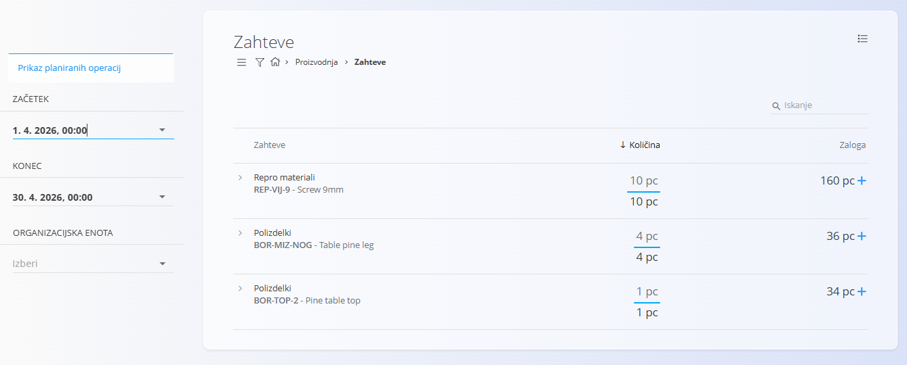
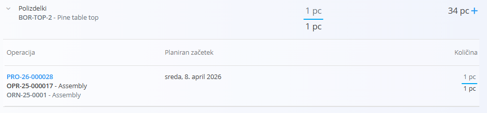

<!-- app_route: /production-orders/requirements -->
<!-- app_label: Zahteve -->
<!-- canonical_source_url: https://tom-pit.github.io/Connected.Docs/sl/Domene/Proizvodnja/Dokumenti/Zahteve/ -->
<!-- canonical_source_title: Zahteve -->

# Zahteve

Stran **Zahteve** ponuja pregled vseh materialov, potrebnih za planirane proizvodne operacije v izbranem časovnem obdobju. Planerjem pomaga preveriti, ali je na voljo dovolj zaloge, ter hitro ustvariti nabavne naloge, kadar se pojavijo primanjkljaji.

Stran **Zahteve** planerjem omogoča:

- pregled **potrebnih materialov** za prihajajočo proizvodnjo  
- primerjavo **zahtevanih in razpoložljivih** količin  
- vpogled v **operacije**, ki povzročajo porabo  
- hitro ustvarjanje **nabavnih nalogov**, kadar zaloga ni zadostna

> [!TIP]  
> Za celovit prikaz si oglejte video vodič **[Requirements](https://www.youtube.com/watch?v=eK7ui-ak7J0)**.

Do strani dostopate prek **Proizvodnja / Zahteve** v [navigaciji](../../../Skupno/UI/Navigacija.md).

## Shema

| Stolpec | Opis |
|--------|------|
| **Zahteva** | Naziv in šifra materiala. Posamezen material lahko razširite za ogled operacij, ki ga porabljajo. |
| **Količina** | Prikazani sta dve vrednosti: • **Količina v intervalu** — potrebna količina v izbranem časovnem obdobju (zgornja vrednost) • **Skupna količina** — celotna planirana poraba za vse operacije, ki uporabljajo ta material (spodnja vrednost) |
| **Zaloga** | Trenutna razpoložljiva zaloga. • Če je zaloge manj, kot je zahtevano, je vrednost prikazana **rdeče**. • Klik na ikono **+** odpre okno za ustvarjanje **novega nabavnega naloga**. |

## Seznam zahtev

Vsaka vrstica predstavlja **zahtevo po materialu**, izračunano na podlagi vhodov, definiranih v procesih in proizvodnih nalogih.

### Filtri

Filtri se nahajajo na levi strani zaslona in omogočajo prilagoditev, katere planirane operacije so vključene v izračun.

- **Prikaz planiranih operacij** – Če je omogočeno, se zahteve izračunajo samo na podlagi planiranih (še ne izvedenih) operacij.  
- **Začetek / Konec** – Določa časovni interval za izračun potrebnih količin.  
- **Organizacijska enota** – Filtrira zahteve po organizacijski enoti.

V izračun so vključeni samo materiali, ki jih zahtevajo operacije znotraj izbranega časovnega intervala in organizacijske enote.

### Ogledati podrobnosti porabe

Kliknite puščico za razširitev ob materialu, da prikažete vse operacije, ki ga uporabljajo:

Za vsako operacijo so prikazani:

- **Šifra in naziv operacije**  
- **Planiran začetek**  
- **Porabljena količina** v tej operaciji  

To planerjem omogoča vpogled v to, *katere* proizvodne naloge povzročajo porabo materiala.

#### Barvna koda

Sistem prikaže številke porabe z barvno kodo:

- **Rdeče** – zaloga je **0**.
- **Oranžno** – če je zaloga manjša od potreb.
- **Črno** – če je zaloga zadostna za pokritje porabe.

## Ustvariti nabavni nalog

V stolpcu **Zaloga** je gumb **+** poleg številke količine.

Klik na **+** odpre obrazec za ustvarjanje nabavnega naloga, ki je že predizpolnjen z izbranim materialom.

To omogoča hitro dopolnjevanje zaloge neposredno s strani **Zahteve**.

## Meni

Meni v zgornjem desnem kotu strani ponuja možnost izvoza seznama zahtev v datoteko CSV za nadaljnjo analizo ali skupno rabo z drugimi deležniki.