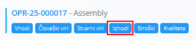
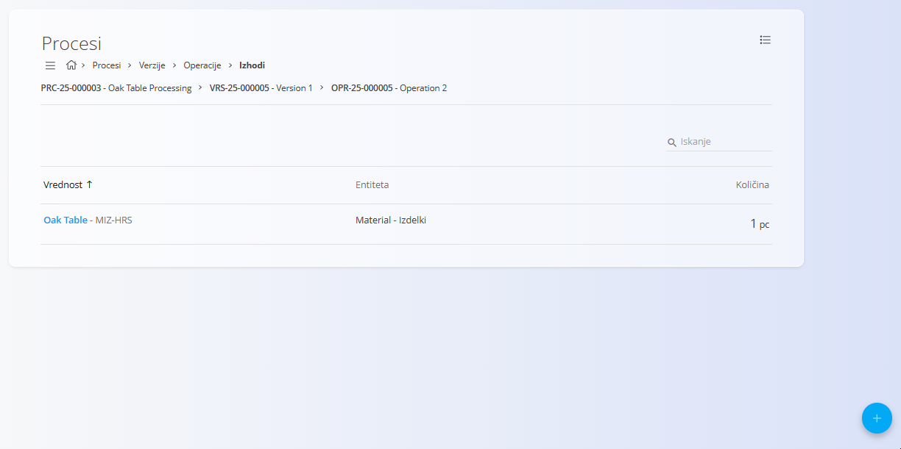
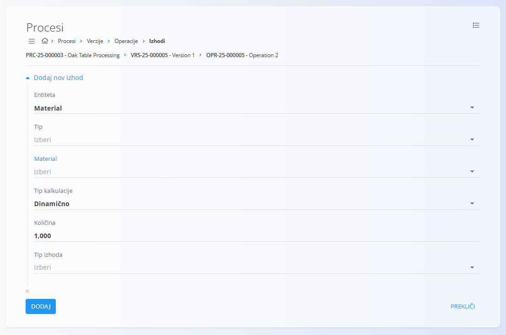

<!-- app_route: /management/processes -->
<!-- app_label: Processes -->
<!-- app_navigation_hint: Odpri proces, izberi verzijo, klikni Operacije, nato pri ustrezni operaciji odpri Izhodi. -->
<!-- canonical_source_url: https://tom-pit.github.io/Connected.Docs/sl/Domene/Proizvodnja/Upravljanje/Izhodi/ -->
<!-- canonical_source_title: Izhodi -->

# Izhodi

Izhodi določajo materiale, ki nastanejo med **operacijo** znotraj verzije procesa. Vsak izhod opredeljuje nastali material, njegovo količino in morebitne oznake za razvrščanje.

Za dostop do te strani odprite verzijo procesa v **Proizvodnja / Upravljanje / [Procesi](Procesi.md)**, nato kliknite **[Operacije](Operacije.md)** in pri izbrani operaciji izberite **Izhodi**.

> [!TIP]
> Za celovit prikaz si oglejte video vodič **[Vhodi in izhodi](https://www.youtube.com/watch?v=647sT70tNZc)**.

## Shema

| Polje | Opis |
|------|------|
| **Entiteta** | Izberite, ali se izhod nanaša na **[Material](../../Sredstva/Materiali/README.md)** ali na oznako materiala. |
| **Tip** | Kategorija materiala, ki nastane:  • **[Izdelki](../../Sredstva/Materiali/Izdelki.md)** • **[Surovine](../../Sredstva/Materiali/Surovine.md)** • **[Repro materiali](../../Sredstva/Materiali/ReproMateriali.md)** • **[Polizdelki](../../Sredstva/Materiali/Polizdelki.md)** |
| **Material** | Konkreten material ali izdelek, ki nastane v operaciji. |
| **Tip kalkulacije** | Določa način izračuna količine: **Dinamično** ali **Statično**. |
| **Količina** | Nastala količina. Merska enota je odvisna od izbranega materiala (kos, kg, m itd.). |
| **Tip izhoda** | Dodatna razvrstitev izhoda (spustni seznam). |
| **Oznake** | Neobvezne oznake za kategorizacijo izhoda. |
| **Vrstni red** | Določa zaporedje prikaza izhodov. |

## Seznamski pogled

Seznam prikazuje vse izhode, ki pripadajo izbrani operaciji. Vsaka vrstica prikazuje material, njegov tip in količino.

### Meni

Meni v zgornjem desnem kotu zaslona omogoča hiter dostop do naslednjih dejanj:

- **Izbriši vse izhode** – Izbriše vse izhode, povezane z operacijo.

## Dodati nov izhod

1. Kliknite akcijski gumb v spodnjem desnem kotu in izberite eno izmed možnosti:

    

    - **Kopiraj iz obstoječega izhoda**
    - **Nov**

2. Izpolnite zahtevana polja.

    

3. Kliknite **Dodaj**, da shranite izhod.

## Urediti izhod

1. Kliknite obstoječi izhod na seznamu.  
2. Spremenite želena polja.  
3. Kliknite **Shrani**.

## Izbrisati izhod

Kliknite obstoječi izhod na seznamu, da odprete stran za urejanje, nato kliknite **Izbriši**. Po potrditvi se izhod odstrani iz operacije.