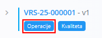
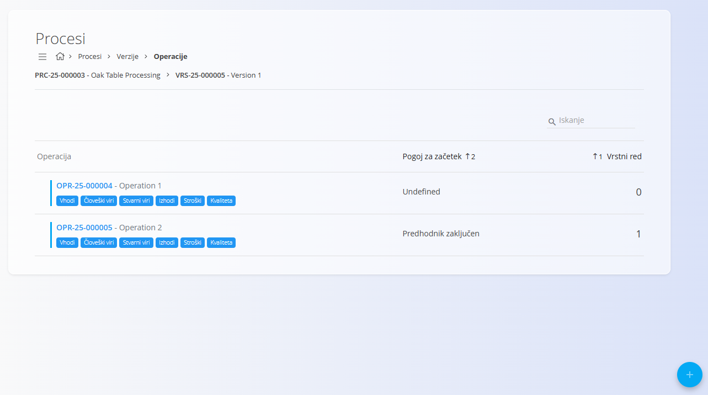
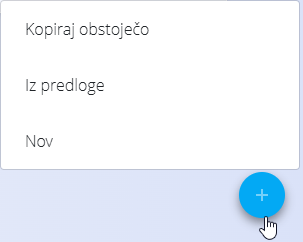

<!-- app_route: /management/processes -->
<!-- app_label: Processes -->
<!-- app_navigation_hint: Odpri proces in izberi verzijo. Klik na Operacije odpre seznam operacij za izbrano verzijo. -->
<!-- canonical_source_url: https://tom-pit.github.io/Connected.Docs/sl/Domene/Proizvodnja/Upravljanje/Operacije/ -->
<!-- canonical_source_title: Operacije -->

# Operacije

Operacije predstavljajo **posamezne korake znotraj verzije procesa**. Vsaka verzija procesa vsebuje eno ali več operacij, ki se izvajajo zaporedno ali glede na določene pogoje. Operacije določajo **katere vire se uporablja**, **katere vhode in izhode obravnavajo**, **koliko časa korak traja** ter **katere organizacijske enote ali stroški se upoštevajo**.

Za dostop do operacij:
1. Pojdite na **Proizvodnja / Upravljanje / Procesi** in izberite **Proces**
2. Izberite **Verzijo**
3. Kliknite **Operacije**

> [!TIP]
> Za celovit prikaz si oglejte video vodič **[Operacije](https://www.youtube.com/watch?v=rPyLL6pSZA0)**.

## Shema

| Polje | Opis |
|------|------|
| [**Šifra**](../../../Skupno/UI/SifreDokumentov.md) | Sistemsko generirana šifra operacije. |
| **Naziv** | Naziv operacije (obvezno). |
| **Opis** | Neobvezen opis operacije. |
| **Vrstni red** | Določa zaporedje izvajanja znotraj verzije procesa. |
| **Pogoj za začetek** | Določa, kdaj se lahko operacija začne: • Nedoločeno • Predhodnik aktiviran • Predhodnik zaključen • Kadarkoli |
| **Pod-status ob aktivaciji** | Začetno stanje operacije: **Se izvaja** ali **Ustavljen**. |
| **Pogoj za samodejno zaključitev** | Določa, ali se operacija zaključi samodejno (npr. *Po času izvajanja*). |
| **Vpliv časa** | Določa, ali trajanje operacije vpliva na skupno trajanje procesa: • Nedoločeno • Vključi • Izloči |
| **Nadrejen** | Omogoča gnezdenje operacije pod drugo operacijo. |
| **Privzeta organizacijska enota** | Določi organizacijsko enoto, odgovorno za operacijo. |
| **Članek** | Doda članek iz [Baze znanja](../../Znanje/BazaZnanja/BazaZnanja.md) k verziji za podrobnejša navodila, opise ali slike. Vnesite naslov članka ali ga izberite s spustnega seznama (neobvezno). |
| **Oznake** | Neobvezne oznake za združevanje ali kategorizacijo operacij. |
| [**Strošek**](../../Nabava/Upravljanje/Stroski.md) | Stroškovna kategorija, povezana z operacijo. |

## Seznam operacij

Seznam prikazuje vse operacije, definirane znotraj izbrane verzije procesa. Vsaka vrstica vključuje:
- Šifro in naziv operacije  
- Pogoj za začetek  
- Vrstni red  
- Gumb za hiter dostop do:  
  - **[Vhodi](Vhodi.md)** – materiali ali elementi, ki se porabijo v operaciji  
  - **[Človeški viri](CloveskiViri.md)** – delavci ali delovna mesta  
  - **[Stvarni viri](StvarniViri.md)** – stroji ali oprema  
  - **[Izhodi](Izhodi.md)** – materiali ali elementi, ki nastanejo v operaciji  
  - **[Stroški](StroskiOperacije.md)** – stroški, povezani z operacijo  
  - **[Kvaliteta](KvalitetaKontrolneListe.md)** – dodeljene kontrolne liste in zahteve kakovosti  

Uporabite polje **Iskanje** za filtriranje operacij po nazivu ali šifri.

## Ustvariti novo operacijo

1. Kliknite [akcijski gumb](../../../Skupno/UI/AkcijskiGumb.md) in izberite:
   - **Novo**
   - **Po predlogi** – če so predloge na voljo v [**Predlogah za operacije**](PredlogeZaOperacije.md#uporaba-predlog-pri-ustvarjanju-operacij)
   - **Kopiraj obstoječo**

   

2. Izpolnite polja:

   ")  
   ")

3. Kliknite **Dodaj**, da ustvarite operacijo.

## Urediti operacijo

Za urejanje operacije:
1. Kliknite operacijo v seznamu.  
2. Spremenite želena polja.  
3. Kliknite **Shrani** za potrditev sprememb.

Operacije je mogoče **omogočiti ali onemogočiti**, kar vpliva na njihov prikaz v proizvodnih tokovih.

## Pogoji zaključevanja in zaporedje

Operacije se izvajajo v zaporedju, določenem z **Vrstnim redom**, razen če je to spremenjeno s **Pogojem za začetek**. Primeri:
- **Predhodnik zaključen** → čaka, da se prejšnji korak zaključi  
- **Kadarkoli** → lahko se izvaja neodvisno  
- **Predhodnik aktiviran** → začne se ob začetku prejšnje operacije  

Ta pravila določajo vedenje procesa v proizvodnji.

## Povezani razdelki operacije

Vsaka operacija vsebuje več podstrani, vsaka s svojim seznamom in zasloni. Ti so dokumentirani ločeno:
- **[Vhodi](Vhodi.md)**
- **[Človeški viri](CloveskiViri.md)**
- **[Stvarni viri](StvarniViri.md)**
- **[Izhodi](Izhodi.md)**
- **[Kvaliteta](KvalitetaKontrolneListe.md)**

Do njih dostopate iz vnosa operacije:

## Izbrisati operacijo

Operacije je **mogoče izbrisati** na strani za urejanje, vendar le, če:
- Niso uporabljene kot nadrejene drugim operacijam  
- Niso uporabljene v aktivnih proizvodnih nalogih  

Za brisanje operacije kliknite operacijo na seznamu in izberite **Izbriši**. Če je operacijo dovoljeno izbrisati, potrdite dejanje, da jo odstranite iz različice procesa.