# Kako ustvariti proces

Procesi določajo, kako so materiali, viri, operacije in kontrole kakovosti združeni za izvajanje določene aktivnosti.

Procesi se uporabljajo tako v **Proizvodnji** kot tudi v **Vzdrževanju**. Določajo zaporedje operacij, potrebne vire, porabljene materiale, ustvarjene izhode in zahteve kakovosti, ki se nato uporabijo pri ustvarjanju proizvodnih ali vzdrževalnih nalogov.

Ta vodič prikazuje, kako ustvariti celovit proces, konfigurirati njegove verzije in operacije, dodeliti vire in materiale ter ga pripraviti za izvajanje.

Primer v tem vodiču prikazuje **proizvodni proces** za izdelavo **hrastovega stola**, vendar enaka načela veljajo tudi za vzdrževalne procese.

> [!NOTE]
>
> * Ta vodič predpostavlja, da so potrebni materiali, viri in kontrolne liste kakovosti že ustvarjeni. Za več informacij glejte:
>
>   * [**Materiali**](../../Sredstva/Materiali.md)
>   * [**Viri**](../../Viri/Upravljanje/Viri.md)
>   * [**Kontrolne liste kakovosti**](../../Kvaliteta/Upravljanje/KontrolneListe.md)
> * Za podrobnejše informacije o procesih in njihovih komponentah si oglejte dokumente v razdelku [**Naslednji koraki**](#naslednji-koraki) na koncu tega vodiča.

## Korak 1: Ustvariti nov proces

Odprite **Proizvodnja / Upravljanje / Procesi**.

1. Kliknite [akcijski gumb](../../../Skupno/UI/AkcijskiGumb.md).

2. Izberite **Nov**.

3. Vnesite naslednje podatke:

   * **Naziv**
   * **Opis**
   * **Oznake**

4. Kliknite **Dodaj**.

Proces je zdaj ustvarjen.

> [!IMPORTANT]
> Prepričajte se, da je dodeljena oznaka **Proizvodnja**, sicer proces ne bo na voljo pri ustvarjanju proizvodnih nalogov.

### Primer

* **Naziv**: *Hrastov stol*
* **Opis**: *Proces proizvodnje hrastovih stolov*
* **Oznake**: *Production*

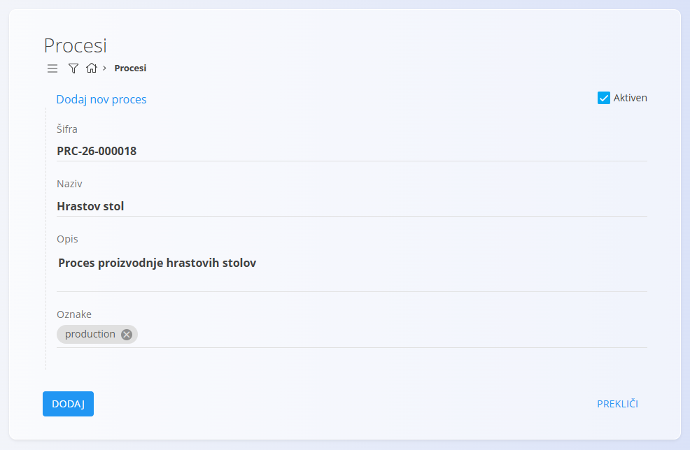

## Korak 2: Ustvariti verzijo procesa

Vsak proces lahko vsebuje eno ali več verzij.

Za ta primer ustvarite verzijo z nazivom **Standardna verzija**.

1. Na seznamu **Procesi** poiščite novo ustvarjen proces.

2. Kliknite **Verzije** pod nazivom procesa.

   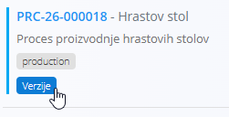

   Prikaže se zaslon z vsemi verzijami procesa. Ker gre za nov proces, je seznam na začetku prazen.

3. Kliknite [akcijski gumb](../../../Skupno/UI/AkcijskiGumb.md).

4. Vnesite:

   * **Naziv**
   * **Opis**
   * **Članek (neobvezno)**: Uporabite to polje za povezavo procesa z določenim člankom iz [baze znanja](../../Znanje/BazaZnanja/BazaZnanja.md), na primer z navodili za sestavljanje.

5. Kliknite **Dodaj**.

Verzija je zdaj pripravljena za konfiguracijo.

### Primer

* **Naziv**: *Standardna verzija*
* **Opis**: *Standardni proces proizvodnje hrastovega stola*

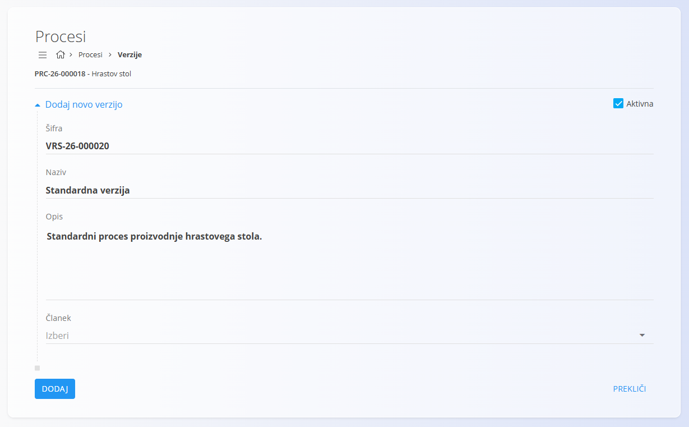

## Korak 3: Dodati operacije

Operacije predstavljajo posamezne korake znotraj verzije procesa.

Za dodajanje operacij:

1. Vrnite se na seznam verzij procesa.

2. Kliknite **Operacije** pod novo ustvarjeno verzijo.

   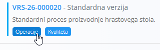

   Prikaže se seznam operacij. Ker gre za novo verzijo, je seznam na začetku prazen.

3. Kliknite [akcijski gumb](../../../Skupno/UI/AkcijskiGumb.md) in izberite **Novo**.

4. Vnesite podatke operacije:

   * **Naziv**
   * **Opis** (neobvezno)
   * **Vrstni red**
   * **Pogoj za začetek**
   * **Pod-status ob aktivaciji**
   * **Privzeta organizacijska enota**
   * **Članek** (neobvezno)

5. Kliknite **Dodaj**.

6. Postopek ponovite za vse potrebne operacije.

Operacije so prikazane v zaporedju, določenem s poljem **Vrstni red**.

### Primer

Za ta primer smo ustvarili naslednje operacije:

| Vrstni red | Operacija          |
| ---------- | ------------------ |
| 0          | Razrez komponent   |
| 1          | Sestavljanje stola |
| 2          | Brušenje površin   |
| 3          | Končni pregled     |
| 4          | Pakiranje          |

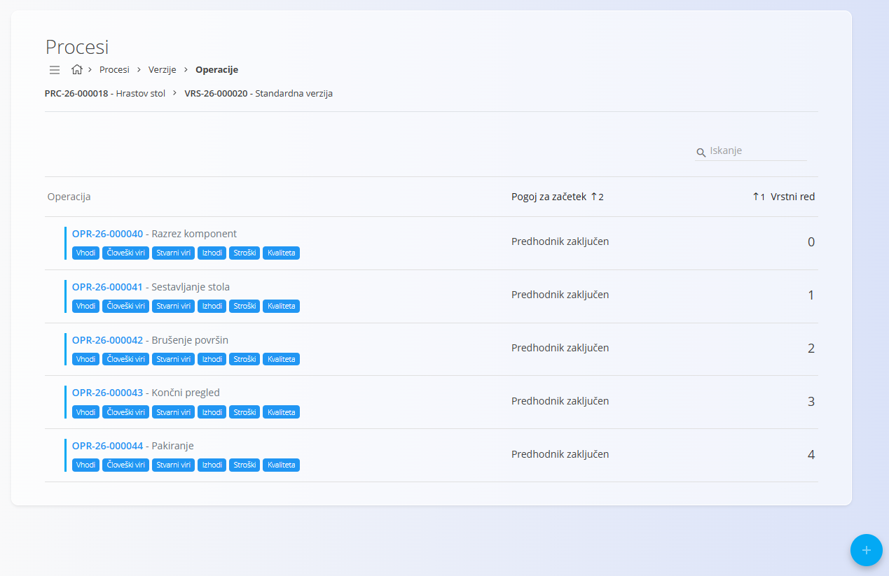

## Korak 4: Konfigurirati vhode operacije

Vhodi določajo materiale ali elemente, ki se porabijo med operacijo.

Za dodajanje vhodov:

1. Na seznamu operacij poiščite operacijo, ki jo želite konfigurirati.
2. Kliknite **Vhodi** pod nazivom operacije. Prikaže se seznam vseh vhodov za izbrano operacijo. Ker gre za novo operacijo, je seznam na začetku prazen.
3. Kliknite [akcijski gumb](../../../Skupno/UI/AkcijskiGumb.md) in izberite **Novo**.
4. Izberite želeni material.
5. Določite količino za porabo.
6. Kliknite **Dodaj**.

Postopek ponovite za vse potrebne materiale.

### Primer

Za operacijo **Razrez komponent** bomo dodali:

* *Raw oak board*
* *Oak wood*

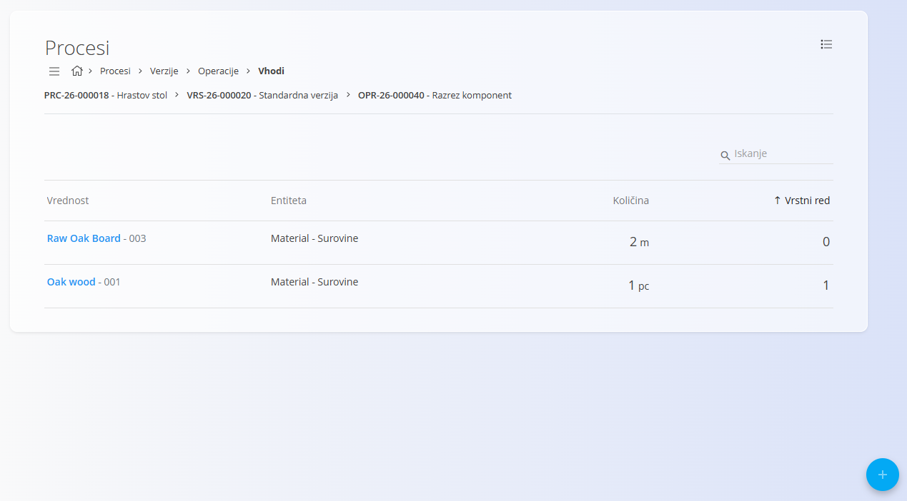

## Korak 5: Konfigurirati vire

Viri določajo ljudi in opremo, potrebne za izvedbo operacije. Za dodajanje virov pojdite na seznam operacij in poiščite operacijo, ki jo želite konfigurirati.

### Človeški viri

Za dodajanje človeških virov:

1. Kliknite **Človeški viri** pod nazivom operacije. Prikaže se seznam vseh človeških virov za izbrano operacijo. Ker gre za novo operacijo, je seznam na začetku prazen.
2. Kliknite [akcijski gumb](../../../Skupno/UI/AkcijskiGumb.md) in izberite **Novo**.
3. Izberite ustrezni tip vira in vir. Določite predviden čas izvajanja operacije.
4. Kliknite **Dodaj**.

### Stvarni viri

Za dodajanje stvarnih virov:

1. Kliknite **Stvarni viri** pod nazivom operacije. Prikaže se seznam vseh stvarnih virov za izbrano operacijo. Ker gre za novo operacijo, je seznam na začetku prazen.
2. Kliknite [akcijski gumb](../../../Skupno/UI/AkcijskiGumb.md) in izberite **Novo**.
3. Izberite ustrezni tip vira in vir. Določite predviden čas izvajanja operacije.
4. Kliknite **Dodaj**.

### Primer

Za operacijo **Sestavljanje stola**:

Človeški viri:

* *Operator*

Stvarni viri:

* *Assembly station 1*

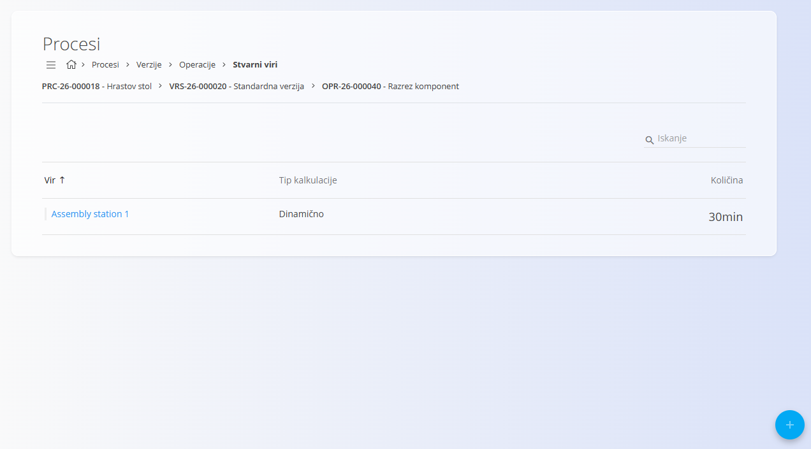

## Korak 6: Konfigurirati izhode

Izhodi določajo elemente, ki nastanejo kot rezultat operacije.

Za dodajanje izhodov:

1. Na seznamu operacij izberite operacijo, ki jo želite konfigurirati.
2. Kliknite **Izhodi** pod nazivom operacije. Prikaže se seznam vseh izhodov za izbrano operacijo. Ker gre za novo operacijo, je seznam na začetku prazen.
3. Kliknite [akcijski gumb](../../../Skupno/UI/AkcijskiGumb.md) in izberite **Novo**.
4. Izberite izhodni material.
5. Določite proizvedeno količino.
6. Kliknite **Dodaj**.

### Primer

Za zadnjo operacijo bomo dodali:

* *Oak wood chair*

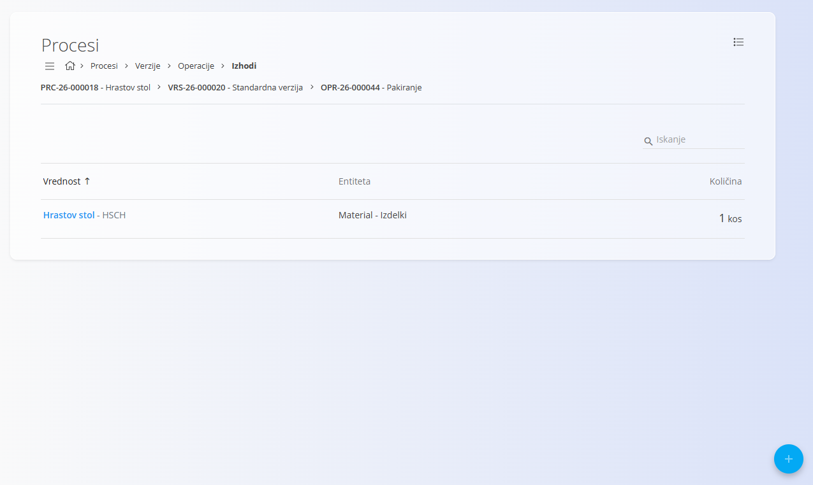

## Korak 7: Dodati kontrole kakovosti

Kontrole kakovosti je mogoče dodeliti verziji procesa ali posameznim operacijam.

Za dodelitev kontrol kakovosti:

1. Poiščite verzijo procesa ali operacijo, ki jo želite konfigurirati.
2. Kliknite **Kvaliteta** pod nazivom operacije. Prikaže se seznam vseh kontrol kakovosti za izbrano operacijo. Ker gre za novo operacijo, je seznam na začetku prazen.
3. Kliknite [akcijski gumb](../../../Skupno/UI/AkcijskiGumb.md).
4. Izberite želeno kontrolno listo in način izvajanja.
5. Kliknite **Dodaj**.

### Primer

Operaciji **Končni pregled** dodelite:

* *Končni pregled izdelka*

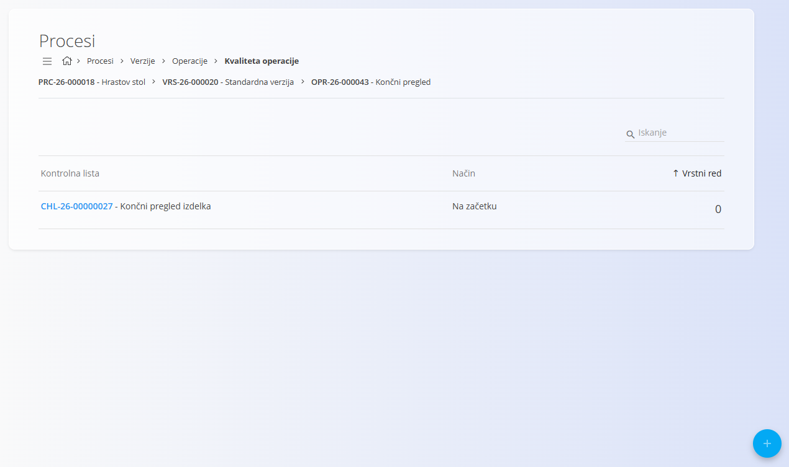

## Korak 8: Izračunati strošek verzije

Ko so konfigurirani materiali, viri, izhodi in stroški, je mogoče izračunati ocenjeni strošek verzije procesa.

1. Vrnite se na zaslon **Verzije**.
2. V stolpcu **Strošek** kliknite **Izračunaj**.

Sistem izračuna ocenjeni strošek na podlagi:

* Stroškov materiala
* Stroškov človeških virov
* Stroškov stvarnih virov
* Dodatnih stroškov

### Primer

Izračunajte strošek izdelave enega **hrastovega stola** z uporabo **Standardne verzije**.

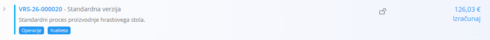

## Korak 9: Uporabiti proces

Proces je zdaj pripravljen za uporabo v operativnih dokumentih.

Glede na dodeljene oznake ga je mogoče izbrati pri ustvarjanju:

* [Proizvodnih nalogov](../Dokumenti/ProizvodniNalogi.md)
* [Vzdrževalnih nalogov](../../Vzdrzevanje/Dokumenti/VzdrzevalniNalogi.md)

### Primer

Ustvarite nov proizvodni nalog in izberite:

* Proces: Hrastov stol
* Verzija: Standardna verzija

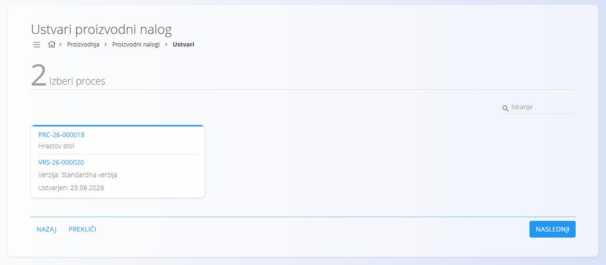

Sistem samodejno ustvari operacije, definirane v verziji procesa.

## Naslednji koraki

Za podrobnejše informacije o konfiguraciji procesov glejte:

* [**Procesi**](Procesi.md)
* [**Operacije**](Operacije.md)
* [**Vhodi**](Vhodi.md)
* [**Izhodi**](Izhodi.md)
* [**Človeški viri**](CloveskiViri.md)
* [**Stvarni viri**](StvarniViri.md)
* [**Kvaliteta**](KvalitetaKontrolneListe.md)
