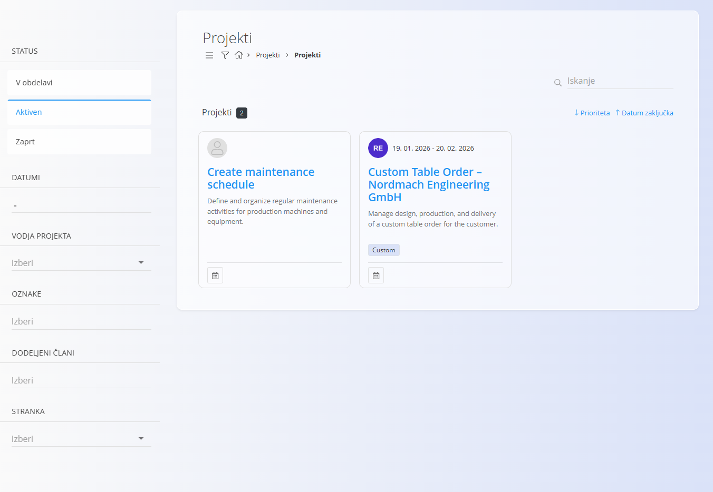
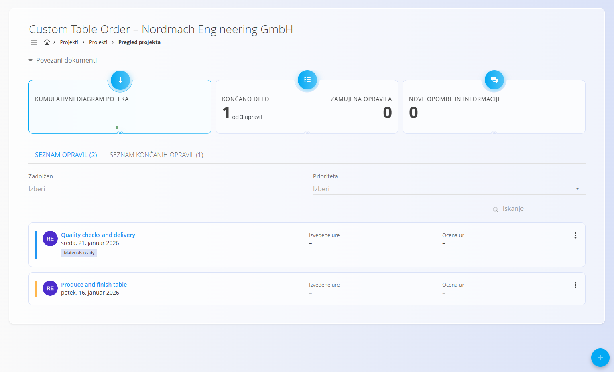
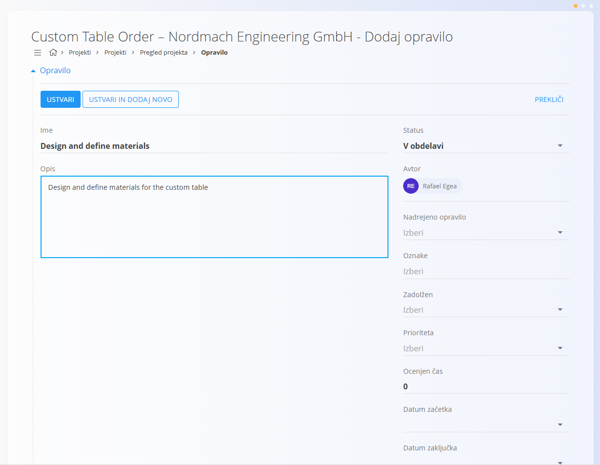
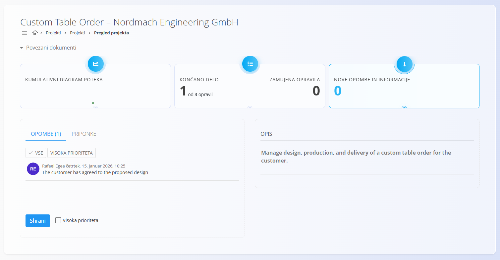

<!-- app_route: /projects/projects -->
<!-- app_label: Projekti -->
<!-- canonical_source_url: https://tom-pit.github.io/Connected.Docs/sl/Domene/Projekti/Dokumenti/Projekti/ -->
<!-- canonical_source_title: Projekti -->

# Projekti

Področje **Projekti** omogoča pregled vseh aktivnih in zaključenih projektov ter predstavlja glavni delovni prostor za **spremljanje napredka in izvajanje opravil** znotraj projekta.

Projekti se ustvarjajo in konfigurirajo v dokumentu **[Upravljanje projektov](../Upravljanje/UpravljanjeProjektov.md)**.  
Ta razdelek je namenjen **delu z obstoječimi projekti**: spremljanju statusa, pregledu opravil in sodelovanju med izvajanjem.

Za dostop do projektov pojdite na **Projekti / Projekti** v [navigaciji](../../../Skupno/UI/Navigacija.md).

## Življenjski cikel projekta

Projekt je lahko v enem izmed naslednjih stanj:
- **V obdelavi** — projekt je načrtovan, vendar še ni aktiven
- **Aktiven** — projekt se izvaja
- **Zaprt** — projekt je zaključen

Status projekta odraža splošni napredek in se upravlja v dokumentu **[Upravljanje projektov](../Upravljanje/UpravljanjeProjektov.md)**.

## Pregled projektov

Stran **Projekti** prikazuje vse razpoložljive projekte v obliki kartic.

Vsaka kartica projekta prikazuje:
- **Ime projekta**
- **Kratek opis**
- **Načrtovano časovno obdobje**
- **Oznake** (če so definirane)
- **Kazalnik prioritete** (če je definiran)

S klikom na kartico projekta se odpre **pregled projekta**.

### Filtri in razvrščanje

Na levi strani lahko s filtri omejite seznam projektov:

- **Status**
  - V obdelavi
  - Aktiven
  - Zaprt
- **Datumi**
- **Vodja projekta**
- **Oznake**
- **Dodeljeni člani**
- **Stranka**

Projekte lahko razvrščate tudi po **prioriteti** ali **datumu zaključka** z možnostmi v zgornjem desnem kotu.

## Urediti projekt

S klikom na projekt se odpre **pregled projekta**, ki ponuja celovit vpogled v stanje in izvajanje projekta.

Pregled projekta je razdeljen na tri glavne dele:
- Pregled projekta in kazalniki
- Opravila (seznam in zaključena opravila)
- Opombe in priponke

## Pregled projekta in kazalniki

Na vrhu pregleda projekta so prikazani ključni kazalniki, ki omogočajo hiter vpogled v stanje izvajanja.

Vsi kazalniki so **klikabilni** in odpirajo dodatne poglede ali podrobnosti:
- **Kumulativni diagram poteka** prikaže vizualni potek opravil skozi čas
- **Končano delo** prikazuje napredek glede na zaključena opravila
- **Zamujena opravila** označujejo opravila, ki so prekoračila rok
- **Nove opombe in informacije** odprejo pogled z opombami projekta

Kazalniki omogočajo hitro oceno stanja projekta brez dodatne navigacije.

## Pregled opravil

Pod kazalniki je prikazan seznam opravil, povezanih s projektom.

Opravila se vedno ustvarjajo **znotraj projekta** in predstavljajo dejansko delo, potrebno za izvedbo projekta.

V tem pogledu lahko uporabniki:
- pregledajo vsa opravila projekta
- preverijo status in prioriteto opravil
- odprejo posamezno opravilo
- spremljajo izvedene in ocenjene ure (če so definirane)

Ta zaslon ponuja **projektni pregled opravil**.  
Podrobnosti o izvajanju opravil, beleženju časa in upravljanju statusov so opisane v dokumentu **[Opravila](Opravila.md)**.

## Ustvariti novo opravilo

Opravila se ustvarjajo **znotraj projekta**.

Kliknite akcijski gumb v pregledu projekta in odprite obrazec **Dodaj opravilo**.

Obrazec za ustvarjanje opravila vsebuje:
- **Ime**
- **Opis**
- **Status**
- **Nosilec**
- **Dodeljeni**
- **Prioriteta**
- **Ocenjen čas**
- **Datum začetka**
- **Datum zaključka**

> [!NOTE]
>
> Podrobnejši opis polj in upravljanja opravil je na voljo v dokumentu [**Opravila**](Opravila.md).

Ko je opravilo pripravljeno, kliknite **Ustvari**.

Če želite ustvariti več opravil zaporedoma, lahko uporabite možnost **Objavi in ustvari novo**, ki objavi opravilo in odpre nov obrazec.

Po ustvarjanju se opravilo takoj doda v seznam opravil projekta.

## Opombe in sodelovanje

Vsak projekt vključuje razdelek **Opombe**, namenjen komunikaciji in dokumentiranju med izvajanjem projekta.

V tem razdelku lahko uporabniki:
- dodajajo opombe, povezane s projektom
- označijo opombe kot visoko prioritetne
- dodajajo priponke in dokumente
- pregledajo opis projekta

Opombe predstavljajo osrednje mesto za projektne odločitve, posodobitve in skupne informacije.
