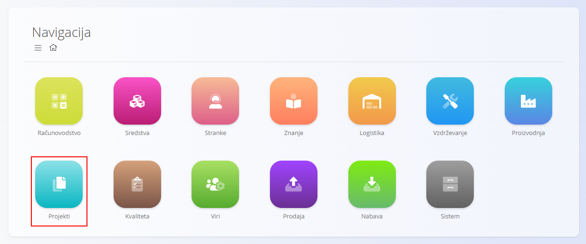
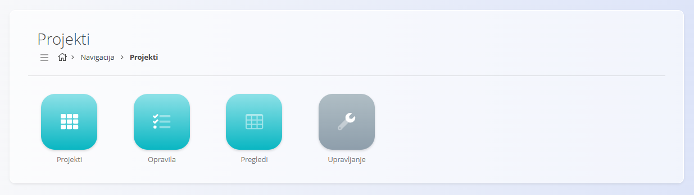
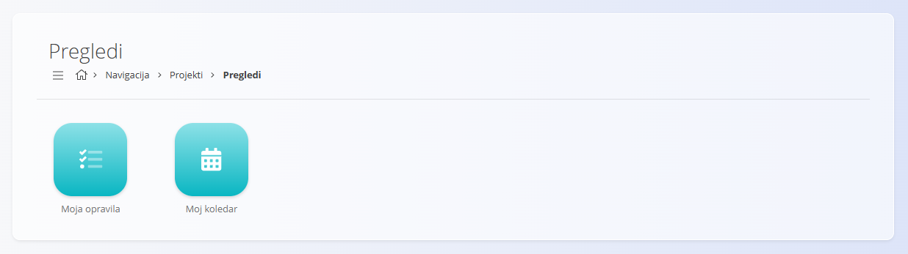
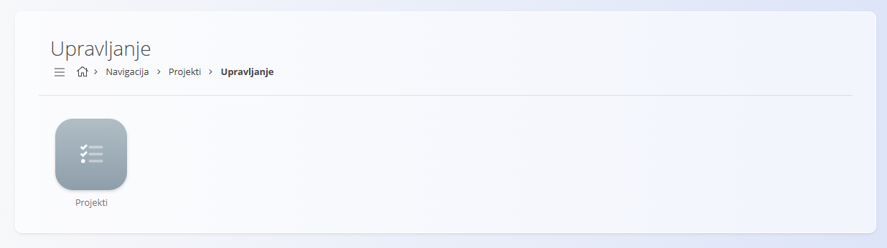

<!-- app_route: /sitemap/projects -->
<!-- app_label: Projekti -->
<!-- canonical_source_url: https://github.com/Tom-PIT/Connected.Docs/blob/main/sl/Domene/Projekti/DomenaProjektov.md -->
<!-- canonical_source_title: Projekti -->

# Projekti

Domena **Projekti** podpira strukturirano načrtovanje, izvajanje in spremljanje projektnega dela znotraj vaše organizacije.  
Zagotavlja orodja za organizacijo projektov, upravljanje opravil, spremljanje napredka ter personalizirane poglede za uporabnike, vključene v izvajanje projektov.

Domena Projekti se običajno uporablja za **interne pobude**, **medoddelčne aktivnosti** ali **neprodukcijsko delo**, ki zahteva usklajevanje, sledenje opravilom in preglednost skozi čas.

Za dostop do te domene pojdite na **Projekti** v [navigaciji](../../Skupno/UI/Navigacija.md).

> [!NOTE]  
> Razpoložljive domene in funkcionalnosti so odvisne od konfiguracije podjetja in omogočenih modulov.

## Kaj je vključeno v domeno Projekti?

Domena je organizirana v več funkcionalnih sklopov:

- **Projekti** – definicije projektov in struktura na visoki ravni  
- **Opravila** – izvedbene enote znotraj projektov  
- **Pregledi** – personalizirani in analitični pregledi opravil  
- **Upravljanje** – nastavitve in podporne definicije za projekte  

## Projekti

Zaslon [**Projekti**](Dokumenti/Projekti.md) je osrednje mesto, kjer se projekti pregledujejo in upravljajo.

Vsak projekt običajno predstavlja **ciljno usmerjeno pobudo** z:
- opredeljenim obsegom
- časovnico
- dodeljenimi udeleženci
- naborom povezanih opravil

Projekti zagotavljajo strukturni okvir za opravila in omogočajo spremljanje napredka na višji ravni.

Projekti delujejo kot organizacijski sloj, ki združuje opravila, uporabnike in roke v eno obvladljivo celoto.

## Opravila

Zaslon [**Opravila**](Dokumenti/Opravila.md) se osredotoča na **izvedbeni nivo** projektnega dela.

Opravila predstavljajo posamezne enote dela, ki:
- so dodeljene uporabnikom ali ekipam
- imajo statuse in prioritete
- se spremljajo skozi čas
- prispevajo k napredku projekta
- vedno pripadajo določenemu projektu

Ta razdelek običajno uporabljajo člani ekip, ki izvajajo dejansko delo.

## Pregledi

Razdelek **Pregledi** ponuja **uporabniško usmerjene in analitične poglede** na opravila in projekte.

Razpoložljivi pregledi vključujejo:

- [**Moja opravila**](Pregledi/MojaOpravila.md) – personaliziran seznam opravil, dodeljenih trenutnemu uporabniku  
- [**Moj koledar**](Pregledi/MojKoledar.md) – koledarski pogled opravil in rokov  

Ti pregledi so namenjeni temu, da uporabnikom pomagajo:
- razvrščati delo po prioritetah
- razumeti roke
- učinkovito upravljati delovno obremenitev

Pregledi so **samo za branje** in ne omogočajo neposrednega ustvarjanja ali spreminjanja projektov ali opravil.

## Upravljanje

Razdelek **Upravljanje** vsebuje nastavitve in osnovne podatke, ki določajo vedenje domene Projekti.

Ta del običajno uporabljajo skrbniki ali napredni uporabniki za:
- definiranje nastavitev, povezanih s projekti
- konfiguracijo obnašanja opravil
- upravljanje podpornih podatkov, ki se uporabljajo v projektih

Spremembe, narejene tukaj, vplivajo na strukturo in prikaz projektov ter opravil v celotni domeni.

> [!TIP]
> Oglejte si celoten seznam upravljanja: **[Kazalo upravljanja](../../KazaloUpravljanja.md)**.

## Pregled poteka dela v domeni Projekti

Tipičen potek dela v domeni Projekti vključuje naslednje korake:

### **1. Definicija projekta**
- Ustvari se projekt, ki predstavlja določeno pobudo ali cilj.

### **2. Načrtovanje opravil**
- Opravila se definirajo in povežejo s projektom (ali upravljajo samostojno).
- Dodelijo se odgovornosti in roki.

### **3. Izvajanje opravil**
- Uporabniki delajo na opravilih, posodabljajo napredek in zaključujejo dodeljeno delo.

### **4. Spremljanje in usklajevanje**
- Napredek se spremlja prek seznamov opravil in koledarskih pregledov.
- Vodje in udeleženci pridobijo vpogled v obremenitve in statuse.

## Povzetek

Domena Projekti zagotavlja strukturirano okolje za organizacijo in izvajanje projektnega dela.  
Omogoča:

- jasno organizacijo projektov  
- izvajanje na osnovi opravil  
- osebno preglednost opravil  
- načrtovanje na osnovi koledarja  
- usklajevanje med ekipami  

Podpira ekipe pri upravljanju dela, ki ne sodi v transakcijske ali proizvodno usmerjene procese, hkrati pa ostaja v celoti integrirana v širši sistem.
