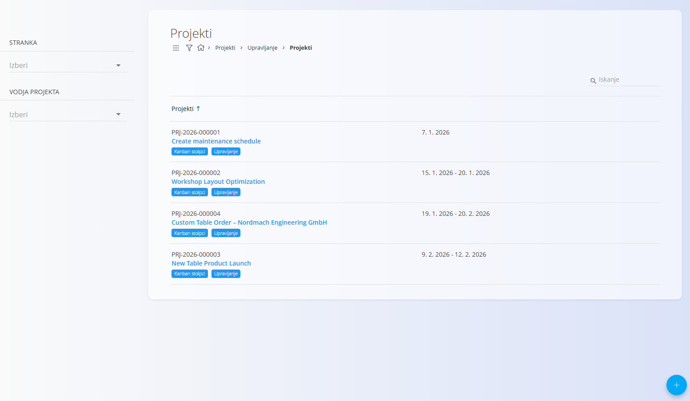
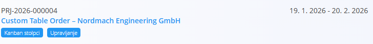
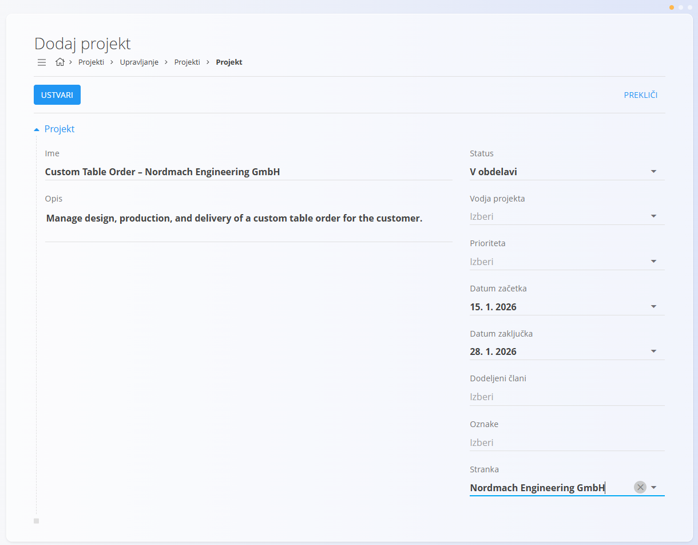
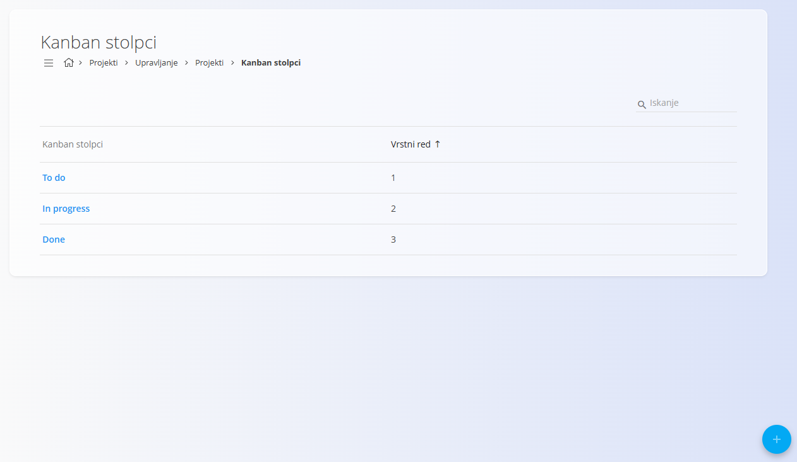
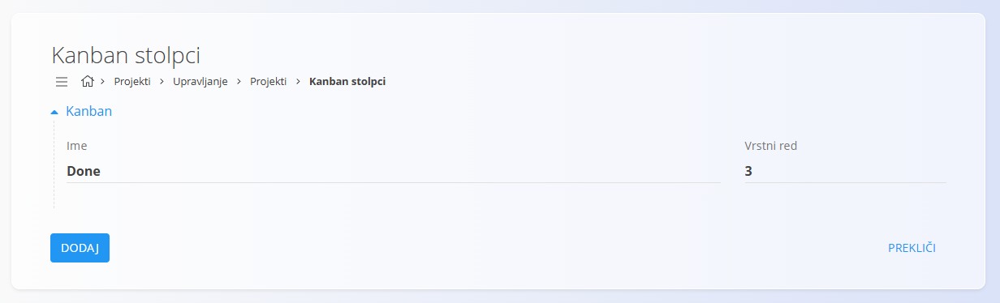
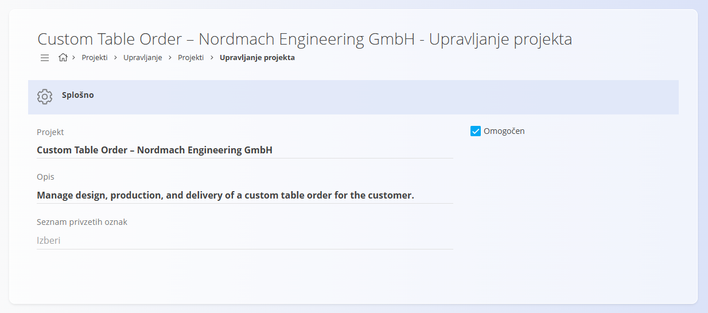

<!-- app_route: /projects/management/projects -->
<!-- app_label: Upravljanje projektov -->
<!-- canonical_source_url: https://github.com/Tom-PIT/Connected.Docs/blob/main/sl/Domene/Projekti/Upravljanje/UpravljanjeProjektov.md -->
<!-- canonical_source_title: Upravljanje projektov -->

# Upravljanje projektov

**Upravljanje projektov** se uporablja za ustvarjanje, konfiguracijo in vzdrževanje projektov v sistemu TomPIT. Projekti predstavljajo strukturiran okvir za opravila, časovnice, odgovornosti in spremljanje napredka ter omogočajo vizualizacijo dela z uporabo **kanban tabel**.

Za dostop do upravljanja projektov pojdite na **Projekti / Upravljanje / Upravljanje projektov** v [navigaciji](../../../Skupno/UI/Navigacija.md).

## Shema

| Polje | Opis |
|------|------|
| **Ime** | Naziv projekta (obvezno). |
| **Opis** | Kratek opis projekta. |
| **Status** | Trenutni status projekta (npr. **V obdelavi**). |
| **Vodja projekta** | Odgovorna oseba za projekt. |
| **Prioriteta** | Prioriteta projekta. |
| **Datum začetka** | Načrtovani datum začetka projekta. |
| **Datum zaključka** | Načrtovani datum zaključka projekta. |
| **Dodeljeni člani** | Uporabniki, vključeni v projekt. |
| **Oznake** | Neobvezne oznake za razvrščanje ali filtriranje projektov. |
| **Stranka** | Stranka, povezana s projektom. |

## Seznamski prikaz

Seznam projektov prikazuje vse projekte, ustvarjene v sistemu. Vsaka vrstica prikazuje:
- **Ime projekta**
- **Načrtovano časovno obdobje**
- Dodeljene **oznake**
- Gumb **Kanban stolpci**
- Gumb **Upravljanje**

### Filtri

Na levi strani seznama lahko projekte filtrirate po:
- **Stranka**
- **Vodja projekta**

Iskalno polje omogoča filtriranje po imenu projekta.

## Ustvariti projekt

Kliknite [akcijski gumb](../../../Skupno/UI/AkcijskiGumb.md) za dodajanje novega projekta.

Pri ustvarjanju novega projekta so na voljo polja, opisana v razdelku **Shema**.

Kliknite **Dodaj**, da shranite projekt.

## Urediti projekt

S klikom na projekt v seznamu se odpre zaslon za urejanje, ki vsebuje enaka polja kot pri ustvarjanju novega projekta.

Ko končate z urejanjem, kliknite **Shrani**, da uveljavite spremembe.

## Kanban stolpci

Vsak projekt lahko definira lastne **kanban stolpce**, ki se uporabljajo za vizualno spremljanje napredka opravil. Kanban stolpci so **specifični za posamezen projekt**.

Za upravljanje kanban stolpcev:
1. Odprite seznam projektov.
2. Pri izbranem projektu kliknite **Kanban stolpci**.

Na zaslonu za kanban stolpce lahko:
- dodajate nove stolpce,
- urejate obstoječe nazive,
- določate vrstni red stolpcev z vrednostjo **Vrstni red**.

Kanban stolpci se uporabljajo pri delu z opravili projekta:
- določajo faze poteka dela,
- vplivajo na vrednosti v spustnem seznamu **Status** pri opravilih.

## Zaslon upravljanja

Klik na gumb **Upravljanje** odpre zaslon za upravljanje projekta.

Na tem zaslonu lahko:
- urejate podatke projekta,
- omogočite ali onemogočite projekt,
- upravljate privzete oznake,
- dostopate do nastavitev kanban stolpcev,
- izbrišete projekt.

## Izbrisati projekt

Projekt lahko izbrišete na zaslonu za upravljanje projekta. Ob brisanju se prikaže potrditveno okno:

*Ali ste prepričani, da želite izbrisati zapis?*

Po potrditvi je projekt trajno odstranjen iz sistema.