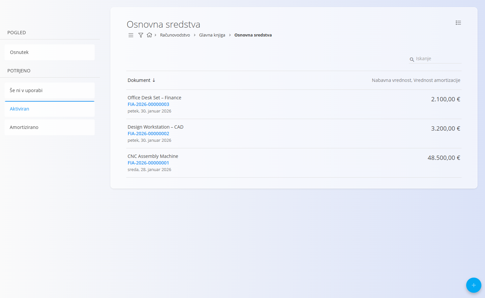
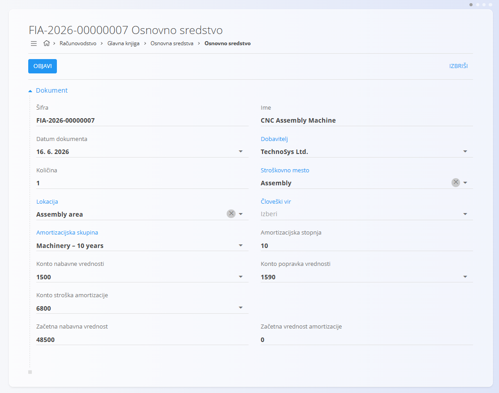
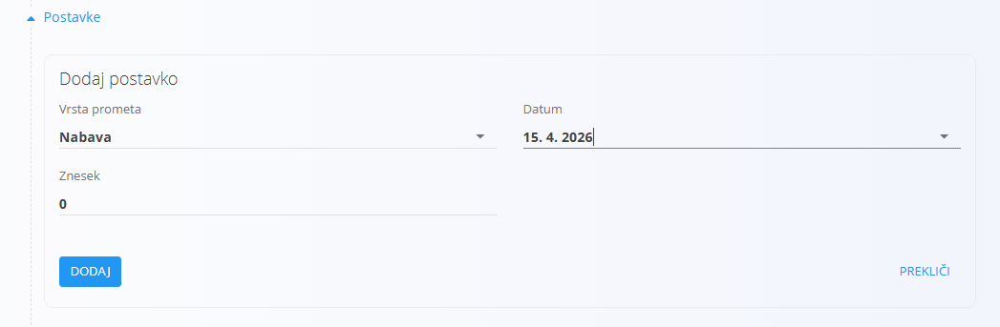
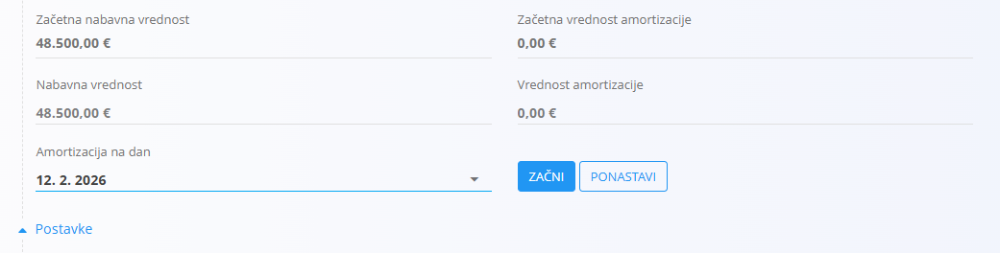

<!-- app_route: /accounting/ledger/fixed-assets -->
<!-- app_label: Osnovna sredstva -->
<!-- canonical_source_url: https://github.com/Tom-PIT/Connected.Docs/blob/main/sl/Domene/Racunovodstvo/Dokumenti/OsnovnaSredstva.md -->
<!-- canonical_source_title: Osnovna sredstva -->

# Osnovna sredstva

**Osnovna sredstva** se uporabljajo za spremljanje dolgoročnih sredstev v lasti organizacije, kot so stroji, oprema, pohištvo in IT oprema.  
Vsako osnovno sredstvo predstavlja posamezno sredstvo ali skupino enakih sredstev, ki se kapitalizirajo in amortizirajo skozi čas.

Za dostop do tega zaslona pojdite na **Računovodstvo / Glavna knjiga / Osnovna sredstva** v [navigaciji](../../../Skupno/UI/Navigacija.md). :contentReference[oaicite:0]{index=0}

> [!NOTE]
> Osnovna sredstva so tesno povezana z **[amortizacijskimi skupinami](../Upravljanje/GlavnaKnjiga/AmortizacijskeSkupine.md)** in **[konti glavne knjige](../Upravljanje/GlavnaKnjiga/Konti.md)**. Način knjiženja in izračun amortizacije sta odvisna od nastavitev amortizacijskih skupin in kontov.

## Shema

  
<strong>Dokument</strong>

| Polje | Opis |
|------|------|
| [**Šifra**](../../../Skupno/UI/SifreDokumentov.md) | Sistemsko generirana enolična oznaka osnovnega sredstva. |
| **Ime** | Naziv osnovnega sredstva (na primer CNC Assembly Machine). |
| **Datum dokumenta** | Datum, ko je bil zapis osnovnega sredstva ustvarjen. |
| **Dobavitelj** | Dobavitelj, pri katerem je bilo sredstvo kupljeno. |
| **Količina** | Število enakih osnovnih sredstev, zajetih v zapisu. |
| [**Stroškovno mesto**](../../../Skupno/Upravljanje/StroskovnaMesta.md) | Stroškovno mesto, odgovorno za osnovno sredstvo. |
| [**Lokacija**](../Upravljanje/GlavnaKnjiga/LokacijeGlavneKnjige.md) | Fizična ali organizacijska lokacija osnovnega sredstva. |
| [**Človeški vir**](../../Proizvodnja/Upravljanje/CloveskiViri.md) | Odgovorna oseba za osnovno sredstvo, če je določena. |
| [**Amortizacijska skupina**](../Upravljanje/GlavnaKnjiga/AmortizacijskeSkupine.md) | Pravila amortizacije, uporabljena za sredstvo. |
| **Amortizacijska stopnja** | Letna amortizacijska stopnja, izpeljana iz amortizacijske skupine. |
| **Konto nabavne vrednosti** | Konto glavne knjige za knjiženje nabavne vrednosti sredstva. |
| **Konto popravka vrednosti** | Konto glavne knjige za kumulativno amortizacijo. |
| **Konto stroška amortizacije** | Konto glavne knjige za stroške amortizacije. |
| **Začetna nabavna vrednost** | Začetna vrednost sredstva ob kapitalizaciji. |
| **Začetna vrednost amortizacije** | Začetna kumulativna amortizacija, če obstaja. |

  
<strong>Podrobnosti</strong>

| Polje | Opis |
|------|------|
| **Tip prometa** | Vrsta transakcije osnovnega sredstva: **Nabava** ali **Aktivacija**. |
| **Datum** | Datum transakcije. |
| **Znesek** | Denarna vrednost transakcije. |

## Upravljanje

## Stanja dokumentov

Osnovna sredstva prehajajo skozi naslednja stanja:

- **Osnutek** – osnovno sredstvo je v pripravi in ga je mogoče prosto urejati.
- **Še ni v uporabi** – osnovno sredstvo je objavljeno, vendar še ni aktivirano.
- **Aktiviran** – osnovno sredstvo je v uporabi in vključeno v amortizacijo.
- **Amortizirano** – osnovno sredstvo je zaključilo svoj amortizacijski cikel.

### Seznam

Seznam prikazuje vsa osnovna sredstva.

Na voljo so naslednji filtri:

- **Pogled**
  - Osnutek
  - Še ni v uporabi
  - Aktiviran
  - Amortiziran

Trenutno stanje posameznega sredstva odraža njegov življenjski cikel.

## Dejanja

### Ustvariti osnovno sredstvo

1. Kliknite [akcijski gumb](../../../Skupno/UI/AkcijskiGumb.md) za ustvarjanje novega osnovnega sredstva.
2. Izpolnite obvezna polja v razdelku **Dokument**.
3. Dodelite **amortizacijsko skupino** in preverite povezane konte.
4. Kliknite **Objavi**.

Po objavi se osnovno sredstvo premakne iz stanja **Osnutek** v **Še ni v uporabi**.

### Dodati podrobnosti sredstva

V razdelku **Podrobnosti** lahko beležite dogodke, povezane z osnovnim sredstvom.

#### Nabava

Za beleženje nabave osnovnega sredstva:

- nastavite **Tip prometa** na *Nabava*,
- vnesite **Datum**,
- vnesite **Znesek**.

To omogoča beleženje nabavne vrednosti ločeno od aktivacije.

#### Aktivirati osnovno sredstvo

Za aktivacijo osnovnega sredstva:

- dodajte novo podrobnost,
- izberite **Aktivacija** kot tip prometa,
- nastavite **Datum** aktivacije,
- kliknite **Dodaj**.

Po aktivaciji se osnovno sredstvo premakne v stanje **Aktiviran**.

> [!NOTE]
> Izračun amortizacije je mogoč šele po aktivaciji osnovnega sredstva.

### Amortizacija na datum

Razdelek **Amortizacija na datum** omogoča izbiro datuma za začetek ali zaustavitev izračuna amortizacije.

- **Začni** sproži izračun amortizacije od izbranega datuma.
- **Ponastavi** ustavi izračun amortizacije.

> [!NOTE]
> Če je izbran prihodnji datum, sistem lahko prikaže izračunano vrednost amortizacije.  
> Ta vrednost predstavlja projekcijo amortizacije na podlagi nastavitev amortizacijske skupine in stopnje.
