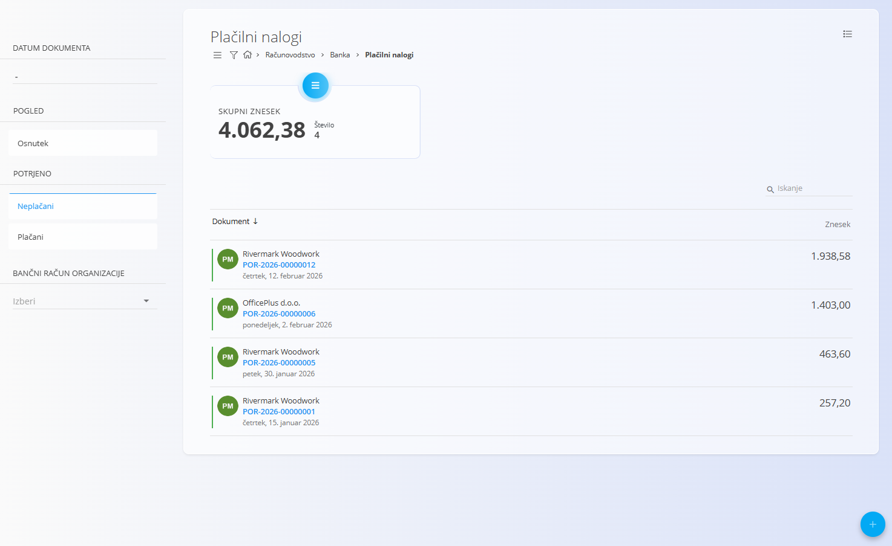
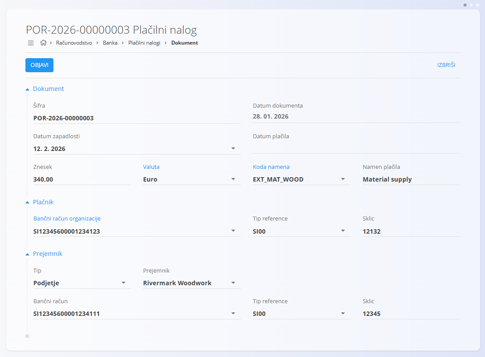
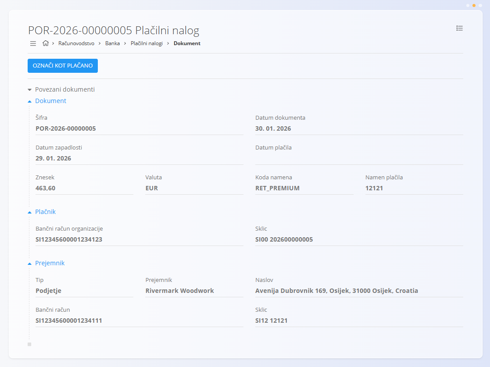

<!-- app_route: /accounting/bank/payment-orders -->
<!-- app_label: Plačilni nalogi -->
<!-- canonical_source_url: https://tom-pit.github.io/Connected.Docs/sl/Domene/Racunovodstvo/Dokumenti/PlacilniNalogi/ -->
<!-- canonical_source_title: Plačilni nalogi -->

# Plačilni nalogi

Zaslon **Plačilni nalogi** se uporablja za ustvarjanje in upravljanje izhodnih plačilnih nalogov za zunanje prejemnike, kot so dobavitelji ali ponudniki storitev. Plačilni nalogi predstavljajo namero za plačilo in omogočajo sledenje plačilu od osnutka do plačanega stanja.

**Plačilni nalogi** vključujejo podatke o plačniku, prejemniku, znesku in namenu plačila. Zagotavljajo, da so plačila pravilno dokumentirana in sledljiva znotraj računovodskega sistema.

Za dostop do tega zaslona pojdite na **Računovodstvo / Banka / Plačilni nalogi** v [navigaciji](../../../Skupno/UI/Navigacija.md).

> [!NOTE]
> - Plačilni nalogi se praviloma ustvarijo na podlagi **prejetih računov**.
> - Objava plačilnega naloga **ne pomeni samodejne izvedbe bančnega plačila**.

## Shema

<strong>Dokument</strong>

| Polje | Opis |
|-----|-----|
| [**Šifra**](../../../Skupno/UI/SifreDokumentov.md) | Enolična identifikacijska oznaka plačilnega naloga. |
| **Datum dokumenta** | Datum, ko je plačilni nalog ustvarjen. |
| **Datum zapadlosti** | Datum, do katerega mora biti plačilo izvedeno (obvezno). |
| **Datum plačila** | Datum dejanske izvedbe plačila. |
| **Znesek** | Znesek plačila. |
| [**Valuta**](../../../Skupno/Upravljanje/Valute.md) | Valuta plačila (npr. EUR). |
| **Koda namena** | Koda, ki opisuje namen plačila (obvezno). |
| **Namen plačila** | Besedilni opis namena plačila (obvezno). |

<strong>Plačnik</strong>

| Polje | Opis |
|-----|-----|
| [**Bančni račun organizacije**](../../../Skupno/Upravljanje/BancniRacuni.md) | Bančni račun, s katerega se izvede plačilo. |
| **Tip reference** | Tip reference, ki jo uporablja plačnik (obvezno). |
| **Sklic** | Sklic plačnika (obvezno). |

<strong>Prejemnik</strong>

| Polje | Opis |
|-----|-----|
| **Tip** | Tip prejemnika (npr. Podjetje). |
| [**Prejemnik**](../../../Skupno/Upravljanje/PoslovniImenik.md) | Poslovni subjekt, ki prejme plačilo (obvezno). |
| [**Bančni račun**](../../../Skupno/Upravljanje/BancniRacuni.md) | Bančni račun prejemnika (obvezno). |
| **Tip reference** | Tip reference, ki jo zahteva prejemnik (obvezno). |
| **Sklic** | Sklic prejemnika (obvezno). |

## Seznam

Seznam prikazuje vse plačilne naloge in omogoča filtriranje za lažje upravljanje.

Na voljo so naslednji filtri:

- **Datum dokumenta**
- **Pogled**
  - Osnutek
  - Neplačani
  - Plačani
- **Bančni račun organizacije**

Vsaka vrstica prikazuje dokument, prejemnika, datum in znesek.

## Potek stanj

Plačilni nalogi sledijo enostavnemu življenjskemu ciklu:

1. **Osnutek**
   - Plačilni nalog je v pripravi
   - Polja je mogoče urejati

2. **Neplačani**
   - Plačilni nalog je objavljen
   - Plačilo še ni izvedeno

3. **Plačani**
   - Plačilo je bilo zaključeno

## Dejanja

### Ustvariti plačilni nalog

1. Kliknite [akcijski gumb](../../../Skupno/UI/AkcijskiGumb.md) za ustvarjanje novega plačilnega naloga.
2. Vnesite zahtevane podatke dokumenta, plačnika in prejemnika.
3. Kliknite **Objavi**, da se plačilni nalog premakne iz *Osnutka* v *Neplačani*.

   

### Urediti plačilnega naloga

Plačilni nalog lahko urejate, dokler je v stanju **Osnutek**.

- Odprite plačilni nalog s seznama
- Posodobite podatke dokumenta (datume, znesek, valuto, namen) ter podatke plačnika in prejemnika
- Kliknite **Shrani** za potrditev sprememb

Objavljeni (Neplačani / Plačani) plačilni nalogi omejujejo urejanje zaradi zagotavljanja računovodske pravilnosti.

### Označi kot plačano

Ko je plačilni nalog v stanju **Neplačani**, ga lahko označite kot plačanega.

1. Odprite neplačani plačilni nalog
2. Kliknite **Označi kot plačano**
3. Stanje plačilnega naloga se spremeni v **Plačani**

   

## Izbrisati plačilne naloge

Plačilne naloge je mogoče izbrisati, dokler so v stanju **Osnutek**.

Po objavi je brisanje lahko omejeno, da se ohrani sledljivost in računovodska pravilnost.

> [!WARNING]
> Brisanje plačilnih nalogov v stanju *Neplačani* ali *Plačani* lahko vpliva na sledljivost plačil in revizijsko sled.

## Meni

Na tej strani so dejanja menija na voljo na dveh mestih.

### Meni seznama

Meni seznama omogoča dejanja za trenutno prikazan seznam.

Na voljo so naslednja dejanja:

- **Izklopi / Vklopi izvozni način**

### Meni dokumenta

Meni dokumenta omogoča dejanja za trenutno odprt dokument.

Na voljo je naslednje dejanje:

- **Izvoz v XML**

Za podrobnosti o dejanjih menija glejte [**Dejanja menija**](../../../Skupno/Koncepti/MeniDejanja.md).
