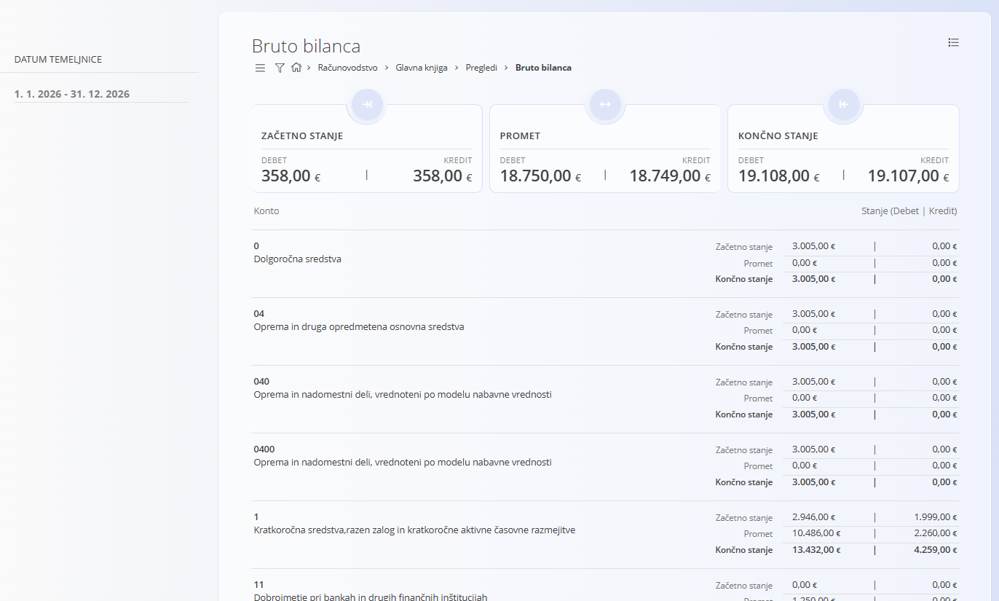

<!-- app_route: /accounting/ledger/account-summary-days -->
<!-- app_label: Bruto bilanca -->
<!-- canonical_source_url: https://github.com/Tom-PIT/Connected.Docs/blob/main/sl/Domene/Racunovodstvo/Pregledi/BrutoBilanca.md -->
<!-- canonical_source_title: Bruto bilanca -->

# Bruto bilanca

Pogled **Bruto bilanca** omogoča združen pregled **začetnega stanja, prometa in končnega stanja po kontih** za izbrano obračunsko obdobje. Gre za **analitični pogled samo za branje**, ki temelji na knjiženih temeljnicah in ne ustvarja ali spreminja dokumentov.

> [!NOTE]
> - Vrednosti se izračunajo izključno na podlagi **knjiženih temeljnic**.
> - Stolpca **Debet** in **Kredit** sta vedno prikazana ločeno, v skladu z načeli dvostavnega knjigovodstva.
> - Ta pogled se običajno uporablja za **preverjanje ob zaključku obdobja**, **kontrolo bruto bilance** in **visokonivojsko finančno analizo**, preden se uporabnik poglobi v podrobnosti (na primer prek pogleda **[Konto kartica](KontoKartica.md)**).

Do tega pogleda dostopate prek **Računovodstvo / Glavna knjiga / Pregledi / Bruto bilanca** v [navigaciji](../../../Skupno/UI/Navigacija.md).

## Pregled

Za vsak konto pogled prikazuje:

- **Začetno stanje** – Začetna debetna in kreditna stanja na začetku izbranega obdobja  
- **Promet** – Skupni debetni in kreditni promet v obdobju  
- **Končno stanje** – Zaključna debetna in kreditna stanja ob koncu obdobja  

Skupni zneski, prikazani na vrhu zaslona, povzemajo vse konte, vključene v trenutne filtre.

## Filtri

Filtri na levi strani omogočajo omejitev prikazanih podatkov:

- **Datum temeljnice** – Določa obdobje za izračun začetnega stanja, prometa in končnega stanja.
- **Konto** – Omeji pregled na enega ali več izbranih kontov.
- **Podjetje** – Prikaže stanja za izbrano podjetje.
