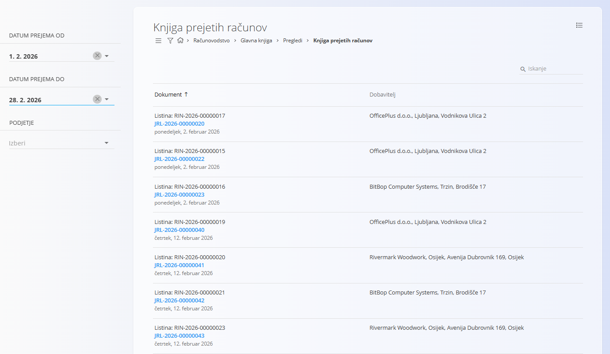

<!-- app_route: /accounting/ledger/received-invoices-tax-book -->
<!-- app_label: Knjiga prejetih računov -->
<!-- canonical_source_url: https://tom-pit.github.io/Connected.Docs/sl/Domene/Racunovodstvo/Pregledi/KnjigaPrejetihRacunov/ -->
<!-- canonical_source_title: Knjiga prejetih računov -->

# Knjiga prejetih računov

Pogled **Knjiga prejetih računov** omogoča **filtriran pregled prejetih računov, ki vsebujejo davčne zneske**, skupaj s povezavami na povezane temeljnice.

Gre za **analitični pogled samo za branje**, namenjen davčnemu poročanju in pregledu. Podatkov na tem zaslonu ni mogoče urejati.

Za dostop do tega pogleda pojdite na **Računovodstvo / Glavna knjiga / Pregledi / Knjiga prejetih računov** v [navigaciji](../../../Skupno/UI/Navigacija.md).

> [!NOTE]  
> Ta pogled prikazuje samo **prejete račune, ki ustvarijo davčne knjižbe**. Namenjen je davčnemu pregledu in poročanju ter ne nadomešča uradnih DDV poročil.

## Namen pogleda

Knjiga prejetih računov se običajno uporablja za:

- Pregled **prejetih računov z obračunanim davkom**
- Preverjanje **podatkov o dobavitelju in dokumentu**
- Dostop do povezane **temeljnice**
- Podporo **poročanju in usklajevanju vstopnega DDV**

S klikom na **modro kodo temeljnice** se odpre ustrezen dokument temeljnice.

## Filtri

Filtri na levi strani omogočajo omejitev rezultatov:

- **Datum prejema od / Datum prejema do** – Omeji račune na izbrano obdobje prejema.
- **Podjetje** – Prikaže račune za izbrano podjetje.

## Stolpci

Vsaka vrstica predstavlja en prejeti račun in vključuje:

- **Dokument** – Šifra računa in povezana temeljnica.
- **Dobavitelj** – Naziv in naslov dobavitelja.
- **Datum** – Datum računa ali datum prejema (odvisno od konfiguracije).

## Meni

Meni omogoča dodatna dejanja, ki so na voljo na tej strani.

Na voljo je naslednje dejanje:

- **Izvoz v PDF**

Za podrobnosti o dejanjih menija glejte [**Dejanja menija**](../../../Skupno/Koncepti/MeniDejanja.md).
