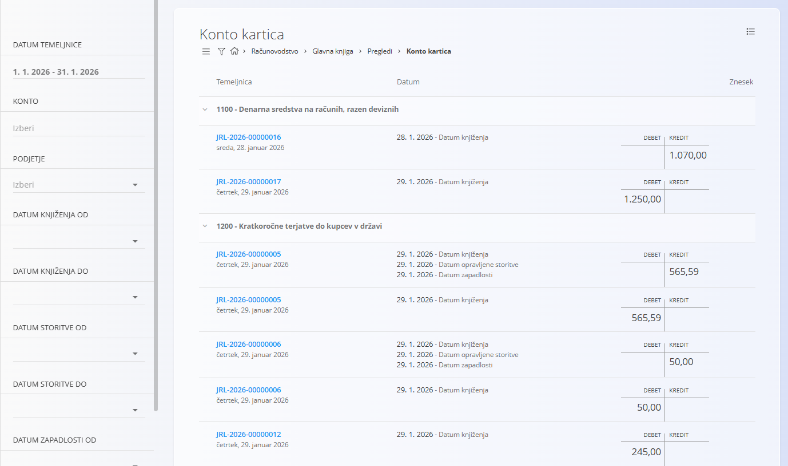

<!-- app_route: /accounting/ledger/views/account-card -->
<!-- app_label: Konto kartica -->
<!-- canonical_source_url: https://tom-pit.github.io/Connected.Docs/sl/Domene/Racunovodstvo/Pregledi/KontoKartica/ -->
<!-- canonical_source_title: Konto kartica -->

# Konto kartica

Pogled **Konto kartica** omogoča podroben pregled **debetnih in kreditnih knjižb po posameznem kontu**, na podlagi knjiženih temeljnic. Gre za **analitični pogled samo za branje**, ki ne ustvarja in ne spreminja dokumentov.

Do pogleda dostopate prek **Računovodstvo / Glavna knjiga / Pregledi / Konto kartica** v [navigaciji](../../../Skupno/UI/Navigacija.md).

## Namen pogleda

Konto kartica se uporablja za:

- pregled debetnih in kreditnih knjižb za enega ali več kontov,
- analizo stanj v izbranem časovnem obdobju,
- sledenje knjižbam do izvornih **temeljnic**,
- podporo pri usklajevanju in revizijskih postopkih.

Pogled prikazuje podatke izključno iz **knjiženih temeljnic**.

## Postavitev in struktura

Pogled je organiziran po **kontih**, pri čemer so knjižbe za posamezen konto razvrščene kronološko.

Za vsako knjižbo so prikazane naslednje informacije:

- **Šifra temeljnice**
- **Datum knjiženja** (ter povezani datumi, kadar so na voljo)
- Znesek v **Debet** in **Kredit**

S klikom na **modro označeno šifro temeljnice** odprete pripadajoč dokument **[Dvostavno knjigovodstvo](../Dokumenti/DvostavnoKnjigovodstvo.md)**.

## Filtri

Filtri na levi strani omogočajo omejevanje prikaza:

- **Datum temeljnice (od / do)** – omeji temeljnice glede na obdobje temeljnice.
- **Konto** – prikaže knjižbe za izbrane konte.
- **Podjetje** – filtrira knjižbe po podjetju.
- **Datum knjiženja (od / do)** – filtrira po datumu knjiženja.
- **Datum opravljene storitve (od / do)** – kadar je uporaben.
- **Datum zapadlosti (od / do)** – kadar je uporaben.
- **Znesek (od / do)** – omeji knjižbe glede na znesek.

Filtre lahko kombinirate za natančnejšo analizo določenih obdobij, kontov ali poslovnih partnerjev.

## Izvoz podatkov

Z uporabo menija v zgornjem desnem kotu lahko podatke izvozite v **PDF** obliki.

## Razlaga vrednosti

- Stolpca **Debet** in **Kredit** prikazujeta smer knjiženja posamezne postavke.
- Knjižbe so združene po pripadajočem **kontu**.
- Ena temeljnica se lahko pojavi večkrat, če vpliva na več kontov.

> [!NOTE]  
> - Prikazane so samo **knjižene** temeljnice.  
> - Osnutki ali neuravnotežene temeljnice niso vključeni.  
> - Konto kartica je namenjena **analizi in preverjanju** ter ne omogoča urejanja ali knjiženja.

Za popravljanje ali urejanje knjižb odprite pripadajočo **[temeljnico](../Dokumenti/DvostavnoKnjigovodstvo.md)** neposredno.

## Meni

Meni omogoča dodatna dejanja, ki so na voljo na tej strani.

Na voljo je naslednje dejanje:

- **Izvoz v PDF**

Za podrobnosti o dejanjih menija glejte [**Dejanja menija**](../../../Skupno/Koncepti/MeniDejanja.md).
