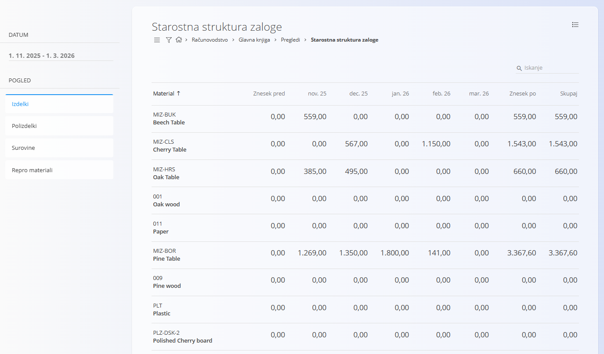

<!-- app_route: /accounting/ledger/views/stock-age-structure -->
<!-- app_label: Starostna struktura zaloge -->
<!-- canonical_source_url: https://github.com/Tom-PIT/Connected.Docs/blob/main/sl/Domene/Racunovodstvo/Pregledi/StarostnaStrukturaZaloge.md -->
<!-- canonical_source_title: Starostna struktura zaloge -->

# Starostna struktura zaloge

Pogled **Starostna struktura zaloge** omogoča časovni pregled **finančne vrednosti zaloge**, ki prikazuje, kako so vrednosti zaloge porazdeljene po preteklih obdobjih. Gre za **analitični pogled samo za branje**, ki temelji na knjiženih zalogah in računovodskih podatkih ter ne ustvarja ali spreminja dokumentov.

Ta pogled se običajno uporablja skupaj z drugimi pregledi glavne knjige (na primer [**Zaloga**](ZalogaGlavneKnjige.md) ali [**Knjižbe**](Knjizbe.md)) za analizo razlogov za spremembe vrednosti zaloge.

> [!NOTE]
> - Vse vrednosti se izračunajo na podlagi **knjižene zaloge in računovodskih knjižb**.
> - Poročilo je namenjeno **analizi staranja zaloge**, **pregledu vrednotenja** in podpori pri **finančnem poročanju**.

Do tega pogleda dostopate prek **Računovodstvo / Glavna knjiga / Pregledi / Starostna struktura zaloge** v [navigaciji](../../../Skupno/UI/Navigacija.md).

## Pregled

Za vsak material pogled prikazuje, kako je vrednost zaloge razporejena skozi čas znotraj izbranega obdobja.

Stolpci predstavljajo:

- **Znesek pred** - Finančna vrednost zaloge *pred* izbranim časovnim obdobjem (vrednost ob koncu obdobja tik pred začetnim datumom).
- **Stolpci mesec / leto** (na primer *Nov 25*, *Dec 25*, *Jan 26*) - Premiki finančne vrednosti zaloge za vsak posamezen mesec v izbranem obdobju.
- **Znesek po** - Finančna vrednost zaloge *po* izbranem končnem mesecu.
- **Skupaj** - Trenutna skupna finančna vrednost zaloge za posamezen material.

Takšna struktura omogoča razumevanje, **kako dolgo je zaloga na skladišču** in **kako se je njena vrednost spreminjala skozi čas**.

## Filtri

Filtri na levi strani omogočajo omejevanje prikazanih podatkov:

- **Datum** - Določa časovno obdobje, uporabljeno za izračun starostne strukture.
- **Pogled** - filtriranje po tipu materiala:
  - Izdelki
  - Polizdelki
  - Surovine
  - Repro materiali

## Meni

Meni omogoča dodatna dejanja, ki so na voljo na tej strani.

Na voljo je naslednje dejanje:

- **Izvoz v CSV**

Za podrobnosti o dejanjih menija glejte [**Dejanja menija**](../../../Skupno/Koncepti/MeniDejanja.md).
